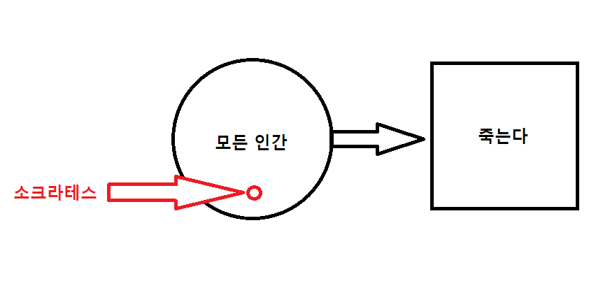

# 논리와 스위치

고대 그리스에서 논리라는 것은 진리를 찾아내기 위해서 언어를 분석한다는 의미를 띄고 있었으므로 철학의 형태를 가지고 있었습니다.

> 모든 인간은 죽는다.
>
> 소크라테스는 인간이다.
>
> 따라서 소크라테스도 죽는다.

  

---

수학자들은 아리스토텔레스 논리학을 수학기호와 연산자를 이용하여 표현하기 위하여 2000년 이상 노력해왔습니다.

논리학에서 매우 중요한 인물인 조지 부울(George Boole)이 나타납니다.

1815년 영국에서 태어난 조지 부울의 미래에는 이상한 일들이 산더미처럼 쌓여 있었습니다.

 

  

 

1800년대 중반에 몇몇 수학자들은 논리를 수학적으로 정의하려고 노력했습니다.(가장 주목할 만한 인물은 '드 모르간 법칙'으로 유명한 오거스트 드 모르간(Augustus De Morgan)입니다.) 하지만 이 분야에서 실제로 개념적인 진전을 이루어낸 사람은 바로 부울이었습니다.

이러한 개념은 그가 쓴 1847년에 쓴 `논리의 수학적 해석: 연역적 추론법의 계산에 관한 에세이`라는 짧은 책에서 처음 소개되었으며, 얼마 지난 1854년에 `생각의 법칙(The Laws of Thought)` 이라는 이름으로 더 유명한, 좀 더 길고 깊이 있는 책인 `논리와 확률의 수학적 이론에 기반한 생각의 법칙에 대한 연구`에서 본격적으로 소개되었습니다.

부울은 1864년, 그의 나이 49세를 일기로 세상을 떴는데, 수업에 들어가기 위하여 비를 맞으며 서두른 것이 폐럼으로 발전하여 죽음에 이르게 되었습니다.

부울은 이성적인 인간의 뇌는 노리를 통하여 사고하므로, 논리를 수학적으로 풀어낼 수 있다면 인간의 뇌 활동에 대해서도 수학적으로 해석해 내는 것이 가능할 것이라 생각했습니다.

---

일반적인 대수학의 또 다른 특성은 두부의 `킬로그램`, 오리의 `숫자`, 기차 여행의 `거리`, 가족들의 `나이`와 같은 `숫자`를 대상으로 한다는 점입니다.

부울의 천재성이 발휘된 부분은 바로 대수학의 연산자들이 숫자를 처리해야 한다는 개념에서 연산자를 분리시켜서, 이를 좀 더 `추상화`시켜 사용했다는 것입니다. 즉, 부울 대수에서 연산자는 수가 아니라 `종류(class)`에 대하여 적용되지요. `종류`라는 것은 간단히 말해 어떤 것의 묶음이라 할 수 있으며, 후에 `집합(set)`이라는 이름으로 잘 알려지게 됩니다.
