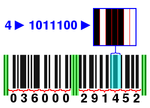

# 비트, 비트, 비트

이진수를 표현하기 위하여 만들어진 비트(bit)라는 단어는 컴퓨터와 연관된 신조어 중 가장 사랑스러운 단어이다. 물론, 이 단어에는 '아주 작은 것, 약간, 일부'라는 일반적으로 사용되는 의미도 있는데, 비트가 하나의 이진수라는 아주 적은 양을 나타내고 있는 것이므로 원래의 의미와도 아주 잘 어울린다.

## UPC (Universal Product Code)

<p align="center">
  
</p>

`101` : 왼쪽, 오른쪽 보호 패턴

`01010` : 중앙 보호 패턴

| 왼쪽 패턴 | 오른쪽 패턴 | 숫자 |
| :-------: | :---------: | :--: |
|  0001101  |   1110010   |  0   |
|  0011001  |   1100110   |  1   |
|  0010011  |   1101100   |  2   |
|  0111101  |   1000010   |  3   |
|  0100011  |   1011100   |  4   |
|  0110001  |   1001110   |  5   |
|  0101111  |   1010000   |  6   |
|  0111011  |   1000100   |  7   |
|  0110111  |   1001000   |  8   |
|  0001011  |   1110100   |  9   |

<br/>

```bash
예제) "0 51000 01251 7"
```

첫번째 숫자(`0`) : 물건의 종류, 고기나 농산물과 같이 무게가 변하는 식료품(`2`), 쿠폰(`5`)

생산자 부호(`51000`) : `51000`의 경우 '캠벨 스프 회사'

해당 회사에서 생산된 특정 제품(`01251`) : `01251`의 경우 캠벨사의 '300그램짜리 치킨 누들 스프'

Modular 점검 문자(`7`) : 오류 점검용 숫자

UPC에서 많은 비트를 사용한 것은 살펴본 것과 같이 오류 점검을 위해서이다.

만일 소비자들이 유성펜을 이용해서 쉽게 그 값을 바꿀 수 있다면 상품 부호와 같은 것이 쓸모없게 되겠지요.

비트를 이용해서 상품 부호, 필름 스피드, 영화 평점, 영국군의 침입, 사랑하는 사람의 의도를 알아보았던 것과 마찬가지로, **비트를 이용하여 `단어, 그림, 소리, 음악, 영화`를 표현할 수 있습니다.**

비트를 이용하여 다른 여러 가지 정보를 표현하는 데 필요한 것은 그 정보가 `얼마나 많은 가능성`을 가지고 있는지 세어보아야 한다는 것 밖에 없습니다. 정보를 나타내기 위하여 각각의 가능성에 숫자를 할당할 때 몇 비트가 필요한지 결정하는 과정에서 위에서 세었던 가능성의 수가 이용됩니다.

비트는 논리학이라는 분야에서도 중요한 역할을 하고 있습니다. 논리학은 특정 문장이 참인지 거짓인지 알아내는 것을 가장 중요한 목표로 하는 분야로서, 수학과 철학이 묘하게 섞여 있지요. 여기서 참은 `1`로, 거짓은 `0`으로 표현할 수 있습니다.
