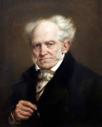

# 글쓰기와 문체   자신의 사색을 녹여서 쓰기

  

> 누구나 쉽게 이해하는 글쓰기처럼 어려운 일은 없다.

## 모호한 글쓰기 == 쓰기 위해 쓴 글

**저술가에겐 두 가지 타입이 있다. 사물의 본질을 밝혀내기 위해 글을 쓰는 사람과, 무언가를 쓰기 위해 사물을 관찰하는 사람이다.** 첫 번째 타입의 저술가는 고유의 사상과 경험을 소유한 사람으로서 이를 독자에게 전달하는 데 글스기의 가치를 둔다. 두 번째 타입의 저술가는 돈을 목적으로, 즉 돈을 벌기 위해 글을 쓴다. 따라서 그들은 무언가를 쓰기 위해 사고한다.

이런 저술가들에게서 발견되는 특징은 다음과 같다. 이들은 될 수 있는 한 오랫동안 엉켜진 사상의 실타래를 붙들고 늘어지는 경향이 있다. 사실의 진위가 불분명하거나 왜곡된 것은 아무런 방해가 되지 않는다. 게다가 자신의 허구성을 감추기 위해서라도 항상 형태가 모호한 사상을 즐겨 애용한다. 따라서 그들의 문장은 명확함과 명료함이 결여되어 있다.

우리는 이 같은 특징을 통해 그들이 단지 원고지와 빈 여백을 메우기 위해 붓을 들었다는 사실을 깨닫게 된다. 우리가 평소 즐겨 읽는 훌륭한 저술가의 글에서도 이 같은 사례를 쉽게 찾아볼 수 있다. 예를 들어 레싱의 연극론이나 장 파울의 소설 몇 편에서도 이처럼 빈 여백을 메우고자 어쩔 수 없이 붓을 들고 사상의 실타래를 힘겹게 쫓아다닌 수고의 흔적을 발견할 수 있다. 우리가 어떤 책을 통해 저술가의 이 같은 거짓된 모순을 발견했다면 그 즉시 손에 들고 있던 책을 버려야 할 것이다.

**시간은 너무나 소중한 조건이다.** 그러므로 저자가 단순히 원고지를 메우기 위해 집필한 책을 읽는다는 것은 그 자체로 저자에게 기만당한 것과 마찬가지다. 대다수의 저자들은 독자에게 무언가 전달해야 할 지식이 있다는 **명분**을 내세우고 있다. 그런데 그 명분이 실은 저자의 변명에 불과했다면 우리가 그들의 책을 읽어주는 것 자체가 바로 기만인 셈이다.

보수와 저작권 침해 금지라는 두 가지 명제가 오늘날 문학을 파멸시킨 원인이라고 생각한다. 사물의 진리를 밝히기 위한 사명감으로 붓을 드는 작가에게만 기록할 수 있는 권리를 허용해야 한다. 문학의 모든 영역에서 비록 그 수는 적더라도, 혹은 단 한 권의 책만이 진실을 담게 되더라도 그 한 권의 책이 우레에게 미치는 영향은 가치를 헤아릴 수 없을 만큼 위대하다. 그러나 저술이라는 활동이 보수라는 금전적 이익으로 직결되는 현실에서 이것은 사실상 불가능하다. 마치 모든 인세에 저주가 걸린 것처럼 어리석은 파멸이 반복되기 때문이다.

어떤 저술가라도 인세를 목적으로 붓을 들기 시작하면 그 즉시 작가로서의 파멸이 기다리고 있다. 오늘날 위대한 작품으로 인정받는 걸작들은 대부분 작가가 무명시절 인세 다위에 연연하지 않는 상황에서 내면의 절박함을 토로하기 위해, 즉 자기희생을 통해 잉태되었다. 이 같은 역사적 사실은 우리에게 스페인의 다음과 같은 격언이 진리였음을 일깨워준다.

> 명예와 돈을 같은 자루에 담을 수는 없다.

독일과 그 밖의 여러 나라에서 현재 문학이 비참한 사회적 대우에 직면한 가장 직접적인 원인은 저술을 통해 돈이 생성되는 구조 때문이다. 돈이 필요한 자는 누구든지 책상에 앉아 글을 쓴다. 그리고 민중은 어리석게도 이렇게 써진 책을 구입한다. 이런 현상 때문에 언어는 또다시 추락을 경험한다.

저급한 저술가들이 살아남을 수 있는 원천은 신간만을 찾는 어리석은 민중에게 있다. 그러므로 그들의 직업은 저술가가 아니라 일당제 저널리스트이다.
