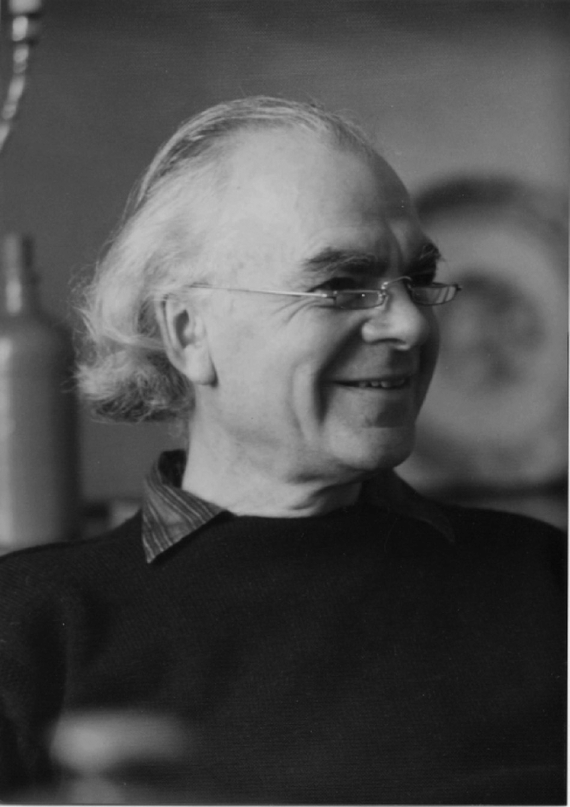

# 생각도구 2 - 형상화 (Imaging)

  

Image by [Quino Al](https://unsplash.com/@quinoal?utm_source=unsplash&utm_medium=referral&utm_content=creditCopyText) on Unsplash

**형상화라는 것은 현상을 그대로 재현하는 것에서부터 특이한 추상능력, 감각적인 연상에 이르기까지 망라된다.** 형상화는 시각과 청각은 물론, 후각과 미각, 몸의 감각까지 동원해서 이루어지기 때문에 우리는 내면의 눈, 내면의 귀, 내면의 코, 내면의 촉감과 몸 감각을 사용할 구실과 기회를 만들어야 한다. 또한 형상화할 때 마음에 떠오른 모든 이미지들은 다른 전달수단으로 변환할 수 있어야 하는데, 그 전달수단은 말, 음악, 동작, 모형, 회화, 도형, 영화, 조각, 수학 논문 등 매우 다양하다.

 

  

> **이미지를 만든다는 것**은 그 자체로 **시의 생명이자 정점이다.**
>
>  - 시인, 존 드라이든 (John Dryden)

## 찰스 스타인메츠의 사물을 그리는 능력

찰스 스타인메츠(Charles Steinmetz)는 그레이엄 벨(Graham Bell)이나 토머스 에디슨(Thomas Edison)만큼 유명하지는 않지만 현대생활에 그가 끼친 영향은 그들 못지않게 지대하다. **스타인메츠는 발전기와 변압기, 일반 배전장비를 발명한 사람이다.** 그 덕분에 벨의 전화기나 에디슨의 전구가 어느 집에서나 사용할 수 있게 된 것이다.

제너럴 일렉트릭사의 동료들은 스타인메츠를 '연방대법원'이라고 불렀다. 그가 풀 수 없는 문제라면 누구도 풀 수 없었기 때문이다. 1894년 기술자 두 명이 몇 주간 붙잡고 씨름했지만 풀지 못한 어려운 문제를 그에게 내밀었다. "직경이 2인치인 쇠막대기에 드릴로 2인치짜리 구멍을 내서 반으로 자른다고 할 때, 깎여나가는 쇠의 양은 얼마나 되는가?" 하는 문제였다. 비용 문제에 민감한 회사의 입장에서는 비싼 쇠에 구멍을 낸다는 것은 물질적, 금전적 손실을 의미하는 것이니만큼 매우 중요한 것이었다.

문제를 낸 두사람은 스타인메츠가 책상 앞에 앉아서 종이를 꺼내 쇠막대기 도형을 그리고 일련의 복잡한 계산을 할 것으로 생각했다. **그렇지만 그의 첫 번째 관심사는 구멍이 뚫을 때 밀려나가는 쇠뭉치의 모양이 어떻게 정할까였다.** 이것은 두 사람이 전혀 생각하지 못한 부분이었다.

  

> 구형도 아니고 원통형도 아니고 일종의 마름모형일세. 기본 모양을 알지 못하면 그것의 입체형을 알아낼 수 없을 뿐 아니라 체적을 계산할 수도 없거든.

스타인메츠의 동료들은 항상 그를 믿음직스럽게 생각하고 있었다. 그렇지만 이런 그들조차 '연방대법원'이 담배를 몇 모금 피우는 사이에

> 여보게들, 답은 5.33세제곱인치라네

라고 말하자 자신의 귀를 의심했다. 놀랍게도 그는 이 모든 것, 다시 말해 쇠막대기의 구멍에서 빠져나온 쇠뭉치의 모양, 그것의 입체형, 그리고 이어지는 계산식까지 **머릿속으로 '보았던' 것이다.**

 

---

 

스타인메츠에게는 비범한 형상화 능력, 즉 어떤 사물의 모습을 상상 속에서 그려내는 능력이 있었다. 이런 재능은 다른 위대한 발명가들, 예를 들어 그의 동료이자 경쟁자로, 교류 전기 전동기와 발전기를 발명한 니콜라 테슬라(Nikola Tesla) 같은 사람에게서도 공통적으로 나타나는 능력이었다.

  

> 나는 어떤 생각이 떠오르면 머릿속에서 즉시 그것의 기본 모양을 상상으로 그려본다. 상상 속에서 그것의 구조를 바꿔보기도 하고 한번 작동을 시켜보기도 한다. 중요한 것은 **내가 실물이나 형체 없이 그 모든 것을 상상 속에서 한다는 것이다.**
>
>  - 발명가, 물리학자, 기계공학자이자 전기공학자, 니콜라 테슬라

## 형상화는 세계를 재창조한다

  

> 저는 **답의 형태적 특징**을 먼저 봅니다. **특징을 잡아낸다는 것은 그림 그리는 데 절대적으로 필요한 거죠.**
>
> 저는 사고의 대부분을 그런 **그림을 좀 더 구체적으로 만드는 작업으로 채웁니다.** 물론 맨 마지막에는 수학이 등장합니다. 수학은 머릿속의 그림을 사람들에게 전달하고 이해시키는 데 효과적인 도구이기 때문이죠.
>
>  - 물리학자, 리처드 파인만 (Richard Feynman)

 

---

 

  

> 모든 과학자들이 심상을 품는 것은 아닙니다. 그러나 저는 심상이 떠오르지 않으면 문제를 풀 수가 없습니다. 그게 저의 문제 해결 방식이죠.
>
> 저는 대체로 시각적 사고를 한다고 할 수 있어요. 제 주변에서 느껴지는 시각적 암시에 대단히 민감하게 반응합니다. 저의 시각적 기억력은 매우 뛰어나고 관찰력 역시 아주 좋은 편이에요. 제가 만일 과학자가 되지 않았더라면 아마 디자인 계통의 일을 했을 겁니다.
>
>  - 천체물리학자, 마거릿 겔러 (Margaret Geller)

 

---

 

형상화는 작가들 사이에서도 중요한 생각도구가 된다. 시인 스티븐 스펜더는 시작(詩作)을 가리켜 '이미지들의 논리' 작업이라고 표현했다. 그에게 **시는 매우 생생한 기억, 대개는 시각적인 기억에서부터 출발했기 때문이다.** 물론 이 시각적 기억은 풍부한 표현력을 가진 문어(文語)로 형상화된다.

찰스 디킨스(Charles Dickens)는 자신의 **소설이 머릿속으로 '보았던' 것을 글로 적은 것에 불과**하다고 밝혔다. 마찬가지로, 테네시 윌리엄스(Tennessee Williams)는 희곡 <욕망이라는 이름의 전차, A Streetcar Named Desire>가 하나의 심상에서 비롯되었다고 말한다.

  

> 나는 젊음의 막바지에 이른 한 여인을 떠올렸다. 그녀는 창문 옆 의자에 고적하게 앉아 있다. 달빛이 흘러들어와 그녀의 쓸쓸한 얼굴을 비춘다. 그녀 옆에는 결혼할 남자가 서 있다.
>
>  - 극작가, 테네시 윌리엄스

 

  
  
<욕망이란 이름의 전차>에서 한 장면 (Image from Dundee Contemporary Arts)

## 당신은 북적거리는 파티에서 음악의 음계를 들을 수 있는가?

분명히 많은 발명가와 과학자, 화가들은 형상화가 중요한 생각도구라는 것을 알고 있다. 그러나 **시각적인 이미지를 그려내는 것은 여러 종류의 형상화 중 하나일 뿐이다.** 1990년에 쓰인 <이미지와 이해, Images and Understanding>라는 책에서 호레이스 바로우, 콜린 블랙모어 그리고 미랜다 웨스턴 스미스는 이미지가 그림의 형태 말고도 **비시각적인 방법**으로 지각되고 전달된다고 힘주어 말한다.

> 화가, 디자이너, 엔지니어들이 공통적으로 고민하는 오래된 문제가 있다. 누군가의 마음속에 있는 생각이나 사실을 어떻게 다른 사람의 마음에 옮겨놓는가? **어떻게 이 마음의 수혈은 이루어지는가?** 그것은 이미지를 통해서다. 거기에는 그림이나 도형의 형태도 있지만 말, \*시연(試演), 음악이나 춤의 형태도 있다.
>
>  - <이미지와 이해> 中

\*시연: 무용이나 연극 따위를 일반에게 공개하기 전에 시험적으로 상연하는 것

 

우리가 눈으로 관찰을 한다면 시각적 이미지를 만들어 낼 것이고 우리가 손을 써서 관찰한다면 손의 위치, 손의 움직임에 대한 이미지와 함께 촉각적인 이미지를 만들어낼 것이다. 만일 우리가 코로 관찰한다면 냄새의 이미지를 만들어낼 것인데 이것은 과학적 발명과 예술적 발상에서 중요한 역할을 한다. **요컨대, 우리는 관찰할 수 있는 것을 상상할 수 있다. 그리고 그 상상을 통해 형상화가 이루어진다.**

냄새나 맛에 의한 형상화 사례가 빈약한 것은 우리가 관찰하고 상상할 때 이런 감각들보다 시각을 더 많이 활용하기 때문이다.

 

---

 

시각적 형상화 능력을 판단하는 간단한 실험은 청각적 형상화능력을 측정하는 데도 사용할 수 있다. 당신은 책을 읽을 때 어떤 소리를 듣게 되는가?

"반짝반짝 작은 별"을 읽을 때 이 단어들이 당신의 머릿속에서도 멜로디로 울리는가? 당신이 지금 어떤 멜로디를 듣고 있다면 머릿속에서 펼쳐지는 음계들을 '들으려고' 애써보라. "도, 레, 미, 파, 솔, 라, 시, 도" 당신은 조용히 듣고 있나? 아니면 콧노래를 흥얼거리며 듣기 시작했나? 당신은 라디오나 북적거리는 파티에서 흘러나오는 음악의 음계를 들을 수 있는가?

만일 머릿속에서 작더라도 '온전한' 청각적 이미지를 만들어낼 수 있다면, 그리고 들리는 음악을 콧노래로 따라 하거나 악기로 연주하면서 머릿속으로 소리와 가락을 재현할 수 있다면 당신은 상당한 능력을 갖추고 있는 셈이다.

 

---

 

  

> 전반적으로 일반인들에게는 들리지 않는 소리 이미지를 상상하는 능력이 없다.
>
>  - 작곡가, 애런 코플랜드 (Aaron Copland)

 

---

 

  

> 나는 악상을 악보로 옮기기 전에 아주 오랫동안, 어느 때는 하루 종일이라도 머릿속에 품고 있곤 한다. 그 과정에서 많은 부분을 바꾸기도 하고, 어떤 것은 버린다. 내가 만족할 때까지 계속 반복한다. 그러고 나서 나는 작품을 정밀하게 다듬는다. 악곡의 이미지를 모든 각도에서 **보고 듣는 것이다.** 그것은 마치 조각품과 같다. 그러고 나면 이 곡을 악보로 옮겨 적는 일만 남게 된다.
>
>  - 작곡가, 루트비히 판 베토벤 (Ludwig van Beethoven)

 

---

 

  

> <페트루시카, Petrushka>에 쓰일 음악을 작곡할 때 어떤 인형의 모습이 떠올랐다. 그 인형은 갑자기 생명체가 되어 움직이더니 악마처럼 아르페지오(펼침화음)를 퍼부어대며 오케스트라를 약 올리기 시작했다. 그러자 오케스트라는 위협적인 트럼펫 소리로 응수했다. 끔찍한 소음이 절정에 달했고 결국 그 가엾은 인형은 우울하면서도 성난 모습으로 쓰러졌다.
>
>  - 작곡가, 이고르 스트라빈스키 (Игорь Фёдорович Стравинский)

스트라빈스키는 발레 감독 세르게이 디아길레프(Sergey Diaghilev)에게 헌정하는 폴카(Polka)를 쓸 때 디아길레프가 야회복을 입고 모자를 쓴 채 채찍을 휘두르며 기수를 다그치는 곡마 단장인 양 상상하고 곡을 썼다고 한다. 그는 페트루시카와 폴카를 작곡하면서 음악적 주제가 마음속에 하나의 이미지를 만들어냈고, 이것이 작곡의 기초가 되었다는 점을 분명히 밝히고 있다.

 

---

 

  

> 저는 머릿속으로 음악을 연습합니다. 피아노 앞에서 실제 노래를 부르는 것보다 더 많이요. **음악을 봐야만 해요.** 그리고 그 곡을 머릿속에 집어넣어야 합니다. 아주 정확하게 말하자면 사진처럼 그대로 말이죠.
>
>  - 이탈리아 성악가, 루치아노 파바로티 (Luciano Pavarotti)

 

---

 

소리를 음표로 옮겨 적는 일은 역으로 악보를 소리로 표현하는 일만큼이나 일반인들의 눈에 놀라운 일로 비친다. 작곡가인 아서 호네거(Arthur Honegger)는 사람들에게 가장 많이 듣는 질문이 "악보를 보면 그 악보가 표현하고 있는 음악이 실제로 들리나요?"였다고 말한다.

대부분의 음악가들은 이 질문에 '예'라고 대답할 것이다. 실제로 **코플랜드는 연주를 해보지 않은 상태에서 어떤 소리가 나올지 상상하는 능력 유무가 전문 음악가와 아마추어 음악 애호가를 나누는 기준이 된다고 생각한다.** 이 능력이 정말 놀라운 것으로 나타나는 경우도 있다.

헨리 코웰(Henry Cowell)은 음악을 연주로 듣는 것보다 악보로 읽는 것을 더 좋아했는데 그 이유는 그러는 것이 음악소리를 자신의 마음속에서 완벽하게 통제할 수 있기 때문이었다고 한다. 실제 연주에서는 그게 가능하지 않다는 것이 그의 얘기다.

음악가들, 특히 작곡가들은 눈으로 '듣고' 귀로 '보는' 능력을 마치 일반인들이 일상생활에서 소리와 글자를 연결시키는 것과 같은 방법으로 배양한다.

 

---

 

테네시 윌리엄스는 배우들이 무대에서 실제로 내는 것과는 다른, 극 중 인물의 고유한 목소리와 말투를 상상할 수 있었다. 그는 자신에게 내면의 귀가 있어 희곡이 무대 위에서 상연될 때 어떤 소리로 나타나게 될지 잘 알고 있었다고 말했다. 그는 자기 내면의 귀와 감각을 충족시키기 위해 희곡을 썼노라고 말할 정도였다.

  

> **희곡을 쓸 때면 마치 불을 훤히 밝힌 무대를 보는 것처럼 모든 상황이 다 보인다.** 로마에 있을 때 나는 쓴 글을 한 줄씩 큰 소리로 읽곤 했다. 그것을 들은 집주인 여자는 곧잘 이렇게 말했다. "저런, 윌리엄스 씨가 드디어 미쳐버렸네! 소리 지르면서 방 안을 어슬렁거리고 있잖아!" 그녀는 내가 착란 상태에 빠져 있다고 생각한 것이다.
>
>  - 극작가, 테네시 윌리엄스

 

---

 

  

아인슈타인의 아들은 이렇게 말했다.

"아버지는 연구가 막다른 길에 봉착했거나 난관에 부딪혔다고 느낄 때 음악에서 안식처를 구하셨어요. 아버지는 그걸 통해서 당신의 난제들을 풀어나가셨죠. 아버지는 자주 깊은 상념에서 빠져나와 피아노를 연주하고, 음표 몇 개 그려놓고 나서 다시 연구실로 들어가시곤 했어요."

실제로 아인슈타인은 파이노를 '내 오랜 친구'라고 불렀다. 혼자서는 좀처럼 할 수 없지만 피아노를 통해서라면 자기 자신에게 말을 걸고 노래할 수 있는 것이었다.

  

> 부모님들은 내가 여섯 살 때부터 바이올린을 배우도록 하셨다. 내 발견들이라는 것은 음악적 지각의 결과물이다.
>
>  - 물리학자, 알버트 아인슈타인 (Albert Einstein)

 

---

 

## 시각적으로 생각하는 사람, 비시각적으로 생각하는 사람

물리학자 피터 캐루터(Peter Carruther)는 시각형 사고자인데 그는 이른바 **'그림형, pictorial' 학자**들 그룹과 **'수학형, mathematical' 학자**들 그룹을 따로 놓고 보았다. 수학형 물리학자들은 캐루터가 '물리학적 직관'이라고 부르는 시각형 사고 경향을 갖고 있지 않다. 애런 라이트먼(Alan Lightman)과 로버타 브로어(Roberta Brawer)가 그들의 책 <기원들, Origins>에서 인터뷰한 저명한 천체물리학자의 절반가량은 시각적 이미지에 아무런 관심이 없었다.

자연과학의 여러 분야, 이를테면 양자역학 같은 분야를 주도하는 학자들은 형상화 자체를 인정하지 않고 있다. 프리먼 다이슨은 엄격하게 기호 중심적인 이 분야의 접근법을 어떤 새로운 공식 언어의 습득 같은 것에 비유하고 있다. 말하자면 양자역학을 이해하는 사람은 그것을 다른 지각 형태나 언어로 옮기려고 해선 안되며, 양자역학을 이해하는 것은 다른 것을 거치지 않고 곧바로 수학적으로 이해하는 것을 말하는 것이다. 그런데 이것이야말로 음악가들이 오케스트라의 연주 없이도 악보를 '듣는 것'과 같다.

 

---

 

백여 년 전에 앙리 푸앵카레(Henri Poincaré)는 시각적으로 사고하는 학자들과 그렇지 않은 학자들과의 분열현상을 최초로 감지했다.

  

> 바이어스트라스(Karl Weierstrass)는 모든 것을 연속성과 분석의 관점에서 보았다. 그의 모든 책에는 그림이 하나도 없다. 반대로, 리먼(Georg Riman)은 기하학을 이용했다. 그의 개념은 각각 그림들로 되어 있어서 누구라도 한번 이해하면 절대 잊을 수 없었다. 리(Sophus Lie)도 그림으로 사고한 반면 코발레프스카야(Sophia Kowalewskaja)는 논리적으로 생각하는 사람이었다.
>
>  학생들을 보고 있으면 그들 역시 마찬가지다. 어떤 학생들은 문제를 '분석'해서 풀고 어떤 학생들은 '모양'을 가지고 푼다. 전자는 '공간적으로 보는' 능력이 없고 후자는 긴 계산에 쉽게 싫증을 내고 포기하기도 한다. **그렇지만 이 두 종류는 모두 과학의 진보에 똑같이 필요한 것이다.**
>
>  - 프랑스 수학자, 앙리 푸앵카레

 

---

 

  

> **나는 어렸을 때 항상 작은 엔진 따위를 만들며 놀았다.** 내 생각에 이런 것들이 '생각하는 사람'으로서의 나를 만들지 않았나 싶다. 왜냐하면 **그런 걸 통해서 형태들 사이의 관계성을 알게 되었으니까.** 물론 화학을 공부하면서도 이런 깨달음은 중요했다. 공간에서 나타나는 원자들 간의 관계성에 대해 생각하게 된 것이다.
>
>  - 노벨화학상 수상자, 피터 미첼 (Peter Mitchell)

 

---

 

시인 에이미 로웰(Amy Lowell)은 시 낭송을 듣거나 문학작품을 낭독하는 것이 형상화 기술을 증진시킬 수 있다고 말한다. 어린이들에게 책을 읽어주는 것이 지력(知力)을 촉진시킨다는 결과가 나오는 것도 같은 이유일 것이다. 시 낭송이나 소설 낭독에 귀를 기울일 때 내면의 소리는 커지고 눈은 종이책에서 해방된다. 그 결과 이미지를 만들어내는 일에 집중할 수 있게 된다.

실제로 문학작품 낭독을 듣는 일은 사람의 목소리로 듣건, 테이프에 녹음된 소리로 듣건, 나이를 불문하고 누구에게나 유용하다. 텔레비전이나 영화, 비디오, 컴퓨터 애니메이션도 청각적, 시각적 '그림'을 제공한다는 점에서는 좋은 점이 있다. 그러나 이런 **기성 이미지에 전적으로 의지하게 되면 스스로 이미지를 상상해내는 힘이 자라지 않거나 사라질 수도 있음을 감안해야 한다.**

## 내면의 감각을 일깨우는 다양한 방법들

이 책에서 우리가 제안하는 모든 것은 전 교육과정의 학생들이 형상화 능력을 배양시키는 데 쓸 수 있다. 나이의 많고 적음에 상관없이 관찰 기술을 연마할 수 있듯이 형상화 기술도 발달시킬 수 있다. 이 일은 매우 간단하다.

 

**첫째, 자신의 시각적, 청각적, 기타 감각적 이미지를 인식해보라.**

방금 열쇠를 어디에 두고 왔는지 마음의 눈으로 보라. 읽고 있는 소설을 마치 영화로 보는 것처럼, 아니면 그것을 라디오로 듣고 있는 것처럼 머릿속에 생생하게 떠올려보라. 바나나, 눈, 고양이를 상상할 때 머릿속에서 그것들을 보고 듣고 냄새 맡고, 심지어 맛까지 보려고 노력해보라.

 

**둘째, 하고 싶은 것을 무엇이든 마음껏 해보라.**

만일 당신이 가장 좋아하는 영화 장면을 다시 떠올리고 싶다면 그것이 완전히 자신의 것이 될 때까지 머릿속으로 다시 쓰고 다시 '보라'. 만일 소리를 이미지 형태로 사고하고 싶다면 가장 좋아하는 노래나 협주곡의 선율뿐만 아니라 화성을 머릿속에서 떠올리거나 들으려고 해야 한다.

 

**셋째, 예술을 하라.**

그러나 음악이나 춤, 회화나 요리에 관한 것을 '배우기만' 하지 말라. 직접 그리고, 작곡하고, 시를 쓰고, 음식을 만들어보라. 그러는 가운데 이미지가 저절로 떠오를 것이다. 아마도 당신은 색으로 사고하지 않고서는 그림의 색을 고르지 못할 것이며, 소리로 혹은 소리에 관해 사고하지 않고는 피아노 건반 위의 선율을 짚어낼 수 없을 것이다. 닭고기와 어울리는 맛에 관해 사고하지 않고는 닭고기 요리를 완성하지 못할 것이다. 이렇듯 행위들을 하기 전에 과정을 먼저 상상하고 그 과정을 떠올리려고 노력하라.

 

**마지막으로 내면의 눈, 귀, 코, 촉감과 몸 감각을 사용할 구실과 기회를 만들라.**

다른 사람을 시켜서 수학과 과학 문제를 구술로 내게 하고, 연극 대본을 읽으면서 다른 목소리를 듣고 다른 표정을 보라. 음악을 들으면서 느끼고 상상하는 일에 집중하라. 다른 기술도 그렇지만 이것을 일관성 있고 끊임없이 연습할 때 보다 강력한 이미지를 보다 빠르게 만들어낼 수가 있다.

그러나 이러한 형상화 기술이 늘면 늘수록 이미지를 다른 사람에게 전달하는 데는 어려움을 겪는다. 최초에 떠오른 생각의 즉시성과 완결성은 그에 수반되는 이미지, 느낌, 감정과 더불어 희미해지고 사라지거나 왜곡될 수도 있다. 그래서 많은 창조적인 사람들은 보다 직접적인 전달 형태를 희구(希求)해왔다.

 

---

 

소설가 마거릿 드래블(Margaret Drabble)은 예술이 이미지를 전달하는 수단으로 활용되는 데 대해 회의적이었다.

  

> 화가들과 마찬가지로 작가들도 그림으로 사고하는 경향이 있다. 비록 시각예술이나 문학, 영화가 사적이고 내밀한 심상들을 보여주는 것이기는 하나 이것들 역시 아무리 능숙하게 표현한다 해도 간접적인 전달형태라는 한계에서 벗어나지 못한다.

그래서 드래블은 일종의 꿈꾸는 기계를 상상한다.

> 자신이 꿈꾼 상들을 바로바로 기록해주고, 눈을 뜨자마자 그것들을 조회해 볼 수 있게 하는 기계 말이다.

 

---

 

  

> 언젠가는 마음속에 품고 있는 이미지를 스크린에 투사해서 보이도록 하는 것이 가능할 것이다.
>
> 만일 그런 진보가 이루어진다면 모든 인간관계에 혁명적인 변화가 일어날 것이다. 이런 놀라운 일이 제때 이루어질 것이고 그럴 수 있다고 확신한다. 그렇게 되도록 나는 많은 생각을 쏟아부을 것이다.
>
>  - 미국 발명가, 물리학자, 기계공학자이자 전기공학자, 니콜라 테슬라 (Nikola Tesla)
