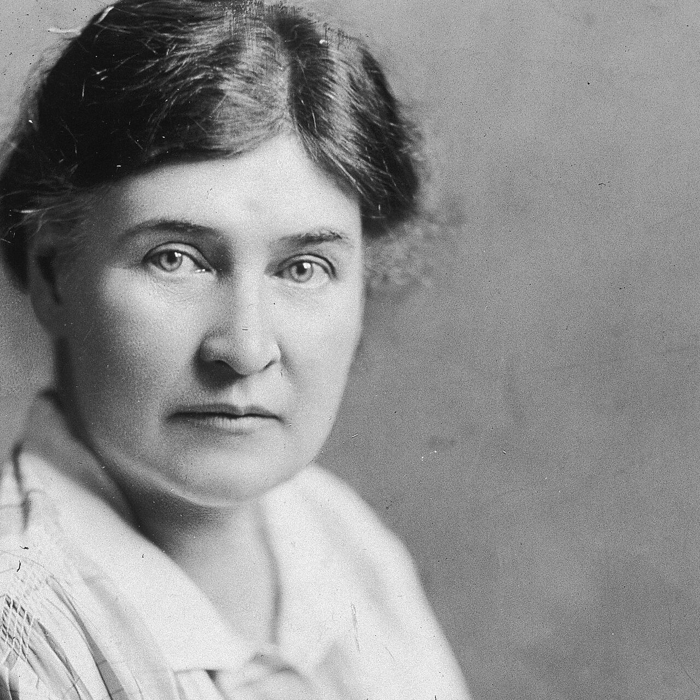
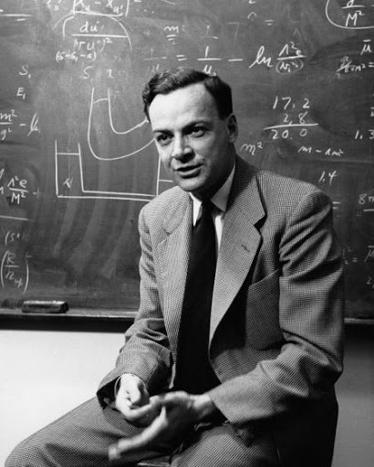
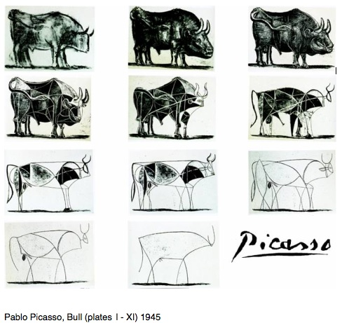
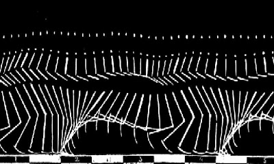

# 생각도구 3 - 추상화 (Abstracting)

  

Image by [okeykat](https://unsplash.com/@okeykat?utm_source=unsplash&utm_medium=referral&utm_content=creditCopyText) on Unsplash

### 추상이란 어떤 대상의 전체를 재현하는 것이 아니라 눈에 덜 띄는 한두 개의 특성만을 나타내는 것이다.

과학자, 화가, 시인들은 모두 복잡한 체계에서 '하나만 제외하고' 모든 변수를 제거함으로써 핵심적 의미를 발견하려고 애쓴다. **현실이란 모든 추상의 종합이며, 이 가능성을 알아냄으로써 우리는 현실을 보다 잘 이해할 수 있다.** 즉, 진정한 의미에서 추상화란 현실에서 출발하되, 불필요한 부분을 도려내가면서 사물의 놀라운 본질을 드러나게 하는 과정이라고 할 수 있다. 그러므로 우리가 궁극적으로 할 일은 추상화 자체의 본질을 찾아내는 것이다.

## 피카소는 눈이 아니라 마음으로 본 것을 그렸다

오렌지 한 개를 온갖 방법으로 `추상화`해보라. 그런 다음 사람을 `추상화`해보라. 다시 다른 사물들을 가능한 한 많이 `추상화`해보라. 할 만큼 했다는 생각이 들면 다시 돌아오라.

이 연습을 통해 대부분의 사람이 그려낸 것은 흔하고 진부한 시각적 추상들이었다. 오렌지를 오렌지색이 칠해진 원으로 표현하거나, 사람을 추상화할 경우 막대기 모양이나 몸은 없으면서도 행복한 표정을 짓고 있는 머리로 표현한다.

(중략) 오렌지와 사람의 촉감, 냄새, 동작, 소리 등을 추상화한 사람은 별로 없다. 어느 누구도 드로잉이 아닌 음악이나 춤, 말, 혹은 숫자로 추상화를 하겠다는 생각을 하지 않는다. 이 모든 의사전달매체들이 추상을 표현하는 데 사용될 수 있음에도 불구하고 막상 추상화 과정에서는 배제된다. 추상화 과정은 일반인들이 잘 인식하지 못하고 있을 뿐 아니라 제대로 이해하지도 않고 있는 것이 분명하다.

 

---

 

  
  
<화가와 모델>, 파블로 피카소 作, 1932

피카소는 무얼 그리고 있는걸까?

 

  

> 당신들은 보고 있지만 보고 있는 게 아니다. 그저 보지만 말고 생각하라! 표면적인 것 배후에 숨어 있는 놀라운 속성을 찾으라! 눈이 아니고 마음으로 보라!
>
>  - 화가, 파블로 피카소 (Pablo Ruiz Picasso)

 

---

 

  
  
물리학자 윌슨이 찍은 구름상자 안의 소립자 궤적, 1970

 

  

> 추상화는 한 가지 관점 아래 어떤 대상이나 대상 집단을 놓아 두고 그 대상이 가진 다른 모든 속성을 무시하는 것이며, 추상의 본질은 다른 속성에 비추어 특히 중요하다고 생각되는 한 가지 특징만 잡아내는 데 있다.
>
>  - 독일 물리학자, 베르너 하이젠베르크 (Werner Karl Heisenberg)

 

---

 

  

커밍스가 나타내고 있는 것은 무엇인가?

## 추상화는 곧 단순화이다

  

> 위대한 과학자가 되기 위해 필요한 것을 말해본다면, 우선 매우 복잡한 것들을 이해하는 능력은 필요없다는 것이다. 오히려 그 반대다. **가장 복잡한 것처럼 보이는 무엇을 간파해서 한순간에 그 저변에 깔려 있는 단순성을 파악해내는 능력**이 필요하다.
>
>  - 미국 소설가이자 물리학자, 미첼 윌슨 (Mitchell Wilson)

수학은 오로지 추상의 장(場)이다. 수의 개념은 언제, 어디서, 무엇에나 적용이 가능한 추상의 진수다. 우리는 수를 현실세계와는 별도의 장에서 다룰 수 있다. '무, nothing' 그 자체는 하나의 추상인 '영, zero'이며, 실재하지 않는 것인 동시에 모든 수의 기반이 된다.

 

---

 

  

> 수학은 모든 종류의 추상적 개념을 다루기에 특히 적합한 도구다. 수학의 세계에는 어떠한 제한도 없다.
>
>  - 이론 물리학자, 폴 디랙 (Paul Dirac)

 

---

 

말 역시 추상을 빌어 발설된다. 수많은 단어들, 예를 들어 사랑, 진실, 명예, 의무 등은 대단히 복잡한 개념들을 나타내고 있다. 작가는 세상에 존재하는 방대한 텍스트에서 이런저런 단어를 추출(추상)하여 서술문장으로 만들어낸다. 그러나 문학에서의 '추상'이란 그 이상의 깊이가 있다.

  

> 문학이 하는 일은 개체가 아닌 종(種)을 들여다보는 것이며, 전체를 포괄하는 속성과 주된 형상에 주목하는 것이다. 이 과정에서 작가는 한 종을 특징짓는 데 영향을 주지 못하는 미미한 차이는 무시해야 한다.
>
>  - 영국 작가, 새뮤얼 존슨 (Samuel Johnson)

 

  

> 예술작업의 보다 높은 단계는 단순화다. 그것은 실로 고급 예술 작업의 전부라고 해도 무방하다. 없어도 되는 관습적 형식과 무의미한 세부를 골라내고 전체를 대표하는 정신만을 보존하는 일이다.
>
>  - 소설가, 윌라 케이터 (Willa Cather)

 

---

 

우리는 휘파람을 불 때 곡의 일부를 발췌하는 식으로 관현악 대작이나 팝 음악을 추상화한다. 우리는 막 읽은 책을 누군가에게 요약해서 말해주면서 추상화를 한다. 또한 보고 싶은 TV 프로그램을 선택할 때도 TV 가이드나 신문에 실린 한 줄짜리 안내기사를 보고 고르는데, 이것 역시 추상이라 할 수 있다. 우리는 신문이나 잡지의 헤드라인을 보고서 그 기사를 읽을지 말지를 결정하는 식으로 추상에 의존한다. 학생들 역시 셰익스피어의 고전희곡 원본보다 요약본을 더 자주 찾는다.

추상화는 다른 모든 분야의 사람들에게 어려운 일이다. 마크 트웨인이나 어니스트 헤밍웨이를 비롯한 많은 작가들은 편집자에게 원고가 지나치게 길어져서 유감이라는 편지를 썼다. 그들은 한결같이 시간이 좀더 있었더라면 길이가 절반으로 줄어들었을 것이라고 말하고 있다.

윈스턴 처칠은 **5분짜리 얘깃거리를 가지고 하루종일 떠들 수는 있지만, 말할 시간이 5분밖에 주어지지 않는다면 그걸 위해서 하룻동안 꼬박 준비해야 한다**고 했다.

이처럼 **글쓰기의 본질은** 종이 위에 단어를 늘어놓는 것이 아니라 **불필요한 것들을 골라내고 버리는 데 있다.** 교사들은 막 배우기 시작한 아이들을 가르치는 것이 어느 정도 배움이 진척된 아이들을 가르치는 것보다 훨씬 어렵다고 한다. 이유는 그 아이들이 기본적으로 알아야 할 것들을 단순화시켜 가르치기 힘들기 때문이다.

 

---

 

  

> 더 큰 일반성을 향해 한 걸음 내딛는 것은 추상성 속으로 한 걸음 내딛는 것이다.
>
> 추상화가 고도화될수록 일반화의 영역은 더 확대된다.
>
>  - 물리학자, 베르너 하이젠베르크

 

  

> 현상은 복잡하다. 법칙은 단순하다. 버릴 게 무엇인지 알아내라.
>
>  - 물리학자, 리처드 파인만 (Richard Feynman)

## 추상화의 본질은 한 가지 특징만 잡아내는 것

대다수 사람들이 저지르는 실수는 현실을 무시하면서 추상화를 시작한다는 것이다. **대상을 관찰하는 것은 어떤 예술가에게든 가장 우선적으로 해야 하는 중요한 일이다.**

  

> 추상에 도달하기 위해서는 항상 구체적인 실재로부터 시작해야 한다. 뭔가 실체가 있는 것에서 출발해야만 나중에 실재의 흔적들을 제거해나갈 수 있다. 그리고 그런다 해도 큰 위험은 없다. 왜냐하면 그 오브제가 표방하는 이념은 아무리 지운다 해도 지워지지 않는 표시를 남길 테니까. 어쨌든 현실이야말로 화가가 그림을 시작하게 되는, 마음이 흥분되고 감정이 동요되는 출발점이 된다.
>
>  - 파블로 피카소

 

  
  
황소(1-11), 파블로 피카소 作, 1945

 

---

 

'추상화'는 다양하게 활용할 수 있는 생각의 도구다. 어떤 대상이나 이념의 다른 측면들을 드러내는 추상화의 방법은 헤아릴 수 없이 많다. **추상화의 결과물은 대체로 관찰과 단순화의 대상이 되는 사물의 특징에 많이 의존하게 된다.** (중략) 현실이란 모든 가능한 추상의 총체이며, 이 가능성을 알아냄으로써 우리는 현실을 보다 잘 이해할 수 있다.

## 움직임도 추상화될 수 있다

  
  
<계단을 내려오는 누드 2>, 마르셀 뒤샹, 1912

 

  
  
프랑스 생리학자 마레가 찍은 사람의 동작에 대한 연속사진

## 분야 간 경계는 추상화를 통해 사라진다

과학자, 화가, 시인들은 모두 복잡한 체계에서 '하나만 제외하고' 모든 변수를 제거함으로써 의미를 발견하려고 애쓴다. 과학에서 실험이란 예술에서의 새로운 시도에 해당하는 것으로서 가장 중요한 것을 추려내기 위한 양식화된 과정이다. **이 과정은 보편적이기 때문에 어느 한 분야에서 추상화 방법을 배우는 것은 다른 모든 분야에서 추상을 이해하는 열쇠가 된다.**

  

> 저는 열여섯 번이나 고쳐씁니다.
>
>  - 독일 생화학자이자 노벨 생리의학상 수상자, 오토 바르부르크 (Otto Warburg)

 

---

 

산티아고 라몬 이 카할은 과학적 관찰과 미술 사이의 경계선이 추상을 거치면서 사라진다는 것을 보여주었다. 신경해부학자였지만 미술에도 재능을 보였던 그는 십대 시절에는 회화를 공부했고 20세기 초에는 처음으로 스페인에서 컬러사진을 찍었다. 그는 자신이 연구한 뇌의 해부도를 직접 그렸다. (중략) 그는 뇌와 척수부위의 실물을 준비하거나 관찰하면서 오전을 보냈고 점심식사 후에야 기억하고 있는 것을 그리곤 했다.

그 후 그는 **그림과 실물을 비교했다.** 거기서 나타나는 **차이점을 분석하고 다시 그렸다.** **이 과정을 여러 차례 반복했다.** 그가 기억에 의지해 그린 **그림이 실물에서 보았던 본질을 포착했다고 생각했을 때**가 되어서야 작업은 비로소 끝이 났다.

그렇기 때문에 그의 그림은 뇌의 특정 부위를 묘사한 것이 아니라 어떤 개체의 뇌를 채집해 절개하더라도 나타나는 보편적인 모습을 보여주고 있다. 저마다 특성 있는 개별 뇌라는 구체적 현실 저변에서 '해부라는 추상적인 현실'을 표현한 것이다.

  
  
<눈의 망막세포>, 라몬 이 카할, 1904

 

---

 

**추상화는 현실에서 출발하지만, 불필요한 부분을 도려내가며 본질을 드러나게 하는 과정이다.** 추상화는 화가도, 작가도, 과학자도, 수학자도, 무용수도 모두 한다. 그리고 그 방법은 기본적으로 동일하다.

우리도 모두 추상화를 할 수 있다.

(중략)

1. 먼저 주제에 대해 현실적으로 생각하라.
2. 그것의 다양한 특성과 특징을 두루 생각하라.
3. 그 중 가장 본질적이라고 생각되는 것을 잡아라.
4. 마지막으로 시간이나 공간의 거리를 두고, 추상의 결과로 나타날 수 있는 것을 생각하라.

추상화를 시작하기에 너무 이른 때도 없고 너무 늦은 때도 없다. 초등학생들은 자신의 방에서, 혹은 듣고 읽은 이야기에서, 또는 하루일과 중에서 가장 중요한 것이 무엇인지를 한 가지 찾아내어 표현하는 것을 배울 수 있다.
