# 생각도구 5 - 패턴형성 (Forming Patterns)

  

Image by [Meriç Dağlı](https://unsplash.com/@meric?utm_source=unsplash&utm_medium=referral&utm_content=creditCopyText) on Unsplash

**우리는 경험한 세계를 표현하고, 경계 짓고, 정의하기 위해 더 많은 패턴을 고안해낼수록 더 많은 실제 지식을 소유할 수 있다. 이에 따라 우리의 이해도 더욱 풍요로워진다.** 패턴형성기술을 배우는 것은 모든 분야와 교과과정에서 혁신의 열쇠가 되는데, 그것은 특별한 도구나 다른 사람의 도움 없이도 운동감각적 패턴과 청각적 패턴, 리듬감만을 이용해서 훈련할 수 있다. 한 패턴을 분해하면서 동시에 다른 패턴을 조립하는 일은 어떤 현상과 과정을 이루는 기본 요소들에 대해 실제적으로 이해할 것을 요구한다. 더 나아가 그것은 지식의 새로운 세상을 열어 보인다.

 

---

 

  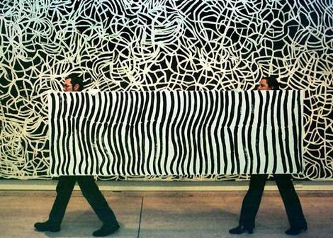
  

  오스트레일리아 시드니의 한 미술관에서 큐레이터들이 크느그와레예의 그림(수직선)을 옮기고 있다.
  벽면에 있는 그림(거미줄) 또한 크느그와레예의 그림이다.
  
  

 

---

 

패턴을 만들어낸다는 것은 둘 이상의 구조적 요소나 기능적 작용을 결합하는 것일 뿐이다. **일관적인 기법으로 하나의 요소나 작용을 다른 것과 병치하는 것은 둘을 단순히 합치는 것 이상의, 그것과는 전적으로 다른 종합적 패턴을 만들어낸다.**

예를 들어보자. 그래프용지가 없을 때 우리는 자와 연필만 가지고 패턴을 만들어내야 한다. 우리는 직선을 하나 긋고 이것을 1/4인치 간격으로 '반복'해 나란히 그어 하나의 패턴을 만들어낸다. 스웨터를 짜는 경우에는 훨씬 복잡한 패턴을 직조해낼 수 있다. 안뜨기와 겉뜨기 두 종류의 뜨개질 법을 결합하면 수천 가지의 패턴을 만들 수 있다. 또 두 번 안뜨기와 두 번 겉뜨기를 교대로 하면 골을 만들 수 있고 한 번씩 교대로 짜면 그냥 밋밋한 편물이 나온다.

 

---

 

  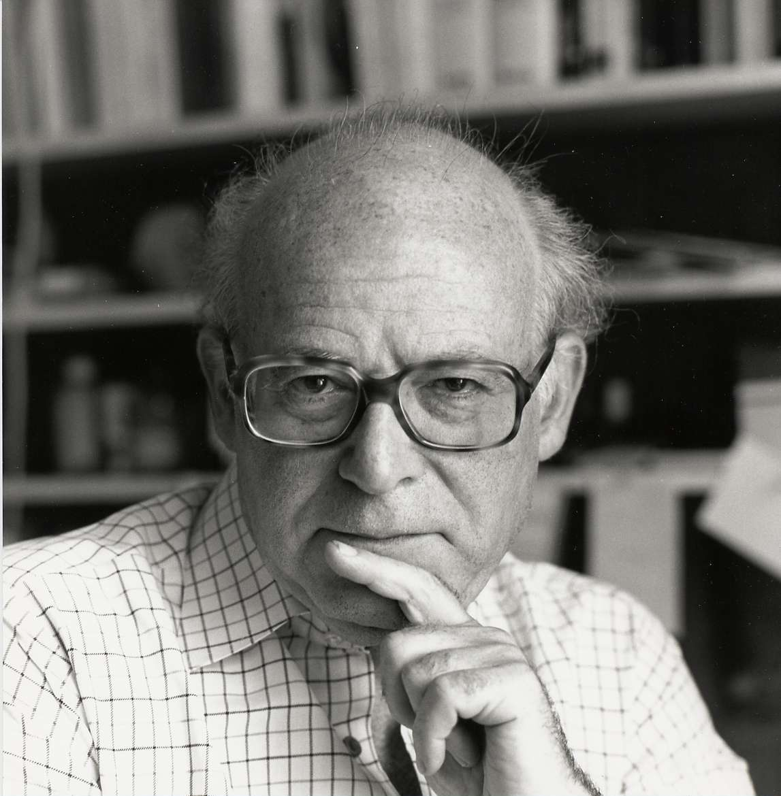

음악학자인 심하 아롬(Simha Arom)은 아프리카 음악의 리듬을 이해하는 데 있어 중요한 단서를 제공하고 있다. 그는 중앙아프리카의 다(多) 리듬 음악을 기록한 수백 편의 오디오 및 영상기록을 면밀하게 분석한 결과 의외로 간단한 원칙 하나를 찾아냈다. 아프리카 음악에는 박(beats)의 일정한 패턴이 반복되는데, 그 주기가 엄격하게 지켜지고 있다는 것이다. 대부분의 음악에서 이 원칙이 지켜지고 있었다. **각 연주자들은 계속 반복되는 일련의 박이나 음을 한 가지만, 그것도 아주 제한적으로 숙지했다.**

 

---

 

바흐가 음악에서 채용한 '자리바꿈'류는 한 체계를 이루는 요소들의 모든 가능한 조합을 찾는, '순열조합론, combinatorics'이라는 보다 폭넓은 수학 개념과 관련이 있다. 이를테면 동일한 요소 두 개를 조합하는 방식은 한 가지밖에 없다. 그러나 두 개의 다른 요소를 조합하는 방식은 네 가지가 되며, 세 개의 다른 요소라면 무려 스물일곱 가지의 조합방식이 가능하다. 그래서 작곡가 다리우스 미요는 이와 같은 순열조합론을 이용해서 복수의 조를 동시에 구사하는 다조(多調) 음악을 연구했다.

  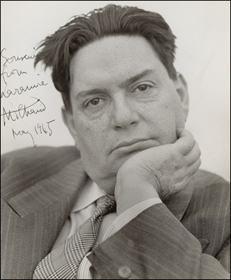

> 나는 중첩되는 두 개의 조로 할 수 있는 가능한 모든 조합과 그 결과로 나타날 수 있는 화음을 연구하기 시작했다. 또한 그것들의 자리바꿈 효과에 대해서도 생각을 했다. 나는 이 화음들을 이루는 조성의 음계에 변화를 가함으로써 내가 상상할 수 있는 모든 변경(permutation)을 시도했다. 나는 이런 작업을 세 개의 조를 가지고 해보기도 했다.
>
>  \- 작곡가, 다리우스 미요 (Darius Milhaud)

 

---

 

단순한 패턴들을 병치시킴으로써 과학에서도 흥미로운 패턴을 만들어볼 수 있다. 물론 패턴들을 미술이나 과학에만 배타적으로 속한 것으로 범주화하기란 불가능하다. 예를 들어 모아레 패턴은 본디 중국에서 수세기 전에 처음 만들어진 '물결무늬 비단'과 관련이 있다. 이 직물은 바탕천에 각도를 약간 달리해서 다른 천을 덧입힌 다음 강한 압력으로 다림질하거나 무늬가 구겨진 굴대를 천 위로 굴려 만든 것이다.

  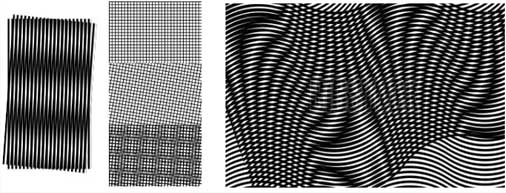

모아레 패턴에서 가장 중요한 것은 제럴드 오스터(Gerald Oster)와 니시지마 야스노리(Nishijima Yasunori)가 <사이언티픽 아메리칸, Scientific American>에 발표한 논문에서 주장한 내용이다. 이 논문에서 말하기를

> 모아레 패턴은 두 주기 함수의 간섭에 대한 수학적인 해결책으로 간주될 수 있다. 그러므로 모아레 테크닉은 일종의 아날로그 컴퓨터로 사용될 수 있다.

그것은 컴퓨터가 숫자 없이 바로 이미지를 더하는 것만으로 '계산'할 수 있는 것을 의미한다. 만일 각각의 그리드가 하나의 수학적 함수를 나타내고 있다면 여러 그리드가 교차하는 점들은 복합적인 함수 문제에 대한 해법이 될 수 있다.

 

---

 

1820년대 초, 신시사이저(synthesizer)나 전자장비가 사용되기 훨씬 전이던 당시 조지프 푸리에(Joseph Fourier)는 이 복잡한 파장이 소리를 나타내는 것인지 전기나 열을 나타내는 것인지, 아니면 다른 물리적 동인(動因)이나 과정을 나타내는 것인지 설명하고자 했다. 복잡한 아프리카 부족 음악을 설명하려고 했던 음악학자들이 그랬듯이 대부분의 수학자들 역시 이 문제에서 난관에 봉착했다. 그러나 심하 아롬이 부족 음악이 **단순하고 반복적인 패턴들을 병치**하는 데 근거하고 있다는 사실을 발견했듯이, 푸리에 역시 **제 아무리 복잡한 파동 함수라 하더라도 보다 단순한 함수들의 결합으로 발생한다는 것을, 혹은 그것으로 설명될 수 있다는 것을 알아냈다.**

 

  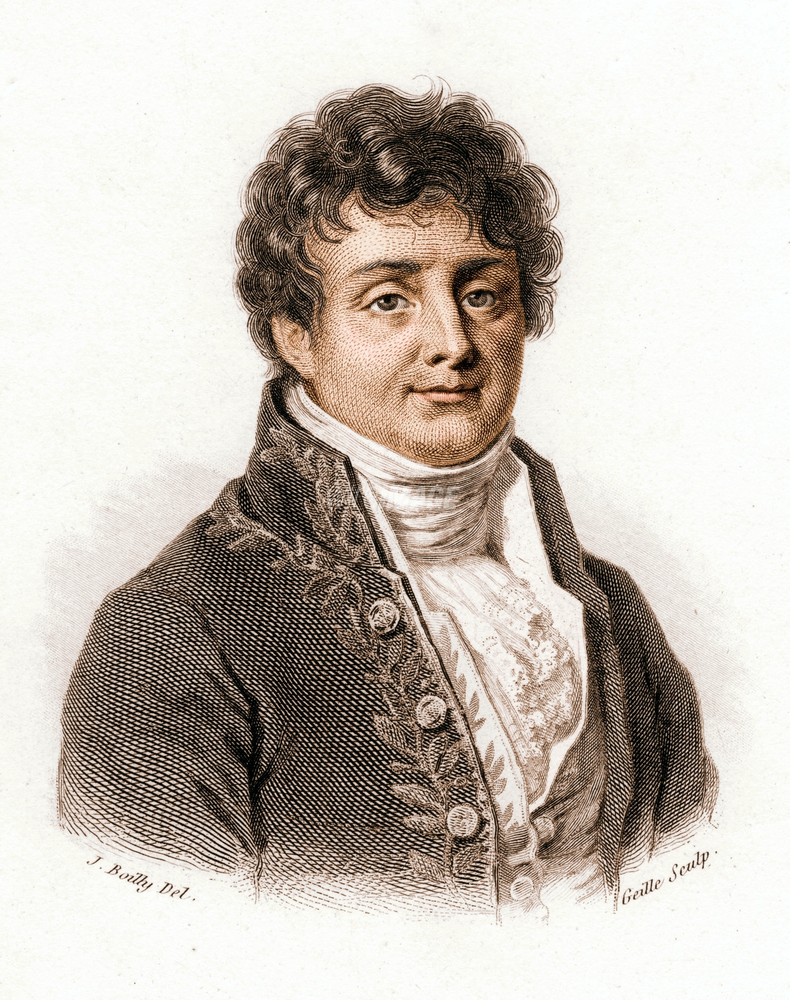

 

  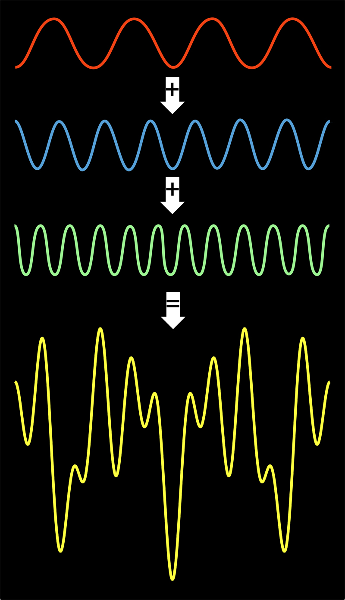

푸리에가 이룩한 성과를 이해하기 위해서는 발상의 전환이 필요하다. 교향악단의 연주를 전달하는 전류를 분석하지 말고 그 전류를 '통합'하려는 시도를 상상해야 한다는 것이다.

 

---

 

  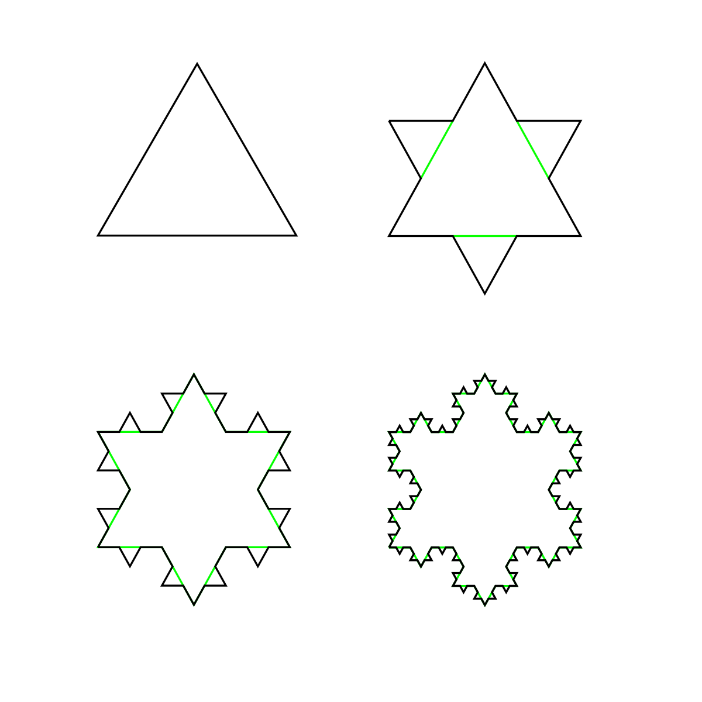

코흐 곡선은 유한한 면적과 무한한 둘레라는 놀랍고도 기이한 특성을 갖고 있다. 이 작업을 거꾸로 해도 똑같이 신기한 결과가 나타난다.

  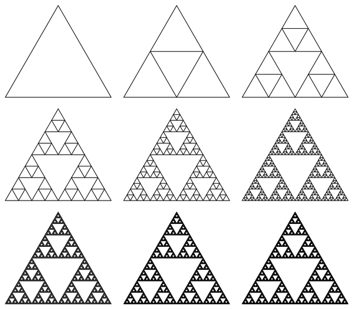

시어핀스키 삼각형의 특성은 코흐 곡선과 정반대다. 이 경우 둘레는 코흐 곡선과 마찬가지로 무한하지만 면적은 존재하지 않는다.

코흐 곡선이나 시어핀스키 삼각형은 프랙털(fractals)이라고 부르는 커다란 수학의 영역이다. (중략) 프랙탈은 극단적으로 기묘한 특질을 가지고 있다. 하나는 면적과 둘레 사이에 나타나는 의외의 관계이고, 다른 하나는 프랙탈에서의 패턴이 크기와 관계없이 정확히 똑같다는 것이다. 가장 작은 것의 구조도 전체 프랙탈의 그것과 동일하다.

재미있는 것은 물리학자와 화가 모두 프랙털 이미지가 산이나 구름처럼 다양한 사물의 구조를 이해하거나 그것을 컴퓨터로 생성해보는 일에 도움이 된다는 것을 알게 되었다는 점이다. 식물학자들은 나무의 구조 안에서 프랙털을 발견하고, 생리학자들은 폐기관지에서 그것을 찾아냈으며, 몇몇 음악가들은 프랙탈 음악이란 것을 작곡하여 음악 속에서 프랙탈을 실험하기 시작했다.

다시 한번 말하자면 **가장 단순한 작업의 결과로 엄청난 복잡성과 의외의 경이로움을 찾을 수 있다.**

 

---

 

  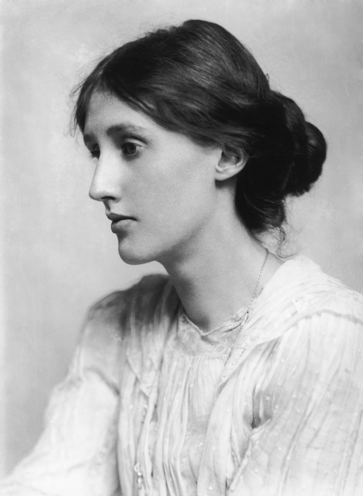

> 따로 떨어져 있는 어떤 것들을 결합하고 있다는 것을 강하게 느꼈으며... 쓰면서 나는 내가, 무엇이 무엇에 속하고 있는지를 발견하고 있는 것처럼 느꼈다. 이런 느낌으로부터 나는 철학이라고 부를 만한 개념에 도달할 수 있었다. 어쨌든 그것은 내가 소유하게 된 항구적인 관념이 되었다. 무의식적으로 영위하는 일상사에서도 어떤 패턴이 숨겨져 있다는 것 말이다.
>
>  \- 영국 작가, 버지니아 울프 (Adeline Virginia Woolf)

 

---

 

  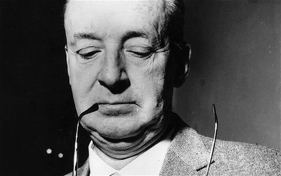

> 글쓰기란 맥락이 끊어진 조각 글들로 조화로운 패턴을 만들어내는 기술이다.
>
>  \- 소설가, 블라디미르 나보코프 (Vladimir Nabokov)

## 가장 단순한 요소들의 결합이 복잡한 것을 생성한다

1960년대 후반, 피아니스트이자 작곡가인 글렌 굴드(Glenn Gould)는 실제로 대화체 음악(conversational music)을 만들었다. 당시 그는 라디오 프로그램 <북부의 생각, The Idea of North>에서 목소리만으로 이루어진 '트리오 소나타'를 시도했다. 처음에 청취자가 듣게 되는 것은 캐나다 북부에 사는 여성이 외로움을 호소하는 소리다. 약 30초 후 이 소리를 덮으며 남성의 목소리가 끼어든다. 역시 같은 주제를 말하고는 있으나 사용하는 단어나 말하는 속도는 다르다. 그리고 곧 다른 남성의 목소리가 이 둘의 소리에 합류하게 되고, 3명이 동시에 이야기하기 시작한다.

그 결과 대화라고 하기엔 다소 불분명하고, 그냥 소리라고 하기엔 뭔가 더 있는 것 같은 효과가 나타난다. 이것은 음표나 멜로디 없이 이루어진 대위법 음악이며 '말에 의한' 것이 아닌 '말 속에서' 이루어지는 의사소통(communication)이다.

처음부터 2분 정도까지 들어보면 여성 목소리를 시작으로 남성 목소리가 한 명 그리고 한 명 추가되는 것을 들을 수 있다.

[Youtube Link](https://youtu.be/TwIbUdbVqQE)

 

---

 

  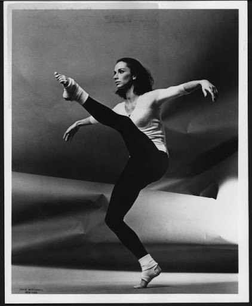

> **춤이 예술이라기보다는 퍼즐처럼 인식되었다. 그 조각 하나하나는 공간과 시간, 형태와 리듬이었다.**
>
>  \- 안무가, 머스 커닝햄의 제자, 캐롤린 브라운 (Carolyn Brown)

 

  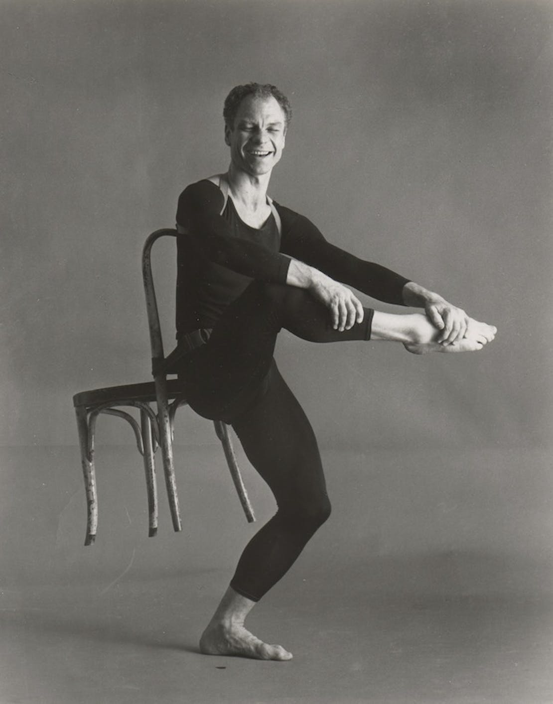

> 관객들은 이런 동작들이 전에 시도되지 않았던 방식으로 해체될 때 어떤 일이 일어날지 보게 될 것입니다. 그리고 그것이 새로운 형식으로 조합될 때 어떤 경이를 품고 있는지도 알게 될 거고요.
>
>  \- 안무가, 머스 커닝햄(Merce Cunningham)

 

  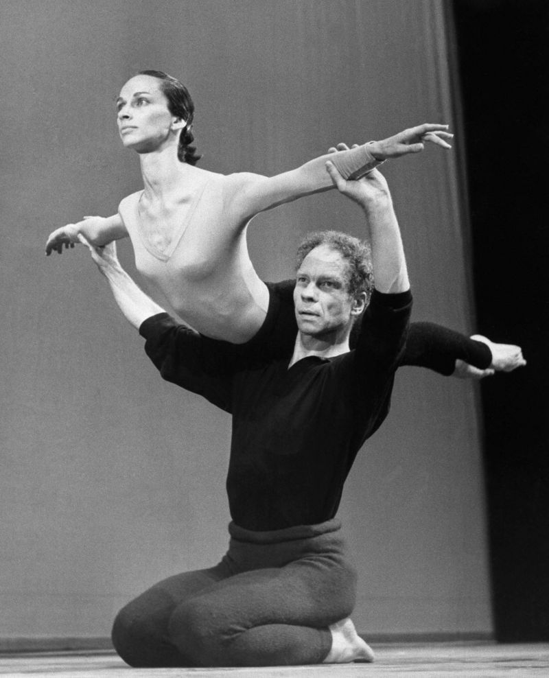

 

---

 

**단순한 요소들이 결합해서 복잡한 것을 만들어낸다는 것은 패턴 형성에 나타나는 보편적인 특징이다.** 우리가 보고 있는 모든 색깔들은 빨강, 파랑, 연초록, 혹은 빨강, 파랑, 노랑이 일정하게 혼합된 것이다. 오직 4개의 핵산 염기만으로 지구상의 전 생명체의 모든 유전자 정보가 암호화된다. 자연 상태에서 파악된 모든 단백질은 20개 아미노산의 '알파벳'으로 이루어져 있다. 우주 안에 있는 수억 개의 화학물질은 불과 100개 미만의 요소들이 결합되어 만들어진 것이다. 가장 놀라운 것은 모든 언어가 두 개의 기호(모스부호의 점과 선)로 옮겨질 수 있다는 사실과 실제로 모든 정보가 0과 1로 변환되어 컴퓨터에 입력될 수 있다는 사실이다.

**패턴 형성에서 인상적인 것은 결합되는 요소들의 복잡성이 아니라 그 결합방식과 교묘함과 의외성이다.**

 

---

 

예술분야의 패턴형성에 나타나는 교묘함, 의외성, 심지어는 다양성까지 과학분야에서 그대로 나타난다. 이 주장이 왜 중요한지는 다음의 말에서도 알 수 있다.

> 열 명의 화가에게 어떤 풍경을 그려보라고 하면 열 개의 다른 그림이 그려진다. 그러나 만일 열 명의 과학자에게 같은 문제를 내주고 풀라고 하면, 제대로 풀었을 경우 열 개의 동일한 답이 나온다.

실제로 창의적인 과학자는 화가와 마찬가지로 자주 다른 풀이 경로와 해법을 채택하곤 한다. 피타고라스 정리를 증명하는 방법만 해도 300가지가 넘는다. 그리고 각각의 방법은 형식과 내용 면에서 서로 구별된다. 최종적인 답은 아마 같을 것이다. 그러나 이것은 열 명의 화가가 각기 다른 스타일로 나무를 그리는 것과 같은 이야기다.

 

---

 

### 더 많은 패턴을 발명해낼수록 우리는 더 많은 실제 지식을 소유하게 될 것이고 우리의 이해는 더욱 풍요로워질 것이다.

 

---

 

패턴 창조기술을 배우는 것은 모든 분야와 교과과정에서 혁신의 열쇠가 된다. 그렇기 때문에 이 기술을 좀 더 일찍 배우는 편이 좋을 것이다. 처음에는 다른 도구의 도움을 받지 않고 운동감각적 패턴과 청각적 패턴, 리듬감만을 이용해서 해볼 수 있다. 어쩌면 한 번쯤 한 손으로는 배를 둥글게 문지르면서 다른 손으로는 머리를 두드리는 동작을 해본 적이 있을 것이다. (중략) 배를 한번 문지르는 동안 머리를 세 번 두드려보라. 만일 여기에 어느 정도 익숙해지고 나면 두 번 문지르는 동안 세 번 두드리기에 도전해본다. 다시 네 번 문지르면서 세 번 두드리기를 시도해본다. 이게 쉬울 거라는 생각은 하지 말기를!

 

---

 

육체를 통해 복잡한 패턴을 표현하는 것이 어려운 사람들은 그림으로 하는 것이 더 쉬울 수도 있다. 르네 파롤라(Rene Parola)가 저술한 <광학 예술: 이론과 실천, Optical Art: Theory and Practice>에서는 규칙적이거나 불규칙적인 패턴을 디자인하는 데 필요한 좋은 본보기와 지침을 아주 폭넓게 제공하고 있다. 파롤라의 책은 해당 예술의 역사와 그 이면의 과학사까지도 다루고 있다.

  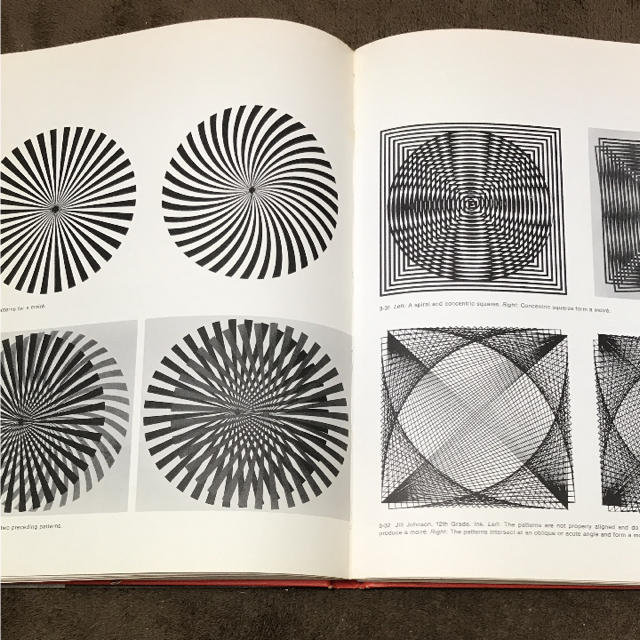
  

  <광학 예술: 이론과 실천, Optical Art: Theory and Practice> 中
  
  

조합적이고 시각적인 패턴을 만드는 능력은 탱그램(Tangram) 같은 퍼즐놀이를 통해서도 증진될 수 있다. 탱그램은 네모판을 다섯 개의 삼각형과 한 개의 사각형, 한 개의 마름모로 잘라놓은 것이다. 이 조각들을 배열하는 방법의 수는 무한하다. 집, 동물, 사람 등 우리가 상상할 수 있는 모든 모양을 만들어낼 수 있다. 특히 우리가 지금까지 말해온 논점과 관계가 있는 것은 탱그램 문제에 대한 답이 여러 개가 나올 수 있다는 점이다.

  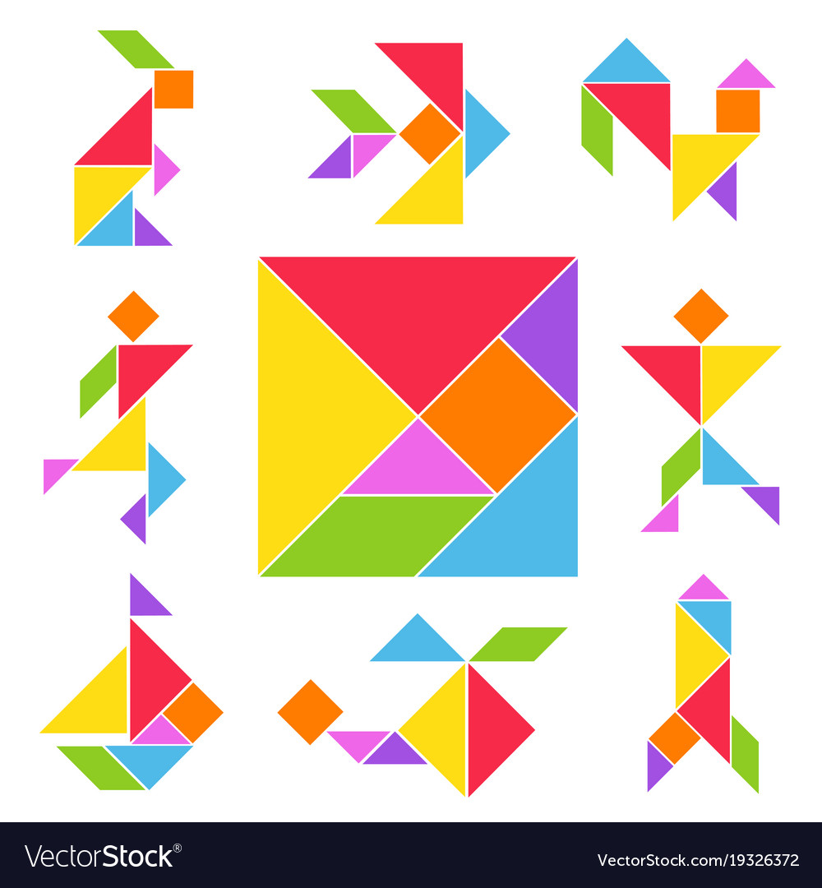
  

  탱그램(Tangram)
  

단순함 속의 다양성은 공학에서도 나타난다. 모든 복잡한 기계들은 레버, 바퀴, 나사, 톱니 등 단순한 기계들로 조립된 것이다. 발명은 이런 부품들을 새로운 방법으로 조립하는 과정이다. 말하자면 그 **부품들을 가지고** **새로운 패턴을 고안해내는 것이다.**

물리학과 컴퓨터과학의 권위자인 MIT 미디어연구소의 미첼 레스닉(Mitchel Resnick)은 레고사와 공동으로 마인드스톰(Mindstorms)을 개발했다. 이것은 컴퓨터로 조종되는 모터와 기존의 레고 블록을 합쳐 놓은 것이다.

  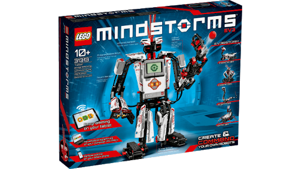
  

  마인드스톰(MindStorms)
  

다른 조립용 장난감들도 유사한 철학에 근거하고 있다. 예를 들어 주브(Zoobs)는 단지 5개의 기본 조립 단위만 가지고 있다. 이 장난감을 고안한 마이클 그레이(Michael Grey)는 화가인 동시에 유전학자이기도 한데, 그는 이 조립 단위를 DNA의 구성단위에 비유한다.

> 주브는 어떤 언어나 알파벳에도 견줄 만하다. 그것을 가지고 무엇이든지 조립해낼 수 있다. 심지어 DNA 모델도 가능하다.

  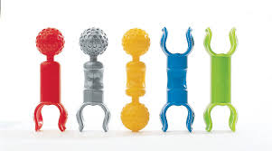
  

  주브(Zoobs)
  

  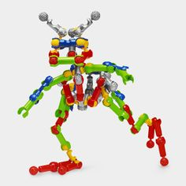
  

  주브(Zoobs)
  

케이넥스 역시 부품 수는 제한되어 있는데, 이 장난감을 발명한 화가이자 사업가인 조엘 글릭맨(Joel Glickman)은 그것을 "3차원 크레용"이라고 부른다. 3차원 속에서 그리지 못할 것은 없다.

  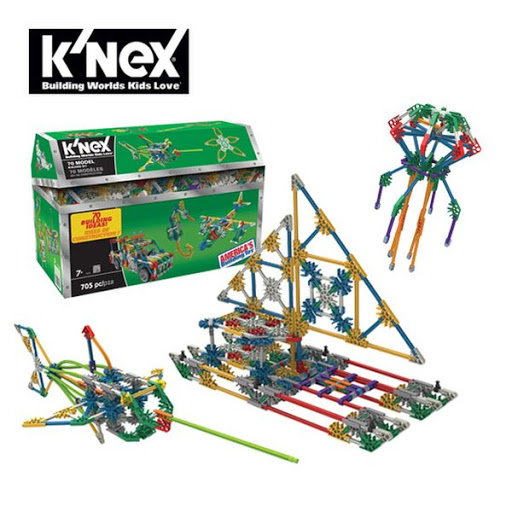
  

  케이넥스(KNEX)
  

이 장난감들의 사례로부터 두 가지 배울 점을 찾아낼 수 있다.

첫째, 장난감 발명자들은 미술과 과학분야에서 폭넓게 공부했던 사람들이고 자신들이 공부한 결과를 발명에 활용했다는 점이다. 이 사실이 의미하는 것은 **패턴 형성이 모든 학문분야의 경계를 넘나 든다는 점이다.**

둘째, 이 장난감으로 패턴을 만들어내는 일은 시각예술이나 컴퓨터 프로그래밍 등과 마찬가지로, 그 결과물의 복잡성이 부속이나 요소 자체의 복잡성에서 기인하는 것이 아니라는 점이다. 그토록 다양하고 경이로운 결과를 생성해내는 것은 **단순한 부속을 다루는 솜씨와 '교묘함'에 있다는 것이다.**

 

---

 

우리는 위의 교훈이 항상 한 개의 정답만을 요구하는 과학분야에도 적용되기를 바란다. 화학을 공부하는 학생들에게 주기표를 가르치는 효과적인 방법은 다른 누군가가 만들어낸 구조를 단순 암기하도록 하지 말고 자신들만의 주기표를 고안하게 만들라는 것이다. 이와 마찬가지로 기하학을 공부하는 학생들은 자신들만의 고유한 정리 증명법을 찾아내야 할 것이다. 교사가 선호하는 방법이나 책에 나와 있는 것들을 따라가기만 하는 태도는 바람직하지 않다.

실제로 과학사나 과학 논쟁사를 공부하다 보면 많은 과학자들이 자신의 깨달음을 표현하기 위해 여러 가지 방법을 시도했음을 알 수 있다. 이는 표준교과서에서 획일화된 공식을 가르쳐 과학분야에서의 자유로운 사고를 화석화하기 전의 일이다. 혼자 힘으로 어떤 패턴을 만들어본다는 것은 암기하는 것보다 훨씬 재미있고 가치 있는 일이다. **한 패턴을 분해하면서 동시에 다른 패턴을 조립하는 일은 어떤 현상과 과정을 이루는 기본 요소들에 대한 실질적인 이해를 요구한다.**

 

### 더 나아가 그것은 지식의 새로운 세상을 우리 눈앞에 열어 보일 것이다.

