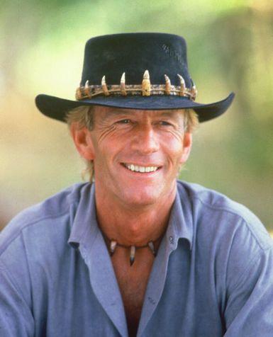

# 요약 - 생각도구 13가지

  

Image by [Glen Carrie](https://unsplash.com/@glencarrie?utm_source=unsplash&utm_medium=referral&utm_content=creditCopyText) on Unsplash

 

  

> 존재하지 않는 것을 상상할 수 없다면 새로운 것을 만들어낼 수도 없으며 자신만의 세계를 창조하지 못하면 다른 사람이 묘사한 세계에 머무를 수밖에 없다.
>    \- 화가, 폴 호건

 

사진, 드로잉, 글은 잉크나 은으로 얼룩져 있는 종이에 지나지 않는다. 이를 '실재'로 받아들일 수 있느냐는 이것들이 상징하는 **감각적, 정서적, 경험적인 느낌들을 재창조해낼 수 있는 기술**에 달려 있다. 이것들이 진실이 되려면 우리 자신의 내부에 그것들을 받아들여야만 한다.

 

> 생산적인 사고는 내적 상상과 외적 경험이 일치할 때 비로소 이루어진다.

 

역사 속에서 가장 창조적인 사람들은 실재와 환상을 결합하기 위해 13가지 생각의 도구들을 이용했다. 이 도구들은 **관찰, 형상화, 추상화, 패턴인식, 패턴 형성, 유추, 몸으로 생각하기, 감정이입, 차원적 사고, 모형 만들기, 놀이, 변형, 그리고 통합**이다.

 

---

 

과학, 철학, 문학, 역사의 분야에서 다른 사람의 생각을 자신에게 '주입'시키는 데는 뛰어난 그들이라도 미술이건 기계건 **실제로 무엇인가를 행하는 능력은 절대적으로 부족했다. 그들에게는 취미가 없다.** 그들은 손으로나 마음으로나 **무엇을 만들어내지 못했다.** 한마디로 그들은 **상상력이 부족했고 마음과 몸, 지성과 직관을 연결하는 능력이 결핍되어 있었다.**

 

> 그들은 '사실'을 습득했지만 그것의 의미는 상상해내지 못했다. '알기'와 '이해하기', 그리고 환상과 실재를 분리시킨 교육은 그들의 총명한 머리를 한쪽만 쓰게 만들었다.

 

---

 

지각심리학자인 리처드 그레고리는 '허구'를 '허위'와 동일시하는 것은 잘못이라고 말한다. 허구와 사실을 서로 맞춰보고 대조함으로써 작가들은 진실에 가까운 근사치를 얻게 된다. 그러나 궁극적인 견지에서 볼 때, **상상으로 꾸며낸 허구는 사실 이상의 것이다. 왜냐하면 창조의 과정이 개입되었기 때문이다.** 예술뿐만 아니라 과학에서도 마찬가지다.

 

루이 파스퇴르는

> 실험자가 가진 '환상'은 그의 능력에서 가장 많은 부분을 차지하고 있다.

라고 말한다.

 

아인슈타인 역시

> 창조적인 일에는 상상력이 지식보다 더 중요하다.

라고 단언한다.

 

피카소는

> 예술은 사람들이 진실을 깨닫게 만드는 거짓말

이라고 했다.

 

수많은 과학자, 예술가들과 마찬가지로 그는 상상력이 단순히 진실을 발견하게 하는 것이라고는 생각하지 않았다. 그는 상상력이 진실을 '이룬다'라고 생각했다.

우리가 감각기관을 통해 직접 받아들이는 것들, 즉 일출과 일몰, 문, 사진이나 그림, 종이 위에 휘갈겨 쓴 글씨들은 전혀 실재가 아니다. 좀 더 정확히 말하자면 **그것들 자체만 가지고서는 우리에게 실재가 될 수 없다.** 우리가 '이해'를 창출하기 위해서는 이런 것들을 '상상력'을 빌어 해석해야만 한다.

## 창조를 이끄는 13가지 생각도구

교육자나 독학자, 부모들이 맡아야 하는 일이 바로 이것이다. 실재와 환상, 이 둘을 재결합하는 일. 창조성이 뛰어난 사람들은 그들의 말과 행동을 통해 그 방법을 알려준다. 그들이 각자 발견한 것들을 한 군데로 모은 것이 이 책에서 말하는 '생각의 도구들'이다. 이 도구들은 관찰, 형상화, 추상화, 패턴인식, 패턴 형성, 유추, 몸으로 생각하기, 감정이입, 차원적 사고, 모형 만들기, 놀이, 변형, 그리고 통합이다.

세상의 관한 모든 지식은 처음에는 관찰을 통해 습득된다. 보고, 듣고, 만지고, 냄새 맡고, 맛을 보고, 몸으로 느끼는 것들 말이다. 이런 느낌과 감각을 다시 불러내거나 어떤 심상으로 만들어 머릿속에 떠올리는 능력이 바로 형상화다. 그런데 이 감각적 경험과 감각적 형상은 너무 많고 복잡하기 때문에 창조적인 사람들은 필수적인 생각도구로서 추상화를 활용한다. 복잡한 사물들을 단순한 몇 가지 원칙들로 줄여나가는 것, 이것이 바로 추상화를 일컫는다.

패턴인식은 자연의 법칙과 수학의 구조를 발견하는 일뿐만 아니라 언어와 춤, 음악의 운율을 발견하는 것이고, 그림의 경우 화가의 형식적 의도를 감지하는 일과 관련되어 있다. 패턴을 안다는 것은 새로운 것을 창조하는 첫걸음이다. 패턴 속에 들어 있는 패턴을 인식한다는 것은 곧 유추로 이어진다. 명백히 달라 보이는 두 개의 사물이 중요한 특질과 기능을 공유하고 있음을 깨닫는 일이야말로 세계에서 가장 위대한 문학과 예술작품, 불후의 과학이론, 공학적 발명을 이루어내는 일의 중심에 놓여 있는 것이다.

생각도구들은 언어와 상징 이전의 것이다. 바로 몸으로 생각하기가 정확히 그런 것인데, 생각이란 것이 먼저 감각과 근육, 힘줄과 피부를 타고 느낌으로 다가오기 때문일 것이다. 감정이입은 몸으로 생각하는 것과 긴밀하게 연결되어 있다. 많은 창조적인 사람들은 뭔가를 생각할 때 자기 자신을 잊는다고 말한다. '나'를 잊고 '그것'과 하나가 되는 것이다.

생각도구 가운데 공간적 경험에 근거하고 있는 것이 있는데 바로 다차원적으로 생각하는 것이다. 다차원적 사고란 어떤 사물을 평면으로부터 끌어내어 3차원 이상의 세계로, 지구로부터 우주로, 시간을 통과하여 심지어 다른 세계로 옮길 수도 있는 상상력을 일컫는다.

어떤 대상과 개념을 모형으로 만드는 것은 다차원적 사고, 추상화, 유추, 손재주의 결합을 요구하는 작업이다. 놀이는 또 다른 통합적인 생각도구로 몸으로 생각하기, 감정이입, 역할 연기와 모형 만들기 등의 생각도구들을 바탕으로 이루어진다. 그리고 변형은 하나의 생각도구와 다른 생각도구 사이, 그리고 생각의 도구들과 공식적인 의사전달 언어 사이에서 일어나는 변환 과정이다. 그러나 그 해결책에 대해서는 말이나 동작, 혹은 방정식을 가지고 논리적으로 표현해야 한다.

끝으로 가장 중요한 통합은 지금까지 설명한 생각도구들의 완결이라고 할 수 있다. 왜냐하면 이해한다는 것은 항상 통합적이며 많은 경험의 방식들을 결합하는 일이기 때문이다. 통합에는 두 개의 기본적인 요소가 있다. 하나는 공감각으로, 이는 동시에 복수적으로 감각하는 것을 일컫는 신경학적, 예술론적 용어이다. 어떤 소리는 색채를 유발하며 어떤 맛은 촉각이나 기억을 불러낸다. (중략) 이 작용은 앞서 설명한 변형의 경우에서처럼 순차적으로 이루어지는 것이 아니라 동시다발적으로 이루어지며 기억, 지식, 상상, 느낌 등 모든 것들이 따로따로가 아닌 전체로, 그리고 몸을 통해서 이해된다. 우리는 이것을 몸과 마음, 감각과 분별력을 이어주는 '통합적 이해(unified understanding)', 혹은 종합지(synosia)라고 부르는데 이것이야말로 생각도구를 가르치는 일의 최종 목표라고 할 수 있다.

 

---

 

우리는 이 생각도구들이 지식을 습득하는 데 중요한 역할을 한다고 주장하고 싶지는 않다. 이 도구들은 유전적인 지능을 알아내거나 특정한 뇌의 기능을 밝혀내는 일에 사용되지는 않을 것이다. 이것들은 뇌의 해부학적 구조나 신경단위체계와는 관련이 없다. 생각도구들은 글자 그대로 '도구'일 뿐이다. 실천력과 결심만 있으면 누구나 이 도구들의 사용법을 배울 수 있다. 이 생각도구들은 보조적인 것이지 다른 인지 기술을 대체하는 것은 아니다.

주방기구를 능숙하게 다룬다고 해서 요리법을 혁신시킬 수 있는 게 아니듯이 독창성은 쉽게 얻어지는 게 아니다. 그러나 그럼에도 불구하고 어떤 요리사나 '생각하는 사람'도 장비 다루는 법을 연습하지 않는다면 창조적으로 될 수 없다. 생각도구들은 창조성에 있어 필수적이다. 그리고 이 도구들은 혁신적인 결과를 염두에 두고 사용되어야 한다.

지식은 점점 더 빠르게 파편화되고 있고 진정한 이해는 점점 더 보기 드문 일이 되고 있다.

 

C. P. 스노우가 말하길

> '분리된 두 문화'들은 점점 더 수가 늘어나서 상호 소통이 되지 않고 있다.

 

우리에게 주어지는 정보는 점점 더 많지만 정작 우리는 그것을 점점 더 적게 이해하고 이용한다. 만일 사회가 '통합적 이해'에 이르는 통로를 대중에게 열어주지 않는다면 정보혁명은 쓸모없는 것이 될 뿐만 아니라 인류문명에도 커다란 위협이 될 것이다.
