# 서론 - '생각'을 다시 생각하기

  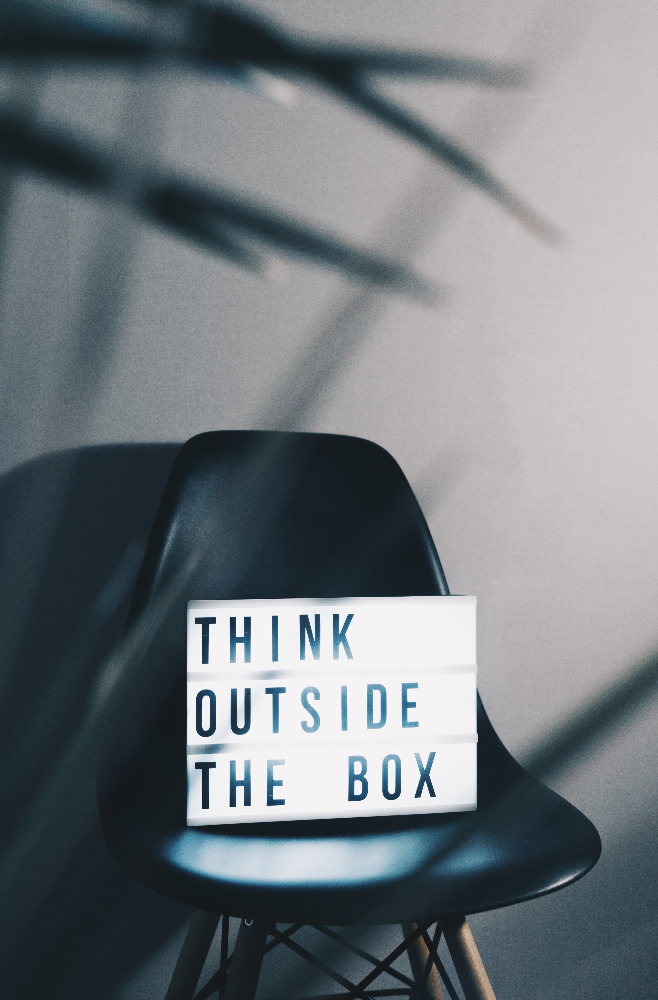

Image by [Nikita Kachanovsky](https://unsplash.com/@nkachanovskyyy?utm_source=unsplash&utm_medium=referral&utm_content=creditCopyText)

 

> 창작의 전제는 상상이지만 이 둘을 혼동해서는 안 된다. 창작이 이루어지려면 먼저 운좋은 발견이 필요할지도 모르나, 이 발견을 온전히 현실화하는 것이 창작이다. 우리가 상상하는 것은 반드시 구체적인 형태를 지녔다고 할 수 없으며 실체를 가진다고도 볼 수 없다. 하지만 창작은 실행과 분리해서는 생각조차 할 수 없는 법. 고로 우리에게 중요한 것은 막연한 상상이 아니라 창조적인 상상이다. 그것만이 우리를 관념의 단계에서 현실의 단계로 나아가게 해줄 것이기에...
>
>  - 이고르 스트라빈스키, <음악의 시학> 중에서

 

  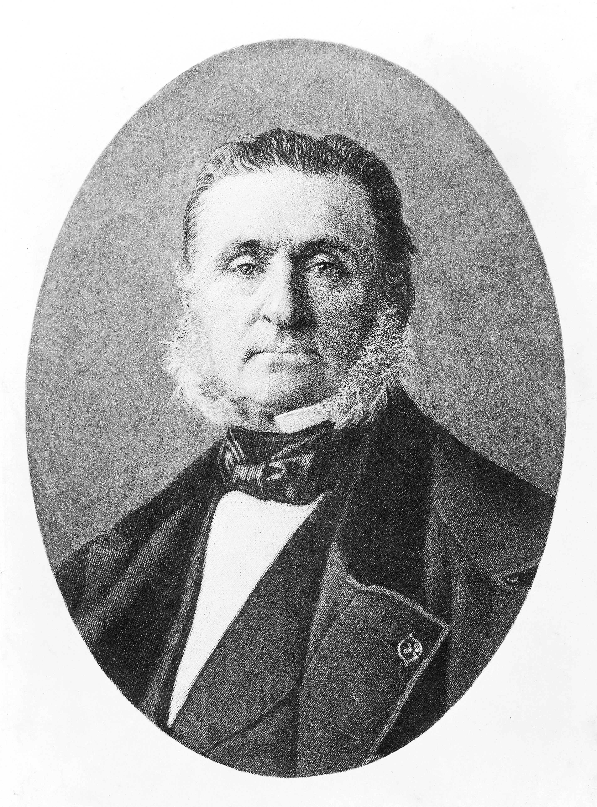

> 최악의 과학자는 예술가가 아닌 과학자이며, 최악의 예술가는 과학자가 아닌 예술가이다.
>
>  - 물리학자, 아르망 트루소

 

## '무엇'을 생각하는가에서 '어떻게' 생각하는가로

대가가 되고자 한다면 필요한 도구의 용법을 익히고, 정신적 요리법을 배우며 실력을 키워나가야 한다. 그러나 이 과정은 우리에게 '정신적 요리'가 의미하는 것이 무엇인지 다시 생각해볼 것을 요구한다. 그리고 이 '다시 생각하기'를 통해 정신적 요리법은 '무엇을 생각하는가'에서 **'어떻게 생각하는가'로 초점이 옮겨진다.**

정신적 요리는 마음의 부엌에서 시작된다. 거기서 개념들은 절여지고 졸여지고 살짝 튀겨지기도 하며, 때로는 다져지고 구워지고 휘저어져 모양을 갖추게 된다. 마치 요리의 대가들이 어떤 재료는 조금만 뿌리고 어떤 재료는 듬뿍 넣는 등 변화무쌍한 동작으로 우리를 놀라게 하는 것처럼 창조적인 상상의 부엌에서도 예기치 못했던 일들이 계속 일어난다.

 

  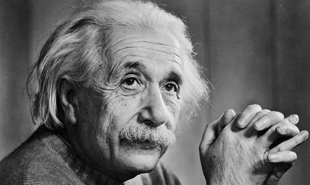

> 언어라는 것, 글로 된 것이건 말로 된 것이건 간에 **언어는 나의 사고과정 안에서 아무런 역할도 하지 못하는 것으로 보인다.** 사고과정에 필수적인 역할을 수행하는 심리적인 실체들은 일종의 증후들이거나 분명한 이미지들로서, 자발적으로 재생산되고 결합되는 것들이다. 내 경우에 그 요소들이란 시각적이고 때로는 '근육까지 갖춘 것'들이다.
>
>  - 물리학자, 아인슈타인

 

  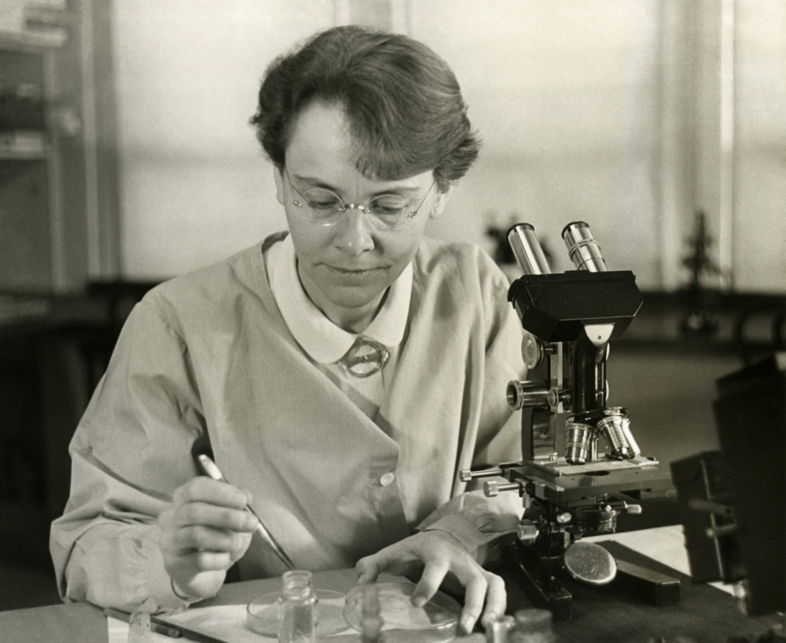

> 옥수수를 연구할 때, 나는 그것들의 외부에 있지 않았다. 나는 그 안에서 그 체계의 일부로 존재했다. 나는 염색체 내부도 볼 수 있었다. 실제로 모든 것이 그 안에 있었다. 놀랍게도 그것들은 내 친구처럼 느껴졌다. 옥수수를 바라보고 있으면 그것이 나 자신처럼 느껴졌다. 나는 종종 나 자신을 잊어버렸다. **가장 중요한 것은 바로 이것, 내가 나 자신을 잊어버렸다는 것이다.**
>
>  - 생물학자, 바버라 매클린턱

## 리처드 파인만은 문제를 풀지 않고 '느꼈다'

"직관인가 수학인가?" 발명가이자 SF소설가인 아서 C. 클라크는 묻는다.

> 우리는 진리를 찾아내기 위해 모형을 사용하는가? 아니면 진리를 알아낸 다음 이를 설명하기 위해 수학공식을 가동하는가?

그에 대한 답은 이미 나와 있다. 후자다.

 

아인슈타인은 이를 다음과 같이 설명했다.

> **직감과 직관, 사고 내부에서 본질이라고 할 수 있는 심상이 먼저 나타난다.** 말이나 숫자는 이것의 표현수단에 불과하다. 기존의 말이나 다른 기호들은 2차적인 것들이다. 심상이 먼저 나타나서 내가 그것을 마음대로 부릴 수 있게 된 다음에야 말이나 기호가 필요한 것이다. **과학자는 공식으로 사고하지 않는다.**

 

매클린턱은 이렇게 말한다.

> 과학적 방법으로 일을 한다는 것은 내가 직관적으로 알아낸 어떤 것을 과학적 틀 속으로 집어넣는 것이다.

 

  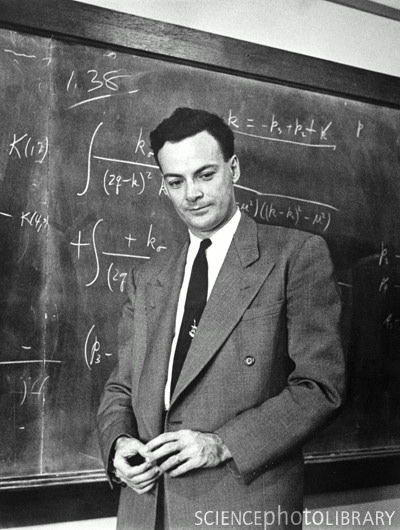

> 수학은 우리가 본질이라고 이해한 것을 '표현'하는 형식일 뿐이지 이해의 내용이 아니다. 내가 문제를 푸는 과정들을 보면 수학으로 해결하기 전에 어떤 그림 같은 것이 눈앞에 계속 나타나서 시간이 흐를수록 정교해졌다.
>
>  - 물리학자, 리처드 파인만

 

느낌과 직관은 '합리적 사고'의 방해물이 아니라 오히려 합리적 사고의 원천이자 기반이다.

제빵사가 빵을 만들기 위해 이스트를 사용한다는 말은 당연해보인다. 그러나 소다빵이나 납작빵을 만들 때는 이스트가 필요없다. 그리고 이스트로 말하자면 맥주나 시리얼 같은 다른 먹을거리를 만들 때도 쓰인다. 요리를 하든 생각을 하든 한 가지 재료만으로는 음식을 만들 수 없다. 사람의 지적 과정 중에서 단 한가지 요인만을 가지고 개인을 분류한다는 것은 아인슈타인을 처음부터 끝까지 논리수학적으로 사고하는 사람으로 규정하는 것만큼 그릇된 것이다.

## 직관은 통찰로 이어진다

  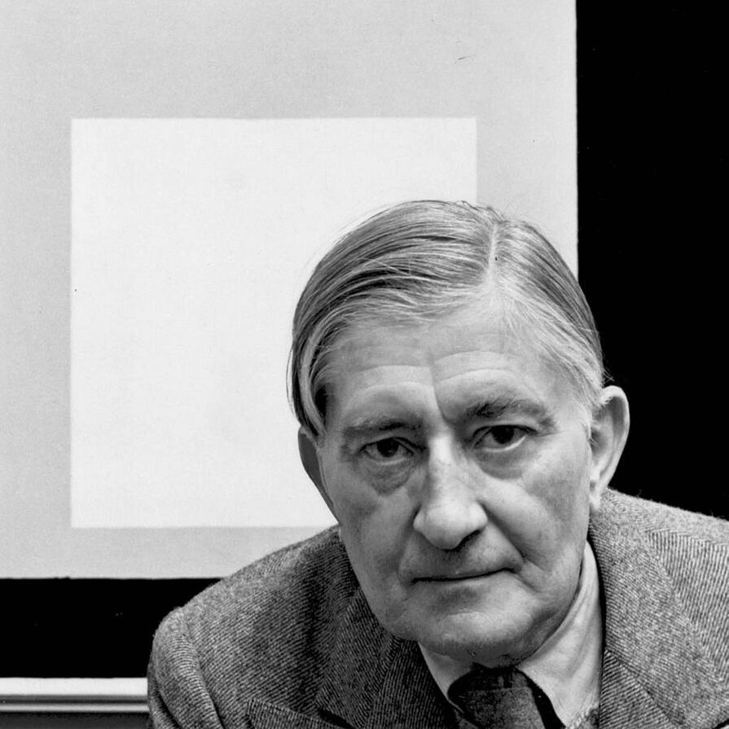

> 예술이란 물(物)적인 사실과 영적인 효과 사이의 불일치이며 삶에 대한 반응을 시각적 공식으로 나타낸 것이었다.
>
>  - 화가이자 디자이너, 요제프 알베르스

 

  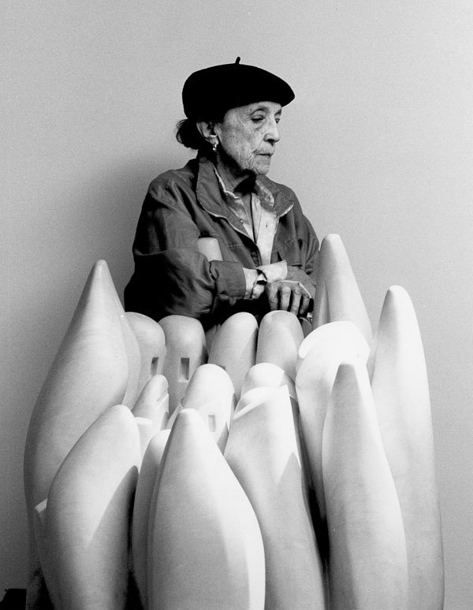

> 나는 오랫동안 깊이 생각했다. 그리고 나서 내가 말해야 할 것이 무엇이며, 또 그것을 어떻게 번역할 것인가를 고민했다. 나는 내가 할 말을 조각으로 번역하기 위해 노력했다.
>
>  - 조각가, 루이스 부르주아

 

  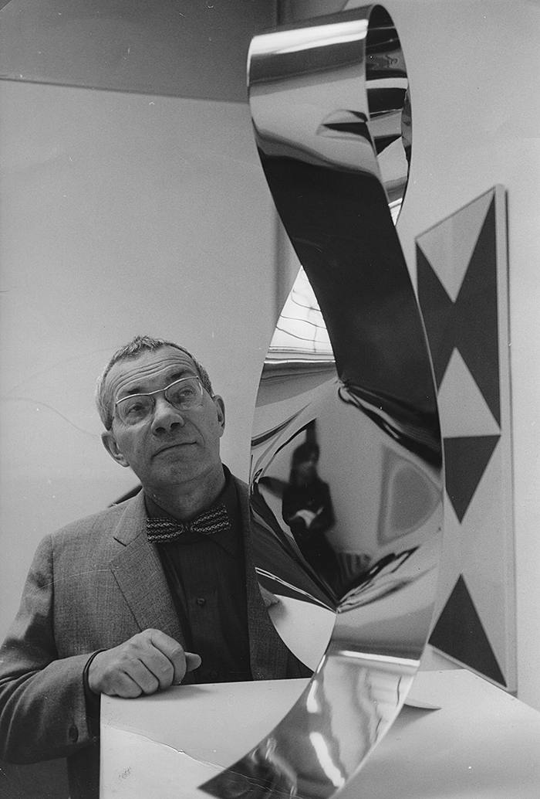

> 예술이란 인간 정신의 표현이며, 마음속에 이미 존재하고 있는 막연한 심상을 구체적인 형태로 가시화 시킨 것
>
>  - 화가, 막스 빌

 

  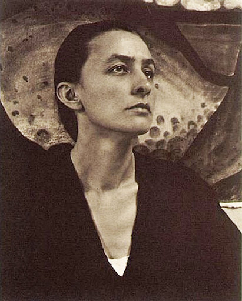

> 오래전에 나는 깨달았다. **내가 보고 즐긴 것을 있는 그대로 그림으로 옮겨놓는다 하더라도 그때 내가 받은 느낌을 관람객들에게 그대로 다시 줄 수 없다는 것**을 말이다. 결국 나는 내가 받았던 느낌과 똑같은 것을 새로 만들어야만 했다. 이것은 복사가 아니었다.
>
>  - 화가, 조지아 오키프

 

그녀의 이러한 말은 결국 예술이 제시하는 이미지가 어떤 느낌이나 개념, 감각의 직접적인 반영이 아니라는 것을 의미한다. 이는 과학자가 창안한 공식이 그의 생각을 그대로 표현한 것이 아닌 것과 같다.

 

  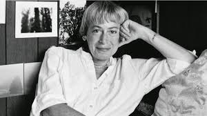

> 소설가들은 말할 수 없는 것을 '말로써' 다룬다. 그런데 그들의 전달매체는 소설이다. 소설은 말로 만드는 것이다. 그래서 말은 역설적으로 사용된다. 왜냐하면 말에는 기호언어적 용법과 함께 상징적, 혹은 은유적 용법이 있기 때문이다. 말은 내적인 느낌을 문자로 나타내는 기호일 뿐, 그 느낌의 본질은 아니다.
>
>  - 소설가, 어슐라 르귄

 

### 
우리가 이 책을 통해 도전하려는 것은  느낌과 이미지와 감정의 초논리를 이해하고 설명하는 일이다.

 

> 오직 직관만이 교감을 통하여 통찰력으로 이어질 수 있다. 연구의 성과는 면밀한 의도나 계획에서 오는 게 아니라 가슴으로부터 바로 나온다.
>
>  - 아인슈타인

 

  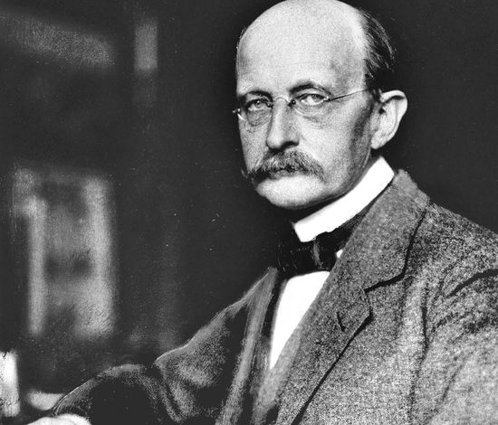

> 과학자에게는 예술적인 상상력이 필요하다.
>
>  - 물리학자, 막스 플랑크

## 느낌, 감정 그리고 직관의 사용법

소위 '창조적인 작업'을 할 때 과학자나 수학자, 예술가(작곡가, 작가, 조각가 등)들은 우리가 '생각을 위한 도구'라고 부르는 공통된 연장을 사용한다. 이 도구들 속에는 정서적 느낌, 시각적 이미지, 몸의 감각, 재현 가능한 패턴, 유추 등이 포함된다. 그리고 상상을 동원하는 모든 사람들은 이 생각도구를 가지고 얻어낸 주관적인 통찰을 객관적으로 표현하기 위해 공식적인 언어로 변환하는 방법을 배운다. 이를 통해서 그들의 생각은 다른 사람들의 마음속에 새로운 생각을 불러일으키게 된다.

 

  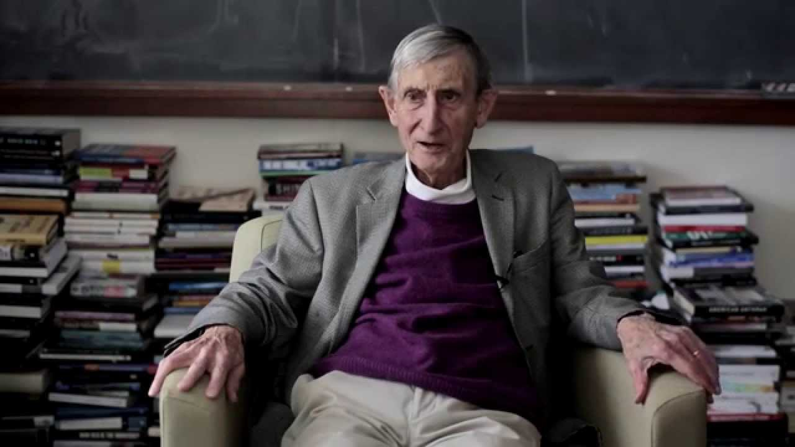

> 과학과 예술이 유사하다는 말은 '창조'와 '행위'에 관한 한 매우 유효하다. 창조라는 점에서 둘은 매우 비슷하다. 장인의 경지에 이른 창조행위가 주는 미적 쾌감은 과학분야에서도 대단히 강력하다.
>
>  - 수학자, 프리먼 다이슨 ( 리처드 파인만의 생각과 줄리언 슈윙거의 생각을 연결한 사람 )

 

  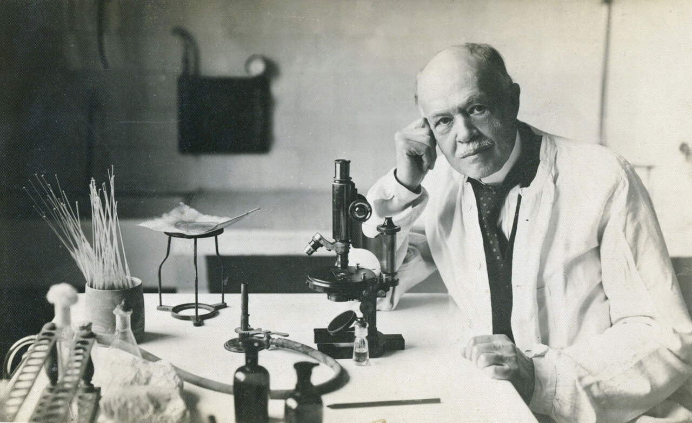

> 새로운 사실의 발견, 전진과 도약, 무지의 정복은 이성이 아니라 상상력과 직관이 하는 일이다. 그런데 상상력이나 직관은 예술가나 시인들과도 밀접한 관련을 맺고 있다. 현실로 이루어지는 꿈과, 무언가를 창조할 듯한 꿈은 같은 것이다.
>
>  - 노벨 생리의학상 수상자, 샤를 니콜

 

직관적인 생각도구가 학문에 공통적으로 사용될 수 있음을 알고 있는 사람들은 많지 않다. 근시안적인 인식과 태도는 철학자들이나 심리학자들뿐만 아니라 교육자들에게도 나타난다. 유치원에서 대학원에 이르기까지 모든 교육단계의 커리큘럼이 과정이 아닌 결과에 의해 규정되어 어떻게 여러 과목으로 나뉘고 있는지 보라. 교육의 시작단계에서부터 학생들은 문학, 수학, 과학, 역사, 음악, 미술 등으로 분리된 과목을 공부한다. 마치 그 과목이란 것이 본질적으로 별개의 것이고 상호배타적이기라도 한 것처럼 말이다.

수학자들은 오로지 '수식 안에서', 작가들은 '단어 안에서', 음악가들은 '음표 안에서'만 생각해야 하는 것이다. 각 학교와 대학들은 필요한 재료의 절반만을 사용하는 요리법을 고집하고 있다. '생각하기'의 본질을 절반만 이해하기 때문에 교사들은 가르치는 방법의 절반만 이해하고 학생들은 배우는 방법의 절반만 이해하게 되는 것이다.

본래 통찰이라는 것은 상상의 영역으로 호출되는 수많은 감정과 이미지 속에서 태어나는 게 아니던가. 따라서 '느낌'도 필히 커리큘럼의 일부가 되어야 한다. 학생들은 몸으로 느껴지는 것에 대해 어떻게 주목하고 그 느낌을 발전시키며 사용해야 하는지 반드시 배워야 한다.
