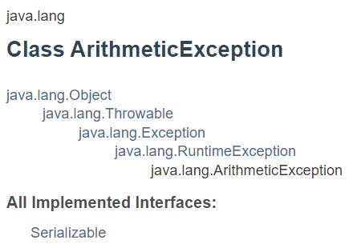

# 예외(Exception)

[내용 출처-'쉽게 배우는 자바2', 생활코딩, Boostcourse](https://www.boostcourse.org/cs128/joinLectures/66614?isDesc=false)

## 숙명과 운명

숙명은 내가 어떻게 할 수 없는 것이다. `~ERROR`

운명은 내가 한 행동으로 나를 바꿀 수 있는 것이다. `~EXCEPTION`

Error는 개발자의 본인 실수로 나타나는 것이 아닌 환경의 문제로 나타나는 것을 일컫는다.

예를 들어, 메모리가 부족한 상황, 운영체제상의 문제로 인한 프로그램 정지, 컴퓨터의 전원이 나가버리는 등등 프로그램이 동작하는 환경의 문제를 `ERROR`라고 한다.

반대로 개발자가 상정한 상황에서 벗어난 상황에서 나타날 때, 이를 `EXCEPTION` 이라고 한다. 파일이 들어오도록 코드를 작성했는데 예를 들어 `파일이 들어오지 않았을 때`와 같은 경우를 `예외(EXCEPTION)`라고 한다.

## 예외의 발생

### Java에서는 숫자를 `0`으로 나누는 경우 예외로 처리한다.

```java
public class ExceptionApp {

	public static void main(String[] args) {
		System.out.println(1);
    /*
    Exception in thread "main" java.lang.ArithmeticException: / by zero
	at ExceptionApp.main(ExceptionApp.java:6)
    */
		System.out.println(2/0);
		System.out.println(3);
	}

}
```

## 예외 처리 (Exception Handling)

```java
public class ExceptionApp {

	public static void main(String[] args) {
		System.out.println(1);
		int[] scores = { 10, 20, 30 };
		// try, catch => handling exceptions
		try {
			System.out.println(2);
			System.out.println(scores[3]);
			// below codes are not going to execute
			System.out.println(3);
			System.out.println(2 / 0);
			System.out.println(4);
		} catch (ArrayIndexOutOfBoundsException e) {
			System.out.println("없는 값을 찾고 있군요!");
		} catch (ArithmeticException e) {
			System.out.println("잘못된 계산입니다.");
		}
		System.out.println(5);

	}

}
```

예외가 발생함에도 불구하고 그대로 프로그램을 완성시켜서 사용자에게 사용하게 한다면 숫자 `0`을 입력하면 프로그램이 멈춰버리는 상황이 발생한다.

더 나쁜 상황은 `언제 뻗을지 모르는 불안한` 프로그램이 되는 것이다.

`try catch`문을 이용하여 `예외`처리를 하면 문제가 되는 상황에서도 끝까지 실행은 되는 튼튼한 프로그램이 된다.

Java에서는 `Exception Class`를 제공하여 예외를 처리할 수 있도록 도와준다.

예외가 발생할 것으로 보이는 부분을 `try`로 묶어서 처리하면 일단 해당 코드를 실행하고 `예외`가 발생하는 경우에는 `try` 내부의 남아있는 코드는 모두 실행하지 않고 바로 해당 예외를 처리하는 `catch`문으로 넘어간다.

`catch`문은 괄호 안에 `예외 객체`를 선언하고 예외 상황에서 실행할 코드를 입력한다. `catch`문은 여러 개를 만들 수 있다.

## 예외의 우선순위

<p align="center">
  
</p>

- Exception
  - RuntimeException
    - ArithmeticException

여러 예외가 있더라도 `Exception` class를 이용해서 포괄적으로 예외처리를 할 수 있다.

예외처리에 있어서 `catch`문의 위치도 중요하다. `try`문에서 발생한 예외는 여러 개의 `catch`문을 순서대로 거쳐가면서 해당 `catch`문의 예외가 이번에 발생한 예외가 맞는지 확인한다. 그리고 맞다면 그 `catch`문을 실행한다.

```java
public class ExceptionApp {

	public static void main(String[] args) {
		System.out.println(1);
		int[] scores = { 10, 20, 30 };
		// try, catch => handling exceptions
		try {
			System.out.println(2);
			System.out.println(scores[3]);

			// below codes are not going to execute
			System.out.println(3);
			System.out.println(2 / 0);
			System.out.println(4);
		} catch (ArithmeticException e) {
			System.out.println("계산이 잘못된 것 같습니다.");
		} catch (Exception e) {
			System.out.println("뭔가가 이상합니다. 오류가 발생했거든요");
		}
		System.out.println(5);

	}

}
```

## catch문의 `e`에 대해서

`e`는 Exception 객체타입의 instance 변수이다.

예외 instance에는 예외가 발생한 원인, 어디서 발생했는지 등에 대한 정보들이 들어 있다.

이것들을 활용하면 프로그램의 어디서 왜 예외가 발생했는지 손쉽게 알 수 있다.

이러한 정보를 통해, 코드의 내용이나 구조 등을 나쁜 의도를 가진 사람들에게 노출될 수도 있기 때문에 보통 이러한 정보를 사용자가 직접 볼 수 있게 구성하지 않는다.

서버측에서 로그 파일 등을 이용해 관리자만 볼 수 있게 처리한다.

자세한 예외 instance의 method 종류는 [`Throwable` class의 설명서](https://docs.oracle.com/javase/8/docs/api/java/lang/Throwable.html#constructor.summary)에서 확인할 수 있다.

```java
public class ExceptionApp {

	public static void main(String[] args) {
		System.out.println(1);
		int[] scores = { 10, 20, 30 };
		// try, catch => handling exceptions
		try {
			System.out.println(2);
			// System.out.println(scores[3]);

			// below codes are not going to execute
			System.out.println(3);
			System.out.println(2 / 0);
			System.out.println(4);
		} catch (ArithmeticException e) {
			System.out.println("계산이 잘못된 것 같습니다. 이유 : " + e.getMessage());
			e.printStackTrace(); // console에 error를 보여주도록 함. 프로그램이 멈추지는 않음
								 // 일반 사용자에게 보여지면 보완이슈가 발생할 수 있는데, logging 시스템 API를 활용하면 좋다.
		} catch (Exception e) {
			System.out.println("뭔가가 이상합니다. 오류가 발생했거든요");
		}
		System.out.println(5);

	}

}
```

## Checked exception vs Unchecked exception

어떤 Exception은 사용자가 try catch로 잡아내지 않더라도 무사히 컴파일 되기도 하고 어떤 Exception은 try catch 또는 method 단위에서 throws를 이용해서 잡지 않으면 컴파일 되지 않는다.

`ArithmeticException`, `ArrayIndexOutOfBoundsException` 같은 경우는 try catch 문으로 잡아내지 않아서 프로그램이 뻗는다 할지라도 `compile`해서 실행할 수는 있다. 이러한 `Exception`들을 `unchecked Exception`이라고 부른다.

`unchecked Exception`은 모두 `RuntimeException` class로부터 상속된 예외 클래스들이다.

하지만 `try catch` 문 등으로 잡아내지 않으면 프로그램이 `compile` 자체가 안되는 예외들도 있다. 이러한 예외들을 `checked Exception`이라고 부른다. `Throwable`로부터 상속받은 모든 클래스에서 `RuntimeException`을 제외한 모든 에러와 예외들이 `checked Exception`에 속한다. `checked Exception`은 반드시 `예외 처리`를 해주어야 한다.

```java
import java.io.FileWriter;
import java.io.IOException;

public class CheckedExceptionApp {

	public static void main(String[] args) {
		try {
			FileWriter f = new FileWriter("data.txt"); // FileWrite must use `IOException`
													   // because it is checked Exception
			f.write("Hello");
			f.close();
		} catch (IOException e) {
			e.printStackTrace();
		}
	}

}
```

## `Finally`와 `Resource` 다루기

Java 프로그램은 외부의 자원(Resource)에 접근해서 작업을 진행할 수 있다. 대표적인 자원으로는 `파일`, `네트워크`, `데이터베이스` 등이 있다. 이러한 자원들은 프로그램 외부에 존재하기 때문에 프로그램이 온전히 제어하지 못한다.

우리가 만든 프로그램만을 위해 존재하지 않기 때문에 읽거나 쓰는 작업을 하는 도중에 상황에 따라 연결이 불량하여 작업이 실패할 수도 있다.

그러므로 이러한 자원을 사용할 때는 자원을 붙들기 위해 파일의 경우 `점유상태`를 나타내기도 하고, 네트워크나 데이터베이스는 `연결상태를 유지`한다. 그리고 마지막으로 우리가 필요한 작업을 끝내고 나서는 자원을 놓아주는 작업을 한다.

### Finally 문

`try`문에서 오류가 발생하면 이후에 작업이 있더라도 `catch`문으로 넘어간다. 그래서 자원을 놓아주는 작업(예를 들어, `f.close()`)을 `try` 문에 넣게 되면, 예외가 발생했을 때 자원을 놓아주는 작업을 못하게 된다.

이런 경우에 사용하는 것이 `finally` 문이다.

`finally` 문은 `try` 문에서 예외가 발생했거나 하지 않았는지에 상관없이 무조건 내부에 있는 코드가 실행된다.

```java
import java.io.FileWriter;
import java.io.IOException;

public class CheckedExceptionApp {

	public static void main(String[] args) {
		FileWriter f = null;	// try 내부에 선언을 해버리면 finally에서 f instance를 가져다 못 씀
		try {
			f = new FileWriter("data.txt");
			f.write("Hello");
			// close를 하기 전에 예외가 발생할 수 있기 때문에 `finally`로 처리해야 한다.
		} catch (IOException e) {
			e.printStackTrace();
		} finally {
			// 만약에 f가 null이 아니라면
			if (f != null) {
				try {
					f.close();
				} catch (IOException e) {	// f.close(); 자체가 IO 이므로 checkedException인 IOException을 예외처리 해주어야 한다.
					e.printStackTrace();
				}
			}
		}
	}

}
```

## Try with Resource

자원을 잡고, 놓아주는 작업을 `try-catch-finally` 문으로 만드는 과정은 상당히 복잡합니다. 그래서 자원을 잡고, 놓아주는 작업을 간단한 형식으로 만들 필요성이 생김.

### try-with-resource statement

Java SE 7 이전에는 위에서 본 것과 같이 `finally` 문을 이용하여 자원을 놓아주는 작업을 해야했다.

하지만 Java SE 7부터 `try-with-resource` 문이 등장하여 자원 관리를 훨씬 단순하게 할 수 있게 되었다. 클래스가 `AutoCloseable` interface를 상속한다면 `try-with-resource` 문에 사용할 수 있다.

```java
import java.io.FileWriter;
import java.io.IOException;

public class TryWithResource {

	public static void main(String[] args) {
		// The power of 'try with resource statements(stmt?)'
		try (FileWriter f = new FileWriter("data.txt")) {
			f.write("Hello");
		} catch (IOException e) {
			e.printStackTrace();
		}
	}

}
```

try-with-resource 문은 `try`문에 괄호를 추가하여 그 안에 사용할 자원을 정의한다.

객체를 여러 개 선언할 수도 있고, 세미콜론(`;`)으로 구별한다. 객체의 정의 **가장 마지막에는 세미콜론을 넣지 않는다.**

전체 `try`문(try, catch, finally)이 종료되면 생성된 인스턴스는 자동으로 종료되기 때문에 암시적으로 `close()`를 이용해서 자원을 놓아주지 않는다.

## `throw Exception`

우리가 직접 예외를 만들어서 발생시킬 수도 있다.

```java
public class MyException {

	public static void main(String[] args) {
		throw new RuntimeException("무언가 문제가 있습니다.");
	}

}
```

문제 상황이 발생했을 때, `throw` 구문을 통해서 예외를 발생시킬 수 있다. 이 경우에는 `RuntimeException` 객체를 이용했지만, `Exception` 객체도 직접 생성할 수 있다.

### Method 단위로 예외 발생

`try-catch` 문으로 예외를 처리할 수도 있지만, method가 설계 의도대로 작동하지 않는 경우 method 자체에서 예외를 발생시킬 수도 있다.

폭탄돌리기처럼 직접 예외를 처리하기보다는 앞으로 method를 사용할 누군가가 예외를 처리해 주기를 바라는 것과 같다.

```java
import java.io.FileWriter;
import java.io.IOException;

public class ThrowException {

	public static void main(String[] args) throws IOException {
		// 1. try catch를 사용해도 되고
		// 2. throws 써서 다른 친구에게 예외 처리를 위임해도 좋다
		FileWriter f = new FileWriter("./data.txt");
		f.write("You Complete Exception Part! Congratulation!");
		f.close();
	}

}
```
