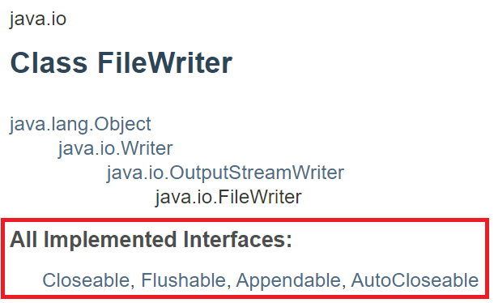
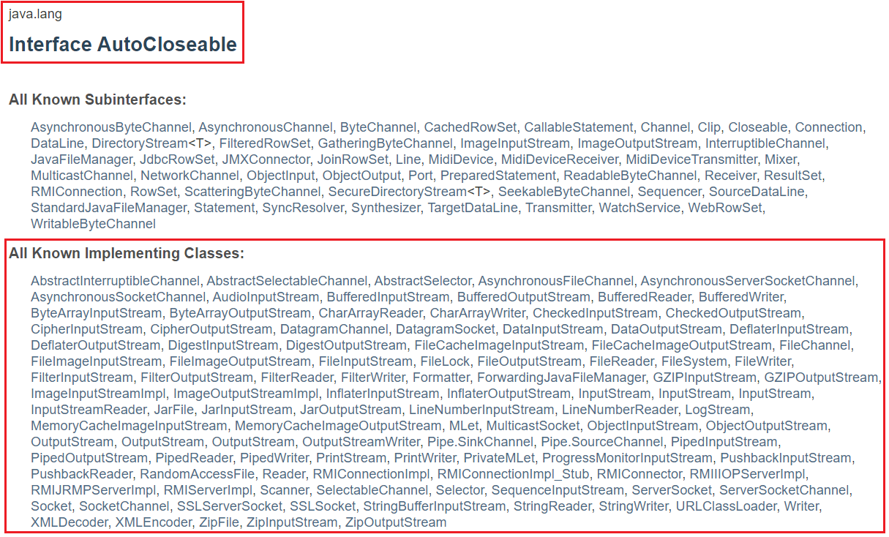
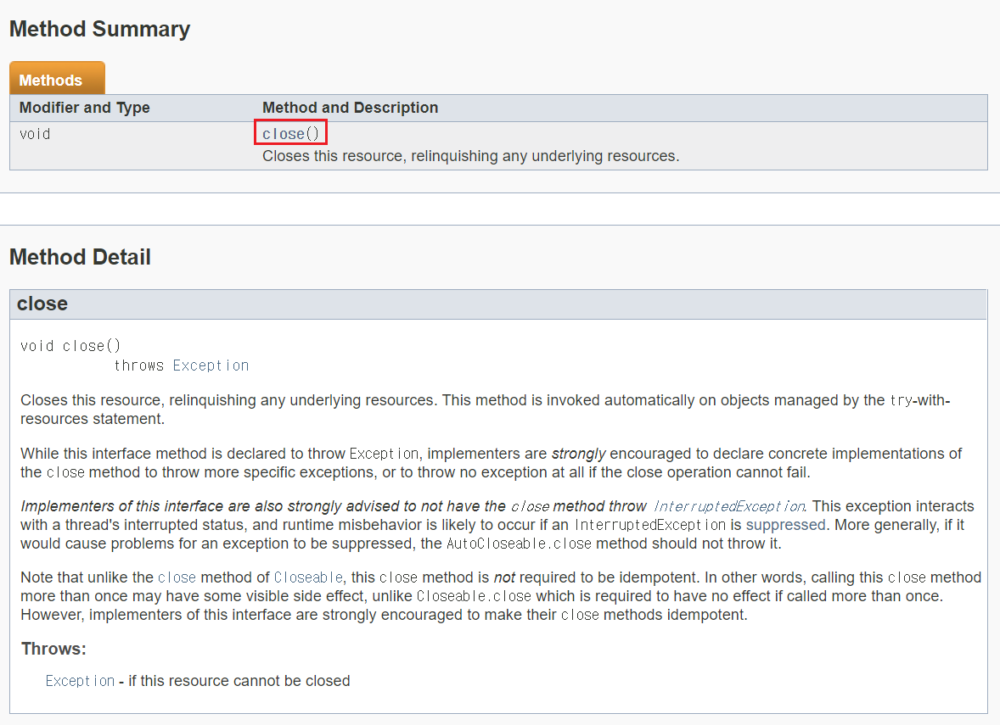
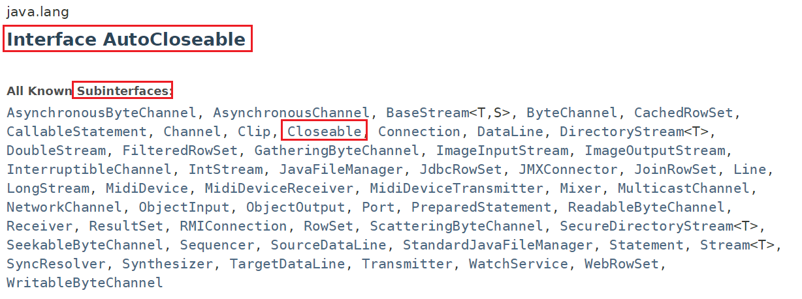
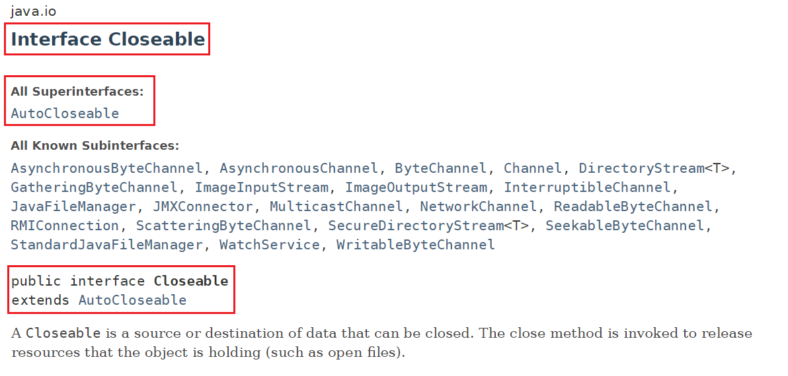

# interfaces in Java API

<p align="center">
  
</p>

- `Class FileWriter`는 4개의 인터페이스를 가지고 있다.

<p align="center">
  
</p>

- `Interface AutoCloseable`을 사용하고 있는 class들은 위의 화면과 같이 대단히 많다!

<p align="center">
  
</p>

- `Interface AutoCloseable`은 `close()` 라는 하나의 method만을 가지고 있다.

[Reference - docs.oracle java SE 7](https://docs.oracle.com/javase/7/docs/api/java/io/FileWriter.html)

---

```java
import java.io.FileWriter;
import java.io.IOException;
import java.io.Writer;

public class FileWriterApp {

	public static void main(String[] args) throws IOException {
		Writer fileWriter = new FileWriter("filewriter.txt");

		fileWriter.write("data 1");
		fileWriter.write("data 2");
		fileWriter.write("data 3");

		// 쓰기 작업이 되는 동안 close를 안해주면 컴퓨터는 다른 모듈에서 시작하려는 write를 못하도록 막고 있음
		// close를 사용해서 놓아줘야 한다.
		fileWriter.close();
	}

}
```

Java API 중에서 `fileWriter` 클래스에는 interface가 어떻게 활용되고 있는지를 알아본다.

- FileWriter instance는 초기화를 할 때, 파일에 접근해서 현재 파일을 점유하고 있다는 표시를 한다.
- 작업이 끝난 후에는 `close()` method를 이용해서 현재 파일에 대한 점유를 끝낸다는 표시를 한다.
- `close()` method는 `AutoCloseable` interface에 선언되어 있는 method이다.
- `AutoCloseable`에는 `close()` method 하나만 선언되어 있는데, FileWriter와 같이 작업에 있어서 복수의 접근을 막을 필요가 있을 경우에 해당 interface를 적용한다.

## AutoCloseable과 Closeable

<p align="center">
  
</p>

<p align="center">
  
</p>
