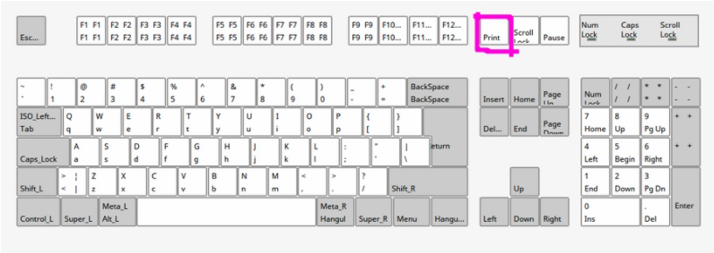

# 리눅스 화면 캡쳐

  

Prt Scr (Print Screen) : 화면 전체를 이미지 파일로 저장

Alt + Prt Scr : 현재 활성창을 이미지 파일로 저장

Shift + Prt Scr : 마우스로 선택한 영역을 이미지 파일로 저장

- 이미지 파일의 기본 저장 위치는 '사진' 디렉토리이다.

[출처-PenTest_LAB Tistory](https://pentestlab.tistory.com/2)
