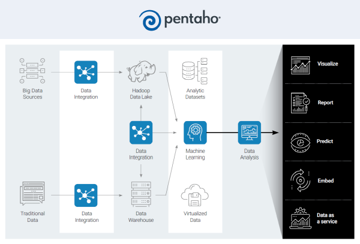

# 펜타호 소개

전 세계 1,800여 사이트에서 활용하는 엔드-투-엔드 원스톱 빅데이터 플랫폼이 있다. 정형 및 비정형 데이터의 수집(Extract)부터 변환(Transformation), 적재(Load), 분석(Analysis), 그리고 시각화(Visualization)에 이르는 과정 모두를 제공하는 히타치 밴타라(Hitachi Vantara)의 펜타호(Pentaho)다.

  

> 빅데이터 분석을 하려는 기업은 늘고 있지만 '전략의 부재'와 '전문 인력 부족' 등 넘어야 할 산이 많다.
>
> 김경륜 이사, 히타치 벤타라

## 빅데이터 플랫폼으로써의 펜타호

데이터 통합부터 구조화, 분석, 시각화 그리고 예측까지 빅데이터 인프라 구축을 위한 모든 기능을 제공하는 업계 유일의 빅데이터 통합 및 분석 플랫폼

1. 빅데이터 통합과 처리에 최적화된 솔루션

- DBMS를 비롯해 웹에서 발생하는 JSON, XML, 각종 로그 그리고 빅데이터 환경인 하둡(Hadoop) 또는 S3, AWS, Azure 클라우드 환경에서든 어떤 형태의 데이터도 쉽고 빠르게 수집할 수 있다.
- 이렇게 수집한 데이터를 '통합'과 '전처리' 과정을 거치면서 '분석 가능한 데이터'로 가공한다.

2. 실시간 데이터 처리를 원활하게 지원한다.

- 배치 데이터 처리와 분석뿐 아니라 실시간으로 데이터를 수집하고 분석한 결과를 통해 인사이트를 확보할 수 있다.
- 데이터 메시징 큐(Queue)인 카프카(Kafka) 또는 MQTT, JMS에서 스트리밍 데이터를 받아와 실시간으로 처리하고 원하는 형태로 적재한 후 이를 활용해 실시간 지표 및 공정 현황 등도 파악 가능

3. 다양한 소스에서 수집된 데이터를 블랜딩하는 과정을 '하나의 워크플로우'에서 구현

- R 및 Python 등 오픈소스 분석 엔진의 라이브러리들을 사용해 머신러닝과 딥러닝 알고리즘 기반의 분석 및 예측 모형 개발 가능
- 데이터 수집 단계부터 블랜딩을 거쳐 머신러닝 기반 모형 구축부터 실시간 업데이트까지 전과정을 '자동화'할 수 있는 덕분에 새로운 업무 프로세스를 즉각적으로 펜타호 상에서 구현 가능
- 즉, 비즈니스 상황 변화에 신속하게 대응할 수 있다.

## 펜타호 구축 사례

- 금융 : 미국 나스닥, 캐터필라(산업기계, 중공업)
- 운송업 : 지역 철도청 BRB(중국)
- 한국 : 카카오게임즈

[출처](https://blog.his21.co.kr/496)
