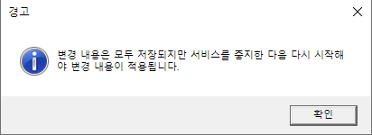
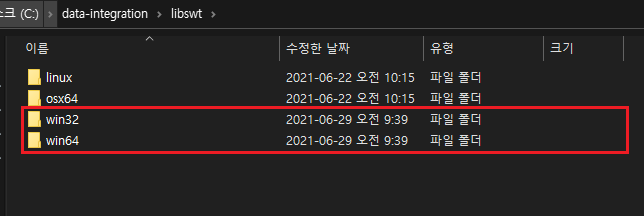

# MSSQL 연동하기

## 1. MSSQL 설치

1. 마이크로소프트 SQL Server 홈페이지에서 '2017 개발자 버전 MS SQL'을 다운로드 받는다. [https://www.microsoft.com/en-us/sql-server/developer-tools](https://www.microsoft.com/en-us/sql-server/developer-tools)

  

2. 다운받은 설치 파일을 실행한 후, 첫번째 유형인 '기본'을 클릭한다.

  

1. 언어를 '한국어'로 선택한다.

  

2. 설치 경로를 확인한 후 '설치' 버튼을 클릭하여 설치를 진행한다.

  

3. 설치 완료 후, 윈도우 검색창에서 'SQL Server 2017 구성 관리자'를 관리자 권한으로 실행한다.

  

4. 왼쪽 탐색창에서 `SQL Server 네트워크 구성 > MSSQLSERVER에 대한 프로토콜` 을 선택한 다음 `TCP/IP` 을 오른쪽 클릭하여 `사용(E)` 을 클릭한다. 상태가 '사용'으로 바뀐 것을 확인하고 아래와 같이 경고창이 뜨는 것을 확인한다.

  

  

5. 윈도우 검색창에 '작업 관리자'를 검색하여 실행한다. 그 다음 상단 탭의 `서비스` 를 선택한 다음 'MYSQLSERVER'를 찾는다. 마우스 오른쪽 클릭하여 `다시 시작(R)` 을 실행해준다.

  

## 2. MSSQL JDBC 다운로드 및 설정

1.  마이크로소프트 JDBC 다운로드 센터에서 MSSQL JDBC 7.4 를 다운받는다.
    [https://www.microsoft.com/ko-KR/download/details.aspx?id=58505](https://www.microsoft.com/ko-KR/download/details.aspx?id=58505)

  

2.  다운받은 파일을 실행하면 아래와 같은 창이 뜬다. `Unzip` 버튼을 클릭하여 압축을 풀어준다.

  

3.  압축을 푼 폴더에서 `auth` 폴더를 찾아서 더블 클릭한다. 윈도우 64bit인 경우는 `x64` 폴더의 파일(`sqljdbc_auth.dll`) 또는 윈도우 32bit인 경우는 `x86` 폴더의 파일(`sqljdbc_auth.dll`)을 복사한다.

  

  

  

4.  펜타호 폴더인 `data-integration` 로 이동한 다음 `libswt` 폴더를 더블 클릭한다. win64 또는 win32 폴더 안에 복사한 파일을 붙여넣기 한다.

  

  

  

5.  다시 SQL JDBC 폴더로 돌아간 다음 `mssql-jdbc-7.4.1.jre8.jar` 파일을 복사한 다음 펜타호 폴더인 `data-integration` 안에 있는 `lib` 폴더에 붙여넣기 한다.

  

  

  

## 3. Pentaho-MSSQL 연동

1. 펜타호를 실행한다. (`data-integration/spoon.bat` 파일 더블 클릭)
2. 상단 메뉴창에서 `파일 > 새로 만들기 > Transformation` 을 클릭한다.

  

1. 왼쪽 탐색창에서 '뷰' 탭을 클릭한 다음 아래의 `데이터베이스 연결` 폴더를 오른쪽 클릭하여 `새로 만들기` 를 클릭한다.

  

4. 아래의 각 항목들에 필요한 정보들을 기입해준다.

  

`Connection name` : 현재 만드고자 하는 데이터베이스 연결 셋업을 지칭하는 원하는 이름을 작성하면 된다.

`Connection type` : 'MS SQL Server (Native)'를 선택한다.

`Access` : 'Native (JDBC)'를 선택한다.

`Settings` :

- Host Name : 로컬로 SQL Server를 사용하는 경우에는 `localhost`를 입력한다. 외부 서버를 사용하고자 한다면 `IP` 주소를 입력한다.

- Database Name : SQL Server 내에 존재하는 원하는 데이터베이스 이름을 작성한다. (MSSQL Server를 설치하면 `master` 라는 DB가 이미 존재한다.)
- Instance Name : SQL Server의 ServiceName으로 MS SQL에서 `SELECT @@SERVICENAME;` 명령어로 확인할 수 있다. 기본값은 `MSSQLSERVER` 이다.
- Port Number : MSSQL의 기본 포트넘버는 `1433` 이다.
- User name & Password : MSSQL에서 계정을 만든 후에 사용할 수 있다. 계정을 만들지 않은 상태라면 아래의 `Use Integrated Security` 체크 박스를 체크하면 이전 설치 과정에서 사용한 `sqljdbc_auth.dll` 파일 덕분에 로그인 없이 연결 가능하다.

5. `테스트` 버튼을 클릭하여 연결이 잘 되었음을 확인한다.

  

## 4. 참고 문헌

- [Pentaho 9.1 CE Document - Setup - Solution database repositories](https://help.pentaho.com/Documentation/9.1/Setup/Components_Reference)

- [[SQL Server] sa 계정 활성화 하기](https://m.blog.naver.com/sophie_yeom/220903335032)
- [[MSSQL] 서버, 인스턴스, 데이터베이스 명 확인하기](https://mozi.tistory.com/302)
- [[MSSQL] SQL Server 소개 및 설치방법 on Windows](https://blog.naver.com/PostView.nhn?blogId=wideeyed&logNo=221434457477)
- [Creating a Pentaho Database Connection to Microsoft SQL Server](https://scribesroom.wordpress.com/2018/08/28/creating-a-pentaho-database-connection-to-a-microsoft-sql-server/)
- [Pentaho cannot connect to SQL Server 2017](https://stackoverflow.com/questions/58026844/pentaho-cannot-connect-to-sql-server-2017)
- [MSSQL 데이터베이스(DB) 생성과 새 로그인 사용자 추가](https://server-talk.tistory.com/248)
