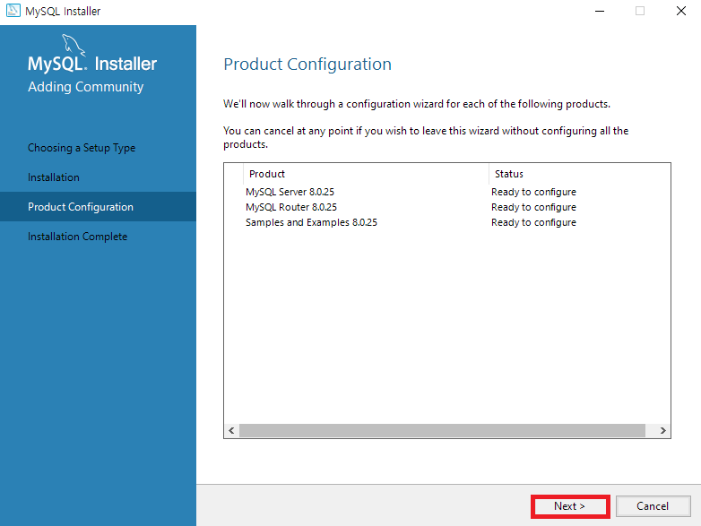
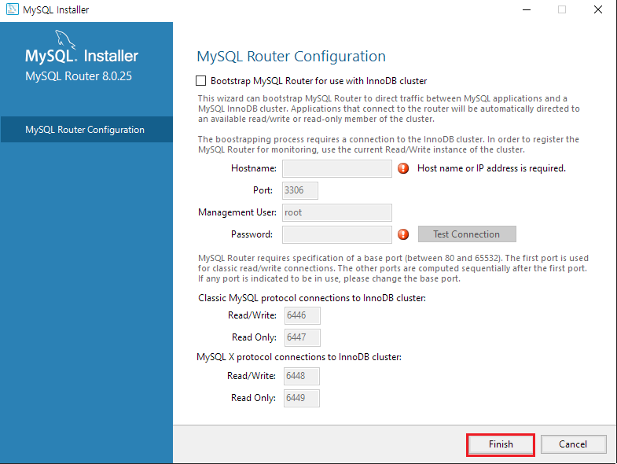

# MySQL 연동하기

펜타호는 Java로 만들어진 프로그램이다. 따라서 [JDBC](https://ko.wikipedia.org/wiki/JDBC)를 활용해서 MySQL을 펜타호에 연결할 수 있다.

순서는 다음과 같다.

1. 본인의 컴퓨터에 먼저 MySQL을 설치한다.
2. 펜타호와 연결하기 위한 JDBC MySQL **Connector/J** 파일을 다운받는다.
3. 설치한 펜타호의 폴더 내부에서 `data-integration/lib` 위치에 다운받은 `.jar` 확장자 파일을 넣는다.
4. 펜타호에서 DB 연결창을 열고 MySQL 연결 및 테스트를 진행한다.

- DB 연결이 잘 되었는지 확인하기 위해서 예제 2가지를 테스트 해볼 것이다.

## 1. MySQL 설치

1. MySQL Community [다운로드 페이지](https://dev.mysql.com/downloads/)에서 본인의 운영체제에 맞는 링크를 클릭해서 다운로드한다.

  

  

- 펜타호의 권장 버전은 5.x 이다. 하지만 최신버전인 8.0.25(21년 6월 28일 기준) 에서도 연동이 가능한 것을 확인하였다.

2. 다운받은 `.smi` 파일을 실행한다.

  

3. 'Developoer Default'를 그대로 선택한 채 `Next` 버튼을 클릭한다.

  

4. `Next` 버튼을 클릭한다.

  

5. `Yes` 버튼을 클릭한다.

  

6. `Execute` 버튼을 클릭한다.

  

7. 설치가 모두 완료되었으면 `Next` 버튼을 클릭한다.

  

8. `Next` 버튼 클릭

  

9. 로컬에서 사용할 포트 설정 화면이다. 기본값을 그대로 놔둔채로 `Next` 버튼을 클릭한다.

  

10. 인증 방법 화면이다. 맨 위의 추천 값을 그대로 선택한채 `Next` 버튼을 클릭한다.

  

11. root 계정의 비밀번호를 입력하고, 필요에 따라서 `Add User` 버튼을 눌러서 계정을 등록한다.

  

12. 계정 등록 화면이다. 계정 등록이 완료되면 `Next` 버튼을 클릭한다.

  

13. `Next` 버튼을 클릭한다.

  

14. 앞서 설정한 값들을 적용하는 단계이다. `Execute` 버튼을 클릭한다.

  

15. 모두 완료가 되었으면 `Finish` 버튼을 클릭한다.

  

16. MySQL Server에 대한 설정이 완료한 것을 볼 수 있다. `Next` 버튼을 클릭한다.

  

17. MySQL Router 부분은 따로 수정하지 않고 `Finish` 버튼을 클릭한다.

  

18. `Next` 버튼을 클릭한다.

  

19. MySQL Server가 잘 연결되는지 확인하는 단계이다. root 계정을 사용하여 `Check` 버튼을 클릭하여 상단의 `Status` 에 연결 성공이 나타나는지 확인하고 `Next` 버튼을 클릭한다.

  

20. `Execute` 버튼을 클릭한다.

  

21. `Next` 버튼을 클릭한다.

  

22. 설치가 최종적으로 마무리 되었으며, `Finish` 버튼을 클릭하면 끝난다. (`Finish` 버튼 클릭 후에 MySQL이 실행되는 것을 원치 않는다면 위의 체크박스를 해제한 뒤에 `Finish` 버튼을 클릭한다.)

  

23. 윈도우 검색창에 'MySQL'을 입력하여 `MySQL 8.0 Command Line Client`를 관리자 권한으로 실행한다.

  

24. 비밀번호 입력란에 'root' 계정의 비밀번호를 입력한다.

  

25. 화면과 같이 `Welcom to the MySQL ~` 가 나타나면 잘 설치된 것이다.

  

## 2. MySQL `Connector/J` 파일 다운로드

1. MySQL Community [다운로드 페이지](https://dev.mysql.com/downloads/)에서 'Connector/J' 항목을 클릭한다.

2. 내 컴퓨터에 설치된 MySQL 버전과 동일한 버전을 다운받는다. (다른 버전은 상단 탭의 'Archives'를 클릭하면 이전 버전들을 다운받을 수 있다.) `Select Operating System` 는 'Platform Independent'를 클릭한다.

  

3. `.zip` 확장자 파일을 다운로드 한다.

  

4. Oracle 회원이어야 다운받을 수 있기 때문에 회원가입이 안되어 있다면 회원가입 후에 다운을 받는다.

  

5. 로그인 후에 다운로드를 누르면 다음과 같은 화면이 나타난다. 'Download Now' 버튼을 클릭하여 `.zip` 파일을 다운로드한다.

  

6. 다운받은 `.zip` 파일의 압축을 푼 다음, 폴더 안의 `mysql-connector-java~.jar` 파일을 복사한다.

  

  

  

7. 펜타호 파일이 들어있는 `data-integration` 폴더 안의 `lib` 폴더에 복사한 `jar` 파일을 붙여넣는다.

  

  

## 3. 펜타호에서 MySQL DB 연동하기

1. 펜타호를 실행한 다음 상단 메뉴에서 `파일 > 새로 만들기 > Transformation` 을 클릭한다.

  

2. 왼쪽 탐색창에서 '뷰'를 클릭한 다음 `데이터베이스 연결` 을 오른쪽 클릭하여 `새로 만들기` 를 클릭한다.

  

3. DB 설정 페이지가 나타난다. `Connection name`을 원하는 이름으로 정하고, `Connection type`에서 'MySQL'를 선택한다. `Settings`에 필요한 정보들을 입력해주고 `Access`는 JDBC를 선택한다.

  

4. 테스트 버튼을 클릭하면 아래와 같은 화면이 나타나면 연결에 성공한 것이다.

  

5. MySQL DB를 연동한 정보를 저장해놓았으므로 펜타호 작업 중에 필요할 때마다 이를 사용할 수 있다.

  

