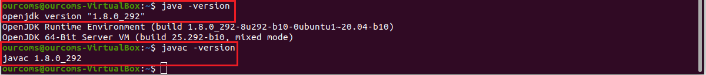
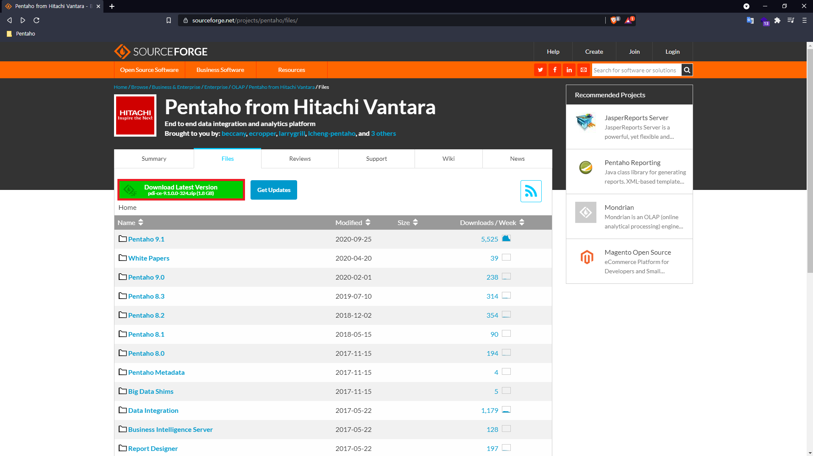
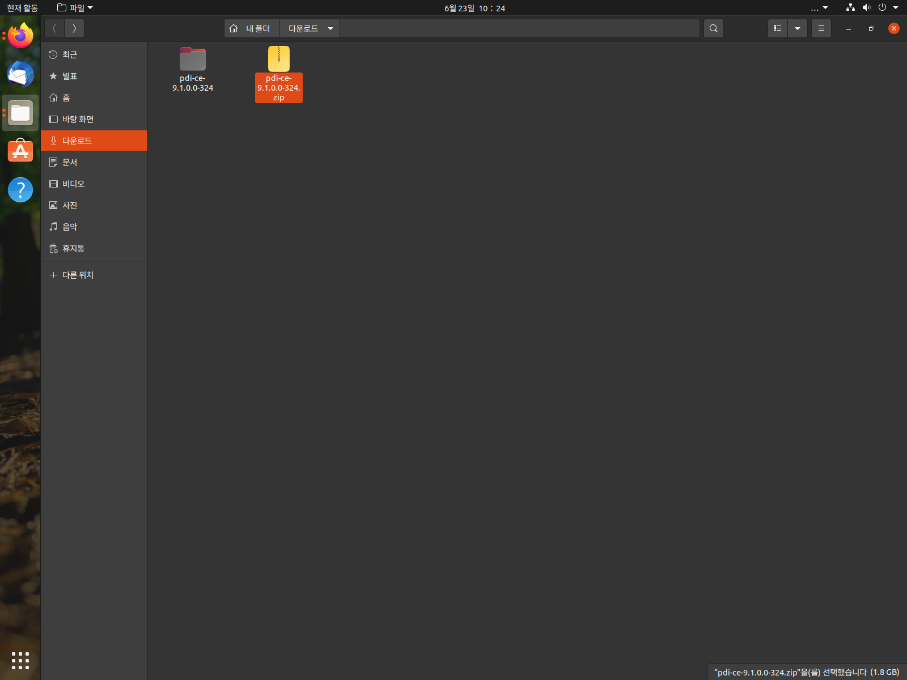
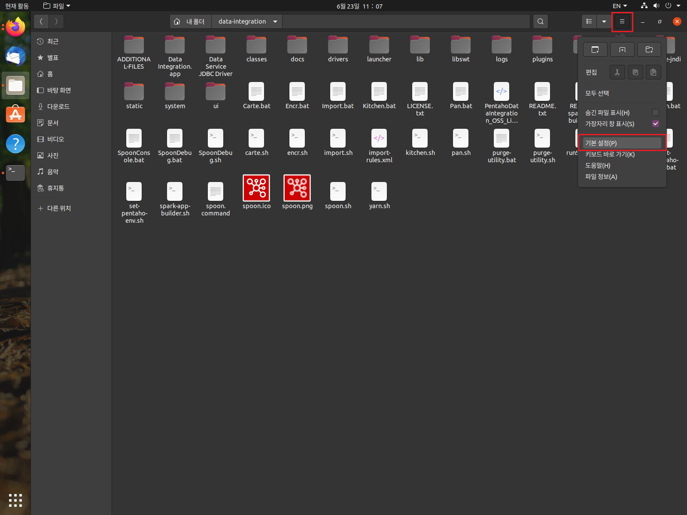
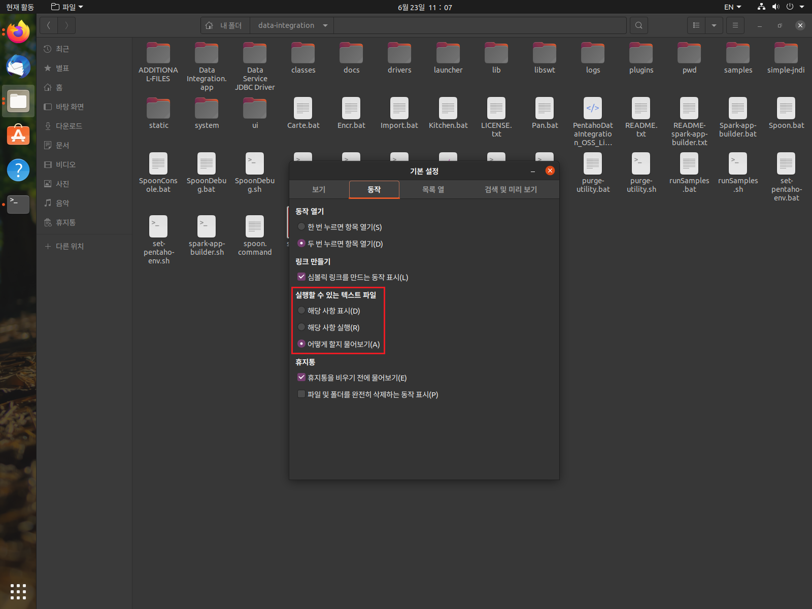
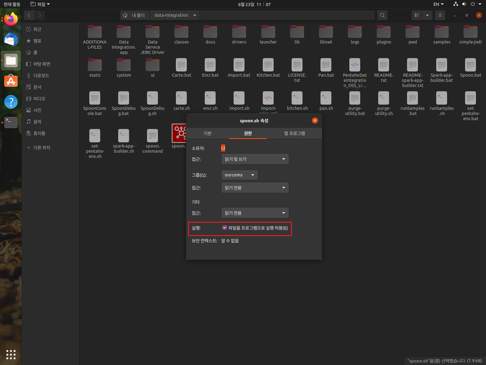
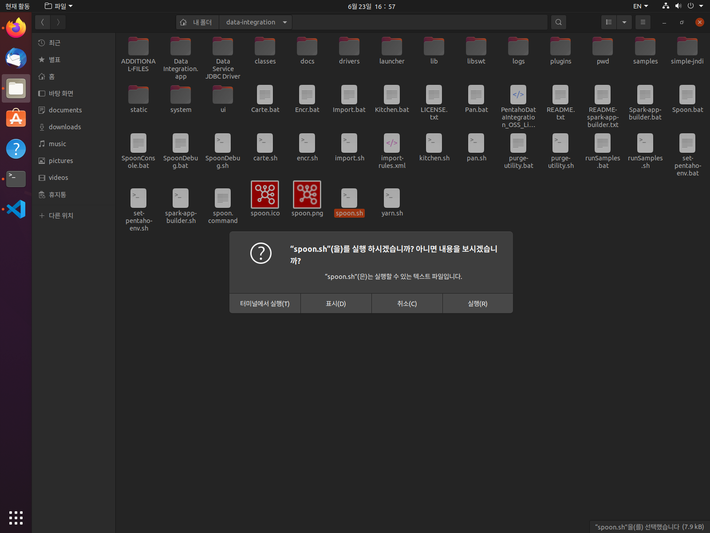
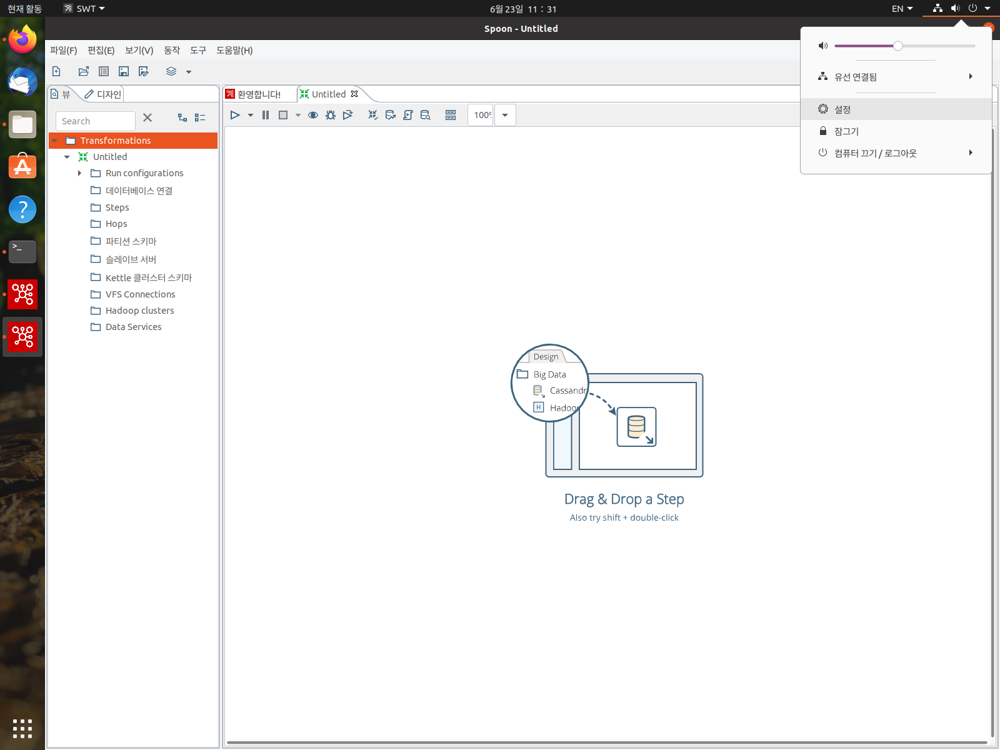
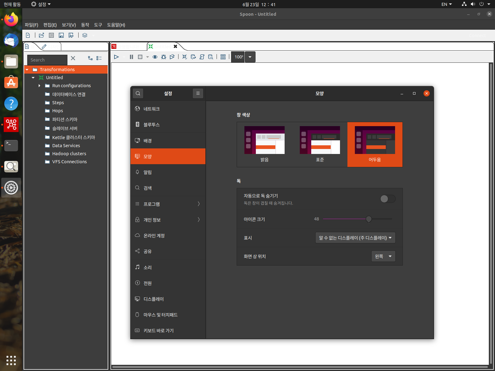
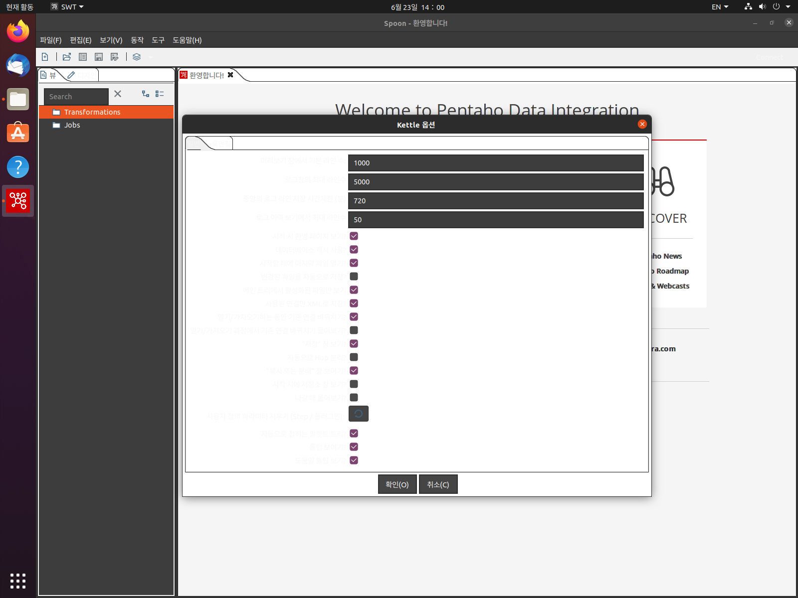

# Linux (Ubuntu 20.04 LTS)에서 설치하기

## CentOS7 환경의 Oracle Virtual Box VM 생성 및 Ubuntu 설치

1. `새로 만들기` 버튼을 누른다.
2. 이름을 정하고 종류는 `Linux` 버전은 `Ubuntu (64 bit)`를 선택한다.
3. 메모리 크기를 설정한다.
4. 가상 하드 드라이브 추가 여부를 선택한 다음에 만들기 버튼을 클릭한다.
5. 하드 드라이브 파일 종류를 정하고 다음 버튼을 누른다.
6. 물리적 하드 드라이브에 저장을 선택한다. (`고정 크기` 추천)
7. 파일 위치 및 크기를 정한 다음 만들기 버튼을 클릭한다.
8. Ubuntu VM을 선택한 다음 `설정 > 저장소` 카테고리에서 속성 항목의 'CD/DVD 드라이브'의 오른쪽의 'CD 모양의 아이콘' 클릭한 다음, '가상 CD/DVD 디스크 파일 선택'을 클릭한다.
9. `Ubuntu~.iso` 파일을 선택한 다음 `확인` 버튼을 누른다. 만약 파일이 없다면 아래의 과정에 따라 `iso` 파일을 다운 받은 후에 8번의 과정을 진행한다.
   - Ubuntu-20.04.2.0-desktop-amd64.iso 다운 받기 [[다운로드 링크](https://ubuntu.com/download/desktop)]
   - Ubuntu `Desktop` 버전을 다운받아서 설치하면 기본적으로 GUI 환경으로 되어있다. (Server 버전을 받으면 CLI 타입)
10. Virtual Box로 돌아와서 `실행` 버튼을 누른다.

## VM에 Ubuntu 20.04 LTS 설치

1. 언어를 '한국어'로 선택한 다음 오른쪽의 'Ubuntu 설치' 버튼을 클릭한다.
2. 키보드 레이아웃 `Korean` 선택
3. `최소 설치` 및 기타 설정은 'Ubuntu 설치 중 업데이트 다운로드'를 체크
4. 설치 형식은 `디스크를 지우고 Ubuntu 설치` 선택
5. 거주지 `Seoul` 선택
6. 유저 정보 입력

## 1. openJDK 1.8 설치

- 터미널에 아래의 명령어를 실행한다.

```bash
sudo apt-get install openjdk-8-jdk
```

- 만약 java 다른 버전이 이미 설치되어 있는 상태라면 아래의 명령어를 통해서 java 버전을 변경할 수 있다.

```bash
update-alternatives --config java
```

`update-alternatives` 는 기본 명령을 결정하는 `symbolic link`를 관리하는 명령어이다.

아래의 두 개의 명령어를 입력하여 Java가 잘 설치되었는지 확인한다.

```bash
java -version
javac -version
```

<p align="center">
  
</p>

## 2. JAVA_HOME 환경 설정

- 터미널 창에서 아래의 명령어를 입력해서 `.bashrc` 파일을 연다.

  ```bash
  vi ~/.bashrc
  ```

- 코드의 맨 아래에 다음 두 줄의 코드를 작성한다.

  ```bash
  export JAVA_HOME=/usr/lib/jvm/java-8-openjdk-amd64
  export PATH="$PATH:$JAVA_HOME/bin”
  ```

- 저장하고 밖으로 나와서 ( 저장하고 나가기 명령어는 `ESC` 키를 한 번 누른 후 `:wq` 를 입력하고 엔터를 치면 된다. ) 아래의 명령어를 입력한다.

  ```bash
  source ~/.bashrc
  ```

- 잘 적용이 되었는지 아래의 명령어로 확인한다.

  ```bash
  echo $JAVA_HOME
  ```

- 잘 적용되었다면 `.bashrc`에 작성했던 경로가 화면에 나타난다.

## 3. Pentaho Community Edition (CE) 다운받기

<p align="center">
  
</p>

- [펜타호 다운로드 홈페이지 링크](https://sourceforge.net/projects/pentaho/files/)
- 다운받은 `zip` 파일을 오른쪽 클릭하여 `압축 풀기` 를 실행한다.
  (압축 푸는 디렉토리 경로 상에서 '한글' 폴더명이 있으면 안된다!)

<p align="center">
  
</p>

- 압축 푼 폴더 안에 `data-integration` 폴더가 생성되어 있을 것이다. 폴더 안으로 들어가서 `README.txt` 파일을 실행하면 아래와 같은 내용이 나온다.

---

```bash
Installation instructions:

Ubuntu 16.04 and later:

- The `libwebkitgtk` package needs to be installed.

  This can be done by running `apt-get install libwebkitgtk-1.0.0`

- On some installations of Ubuntu 16.04, Unity doesn't display the menu bar.
  In order to fix that, spoon.sh has a setting to disable this integration,
  `export UBUNTU_MENUPROXY=0`.
  You can try to remove that setting if you wish to see if it works propery on your machine

CentOS 6 Desktop:

- The `libwebkitgtk` package needs to be installed.
- This can be done by running `yum install libwebkitgtk`
```

---

Ubuntu, CentOS 모두 실행하기 전에 **libwebkitgtk**를 설치해주어야 한다. Ubuntu의 경우 아래의 명령어를 터미널에 입력해서 설치한다.

```
sudo apt-get install libwebkitgtk-1.0.0
```

## `libwebkitgtk` 가 설치되지 않는 문제

Ubuntu >~ 20.04 인 경우에는 `libwebkitgtk`가 APT(Advanced Packaging Tool) 라이브러리에 존재하지 않는다.

따라서 apt의 `sources.list` 파일에 `libwebkitgtk` 를 다운 받을 수 있도록 링크를 추가해주어야 한다.

[[참고 자료-StackOverflow]](https://stackoverflow.com/questions/62301866/how-to-install-the-libwebkitgtk-package-on-ubuntu-20-04-lts)

1. 터미널 창을 연 다음 `sudo nano /etc/apt/sources.list`를 입력한다.
2. 맨 아래에 `deb [http://cz.archive.ubuntu.com/ubuntu](http://cz.archive.ubuntu.com/ubuntu) bionic main universe` 를 붙여넣고 저장한다. (저장은 `ctrl + O` 나가기 버튼은 `ctrl + X` )
3. 터미널에서 `sudo apt-get update` 를 입력한다.
4. 3번 과정이 끝나면 `sudo apt-get install libwebkitgtk-1.0.0` 을 입력해서 설치를 진행한다.

설치가 완료되었으면 터미널 창에서 경로 위치를 `data-integration` 으로 이동한 뒤 `./spoon.sh` 을 입력하면 펜타호가 정상 작동되는 것을 볼 수 있다.

## 터미널 명령어로 실행하지 않고 아이콘 더블 클릭으로 실행하기

1. 터미널에서 실행하지 않고 아이콘을 더블 클릭해서 실행하고자 한다면 아래의 사진과 같이 폴더 오른쪽 상단의 3개의 막대기 버튼을 누르고 `기본 설정` 을 클릭한다.

<p align="center">
  
</p>

2. 상단의 메뉴에서 `동작` 을 선택 한 뒤, '실행할 수 있는 텍스트 파일' 목록에서 바로 실행을 시킬지 또는 '터미널 창 또는 실행하기' 버튼을 선택할 수 있는 창을 띄울지 선택할 수 있다.

<p align="center">
  
</p>

3. 폴더 내부에 있는 `spoon.sh` 파일을 오른쪽 클릭해서 속성(properties)을 클릭한다.

<p align="center">
  
</p>

실행 부분의 `파일을 프로그램으로 실행 허용` 체크 박스를 체크 상태로 해준다.

4. 이제 `spoon.sh` 파일을 더블 클릭하면 펜타호를 바로 실행할 수 있다.

<p align="center">
  
</p>

## Ubuntu의 화면 테마에 따른 펜타호 GUI 색반전

기본 테마의 펜타호 초기 화면

<p align="center">
  
</p>

우분투 우측 상단의 메뉴에서 '설정'을 클릭한 다음 '모양' 카테고리에서 '어두움' 테마로 변경하면 펜타호의 테마도 변경이된다.

<p align="center">
  
</p>

하지만 tap 부분에서는 색반전이 제대로 작동하지 않고 부분적으로 흑백 반전이 이뤄지기 때문에 배경과 글씨 색상이 모두 하얀색으로 되는 부분이 있어서 불편하므로 '표준' 테마를 사용하는 것을 권장한다.

<p align="center">
  
</p>
