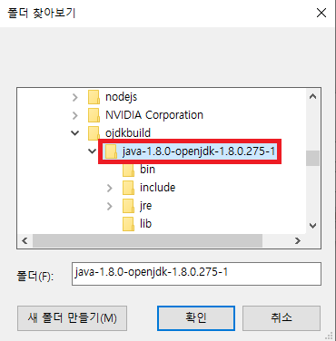
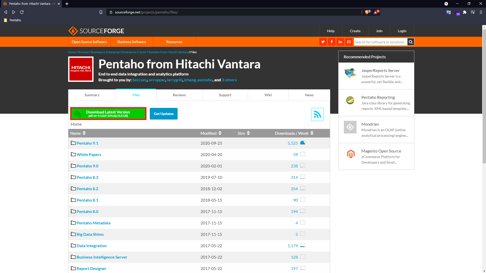

# Windows에서 설치하기

펜타호는 Java 언어로 만들어진 프로그램이므로 컴퓨터에 Java가 설치되어 있어야 한다. 그리고 Java는 여러가지 버전이 있는데 현재의 펜타호 버전은 Java 1.8 버전이므로 해당 버전에 맞게 설치해주어야 한다.

## 1. Open JDK (Java Developer Kit) 1.8 다운로드

- [다운로드 링크](https://github.com/ojdkbuild/ojdkbuild/releases/tag/java-1.8.0-openjdk-1.8.0.275-1.b01)
- 아래의 `.msi` 확장자 파일을 다운받은 후 실행한다.

  

## 2. Java 설치

1. 다운 받은 설치파일을 실행하면 아래와 같은 화면이 나타난다. `Next` 버튼을 클릭한다.

  

2. 라이센스 동의를 체크하고 `Next`를 클릭한다.

  

3.`Next` 버튼 클릭한다.

  

4. `Install` 버튼을 클릭하여 설치를 진행한다. (권한 창이 뜨면 `OK` 를 눌러준다.)

  

5. 아래와 같은 화면이 나오면 설치가 완료된 것이다.

  

## 3. 자바 환경 변수 설정 및 작동 확인

1. 윈도우 화면의 아래에 검색창에 '환경'을 입력하여 `시스템 환경 변수 편집` 을 연다.

  

2. `환경 변수` 버튼을 클릭한다.

  

3. 아래의 `시스템 변수(S)` 에서 `새로 만들기(W)` 버튼을 클릭한다.

  

4. 변수 이름을 `JAVA_HOME` 으로 입력하고 왼쪽 아래의 `디렉터리 찾아보기(D)` 버튼을 눌러서 경로를 설정한다.

  

폴더의 경로는 `내 컴퓨터 > C 드라이브 > Program files > ojdkbuild > java-1.8.0-openjdk~` 으로 마지막 `java-1.8.0-openjdk~` 폴더를 선택한 뒤 `확인` 버튼을 클릭한다.

  

아래 화면과 같이 `변수 값(V)`에 경로가 잘 들어간 것을 확인하고 `확인` 버튼을 누른다.

  

`JAVA_HOME` 변수가 잘 등록되었는지 확인한다.

  

6.  `새로 만들기` 버튼을 다시 클릭하여 변수 이름을 `CLASSPATH` 로 하고 `파일 찾아보기` 버튼을 클릭한다.

  

`내 컴퓨터 > C 드라이브 > Program Files > ojdkbuild > java-1.8.0-openjdk~ > lib` 경로를 따라 폴더에 들어가보면 마지막에 `tools.jar` 파일을 찾을 수 있다. 파일 선택 후 `열기(O)` 버튼을 누른다.

  

`변수 값`에 경로가 잘 들어간 것을 확인하고 `확인` 버튼을 누른다.

  

7.  `시스템 변수(S)` 에서 `Path` 항목을 찾은 다음 `편집` 버튼을 클릭한다.

  

자바를 설치하였다면 아래의 화면과 같이 `java-1.8.0 ~\bin` 경로와 `java-1.8.0 ~\jre\bin` 경로가 추가된 것을 볼 수 있다.

  

이 두 경로들을 아래의 화면과 같이 앞부분의 경로를 `JAVA_HOME` 으로 변경해준다.

  

8.윈도우 검색창에 `cmd` 를 입력하여 아래의 화면과 같이 `관리자 권한으로 실행`을 클릭하여 명령 프롬프트를 실행한다.

  

명령 프롬프트 창에 `java -version` 을 입력한 다음 엔터를 치면 다음과 같이 java의 버전을 확인할 수 있다. `javac -version` 을 입력하여 javac의 버전도 확인한다.

  

  

## 4. 펜타호(pentaho) 설치

1. [펜타호 다운로드 홈페이지 링크](https://sourceforge.net/projects/pentaho/files/)에 접속하면 아래와 같은 화면이 나타난다. 빨간색 체크박스가 되어 있는 최신버전(9.1) 버튼을 클릭하여 `zip` 파일을 다운받는다.

  

2. 다운받은 `zip` 파일을 오른쪽 클릭하여 `압축 풀기`를 실행한다.

  

3. 압축을 푼 다음 저장할 위치를 설정하기 위해 `찾아보기` 버튼을 클릭한다.

  

4. 압축을 풀 위치는 `C 드라이버` 를 추천드립니다. 그 외 원하시는 경로에 압축을 풀어도 되지만 폴더명이 **한글**인 경우에는 펜타호가 정상적으로 작동되지 않으니 유의해주십시오.

  

5. 압축 풀기가 완료되면 아래의 화면과 같이 `data-integration` 이라는 폴더가 생성되는 것을 확인할 수 있습니다. 더블 클릭하여 폴더 안으로 들어갑니다.

  

6.  `data-integration` 폴더 안의 파일들 중에서 `Spoon.bat` 파일을 더블 클릭하여 실행합니다. `Spoon.bat` 파일이 펜타호 실행 파일입니다.

  

7.  `Spoon.bat` 파일을 실행하면 아래와 같이 로딩 화면이 나타납니다.

  

8. 로딩이 끝나면 아래와 같이 펜타호가 정상 작동하여 메인화면이 나타나는 것을 볼 수 있습니다.

  

