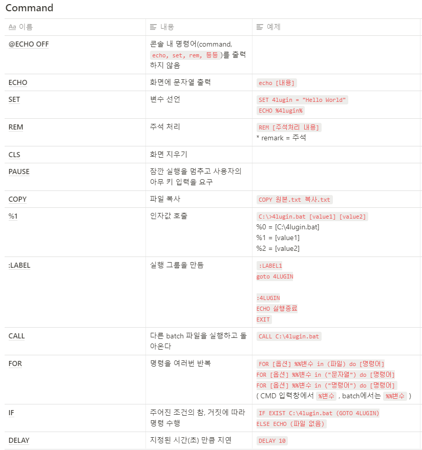
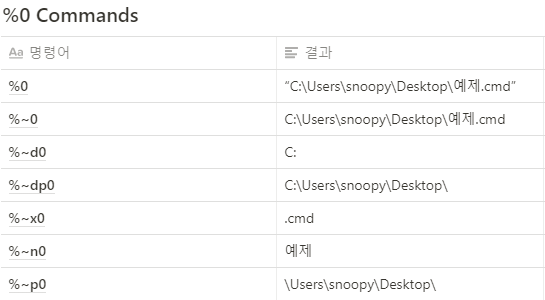

# Shell

Shell은 운영체제(OS, Operating System) 상에서 운영체제의 다양한 기능과 서비스를 구현하는 인터페이스를 제공하는 프로그램이다.

Shell(껍데기)은 사용자와 운영 체제의 내부(kernel) 사이의 인터페이스를 감싸는 층이기 때문에 이러한 이름이 붙여졌다.

[Shell 위키백과](https://ko.wikipedia.org/wiki/셸)

[Shell 스타일 가이드](https://google.github.io/styleguide/shellguide.html)

## Batch file

MS-DOS, OS/2, 윈도우에서 쓰이는 '배치 파일(batch file)'은 명령 인터프리터에 의해 실행되게끔 고안된 명령어들이 나열되어 있는 '텍스트 파일'이다.

배치 파일이 실행될 때, 'COMMAND.COM' 또는 'cmd.exe'와 같은 shell 프로그램이 파일을 읽어 명령어를 줄 단위로 실행한다. 배치 파일은 보통 실행 파일을 자동으로, 연속적으로 실행할 때 유용하며 시스템 관리자가 따분한 일들을 자동화하기 위해 자주 사용한다.

[배치 파일 위키백과](https://ko.wikipedia.org/wiki/배치_파일)

## `pushd` & `popd`

- `push directory` & `pop directory`
- `pushd`와 `popd`는 `stack` 구조로 동작한다.
- `cd`와 `pushd`의 차이점은 `cd`는 UNC(Universal Naming Convention)을 경로로 지정하지 못한다는 것

예시)

```shell
C:\Users\Rhange>cd \\localhost\C$
'\\localhost\C$'
CMD에서 현재 디렉터리로 UNC 경로를 지원하지 않습니다.

C:\Users\Rhange>pushd \\localhost\C$

Z:\>
```

[참고 사이트](https://m.blog.naver.com/mjnms/220459183706)

## java.exe와 javaw.exe

- **javaw.exe**는 console과 무관하게 **자바 어플리케이션만을** 구동
- **java.exe**는 **console창과 함께** 자바 어플리케이션을 구동

## Batch 기본 명령어 모음

<p align="center">
  
</p>

[참고 사이트 - 4lugin tistory](https://4lugin.tistory.com/24)

## `pushd %~dp0`

배치파일 초반에 항상 적어주는 것이 많을 듯

윈도우에서는 특이하게도 UAC(User Account Control)가 켜져있는 환경에서 배치파일을 관리자 권한으로 실행하는 경우 명령 프롬프트 위치가 `C:\Windows\System32` 기준으로 실행된다.

- 이것이 문제가 되는 이유 → 보통 배치파일과 함께 같은 위치에 첨부 파일들을 두고 다른 곳으로 복사해주는 명령어를 쓰거나 아니면 그 첨부파일을 실행하는 경우가 많은데, 이렇게 명령 프롬프트 위치가 변경되어 버리면 복사할 파일이나 실행할 파일의 **절대 경로**를 적어야 한다.
- 그런데 배치파일은 어느 위치에서 실행될지 아무도 모른다. (그 사람이 해당 폴더나 파일들을 어디에 저장할지 모르기 때문에) 따라서 복사할 파일의 절대경로도 그때그때 달라지게 된다.
- 각 파일 경로 앞에 `%~dp0`를 일일이 붙여주어도 되지만 너무 귀찮은 일이다. 그러므로 이렇게 명령 프롬프트 위치를 배치파일이 있는 디렉터리로 되돌려주는게 훨씬 편하다.
- 따라서 `pushd %~dp0` 라고 적으면 명령 프롬프트가 배치파일(`.bat`)이 존재하는 위치로 돌아오게 된다.

<p align="center">
  
</p>

[참고 블로그](https://www.snoopybox.co.kr/1404)

## `SET`

1. 기본: `SET 변수 = 문자열`

- 배치파일에서 변수를 호출할 때는 양쪽에 `%`를 붙여주면 된다.

예시)

```bash
SET A=rhange
echo %A%
rhange
```

- 변수는 대/소문자를 구분한다. (즉, A와 a는 다른 변수이다)

1. `SET /A 변수 = 수식`

- 수식의 계산 결과를 할당하려면 `/A` 옵션을 붙여야 한다.

예시)

```shell
SET B=5
SET /A B=B+3
ECHO %B%
8

# shortcut
SET C=3
SET /A C*=3
ECHO %C%
9
```

## `SETLOCAL`

- 명령어로 배치 파일에서 환경 변경의 지역화를 사용
- 함수 내부에서 지역변수를 만드는 것처럼 해당 배치 파일에서만 환경 변화를 주는 것으로 보임
- 배치파일의 코드가 끝나거나 `endlocal` 명령어가 있다면 해당 명령어까지 적용됨
- [마이크로소프트 SETLOCAL 설명](https://docs.microsoft.com/ko-kr/windows-server/administration/windows-commands/setlocal)

## `COLOR`

- 콘솔창의 화면 색을 지정할 수 있다.
- 첫번째 자리는 배경색으로 두번째 자리는 문자색이다.
- `COLOR 1F` : 파란색 배경에 흰색 글자

## 변수 대체 패턴 - `%, %%, #, ##`

\${variable%pattern}

- 쉘은 특정 pattern으로 끝나는지 확인하기 위해 내부 variable을 살펴본다.
- 패턴과 일치하면 변수의 내용이 사용되고 **가장 짧게 일치하는 패턴**을 **오른쪽**부터 제거한다.

\${variable%%pattern}

- 쉘은 특정 패턴으로 끝나는지 확인하기 위해 내부 변수를 살펴본다.
- 그러나 이번에는 **가장 길게 일치하는 패턴**을 오른쪽부터 제거한다.
- 패턴에 `*` 가 사용되는 경우에만 관련이 있다. 그렇지 않다면 `%` 와 `%%` 는 같은 방식으로 작동한다.

\${variable#pattern}

- 패턴과 일치하는 변수의 내용의 **가장 짧게 일치하는 패턴**을 왼쪽부터 제거한다.

\${variable##pattern}

- 패턴과 일치하는 변수의 내용의 **가장 길게 일치하는 패턴**을 왼쪽부터 제거한다.

[Shell 변수 대체의 패턴 참고](https://knight76.tistory.com/entry/shell-%EB%B3%80%EC%88%98-%EB%8C%80%EC%B2%B4%EC%9D%98-%ED%8C%A8%ED%84%B4)

## Shell Script에서 코드 실행 흐름

- 작성된 코드의 위에서 아래로 쭉 실행된다.
- 두 함수 중에서 하나만 실행하고 싶은 경우에는 `goto` 명령어를 써서 넘어갈 수 있다.

## ?? -> `!==!`

- `Spoon.bat` 에 있는 `!==!` 의미를 해석 못함
- 일단 해당 변수값이 `비어 있다면` 이라는 의미로 보임

```shell
set _cmdline=
:TopArg
if %1!==! goto EndArg
set _cmdline=%_cmdline% %1
shift
goto TopArg
:EndArg
```

## 명령행 인자 (Command-line argument)

Shell 스크립트에서는 최대 9개의 명령행 인자를 받을 수 있다. 그 값은 `$1~$9`에 저장된다. (최신 shell에서는 그 이상의 인자도 받을 수 있다.) `$0`에는 실행한 shell script의 `경로`가 저장된다. `$#` 에는 `인자의 개수`가 저장된다.

## `SHIFT`

- 모든 매개 변수를 한 칸 아래로 이동시키는 명령어
- `shift n` : `n+1, ...` 위치에 있는 매개 인자를 `$1, $2, ...` 로 변경
- `shift`만 사용하면 n의 값은 1이고, n이 0이라면 어떤 매개인자도 변경되지 않는다.

[Shift 명령어 참고 링크](https://linuxism.ustd.ip.or.kr/418)

---

- `shift`는 `$1` 인자를 없애고 각 인자번호를 1씩 줄인다.

예시)

```shell
#!/bin/sh
#
# prarg: 세 개의 인자를 출력하다.
#

prog= basename $0

if [$# -eq 3 ]
then
      echo “Script $prog path: $0”
      echo “Arg1: $1”
      echo “Arg2: $2”
      shift # shift 명령어 실행
      echo “Arg3: $2” # Arg3에 $3가 아닌 $2를 입력했다.
else
      echo “Usage: $ $prog arg1 arg2 arg3”
      exit
fi
$ ./prog es 34 # arguments가 두 개일 경우
Usage: $ prarg arg1 arg2 arg3
$ ./prog 28 ksl 9 # arguments가 세 개일 경우
Script prarg path: ./prarg
Arg1: 28
Arg2: ksl
Arg3: 9 # $2를 입력했지만 shift 덕분에 세번째 인자값이 나온다.
```

- 이때 `$#` 값도 1만큼 줄어든다.
- 모든 args는 `$@`, `$*`에 저장된다. `$@`는 명령행에서 사용한 따옴표가 적용되지만, `$*`에서는 그 따옴표가 적용되지 않는다.
- 따옴표에의 유무에 따라 shell에서 사용하는 특수문자들(`-, 공백, 탭, \, ', ", `` 등)을 해석할 것인지의 여부가 결정된다.
- `$$`에는 현재 shell script의 `process ID`가 저장된다. 이는 명령행 인자는 아니지만 임시파일을 만들때와 같은 경우에 유용하게 사용된다.

[참고 링크 - 리눅스랩](http://www.linuxlab.co.kr/docs/10-4.htm)

## `START`

```shell
START ["제목"] [/D 경로] [/I] [/MIN] [/MAX] [/SEPARATE | /SHARED]

[/LOW | /NORMAL | /HIGH | /REALTIME | /ABOVENORMAL | /BELOWNORMAL]

[/NODE <NUMA 노드>] [/AFFINITY <16진수 선호도 마스크>] [/WAIT] [/B]

[명령/프로그램] [매개 변수]
```

- ["제목"] → 창 제목 표시줄에 나타남
- 경로 → 시작 디렉토리
- [매개 변수] → 명령/프로그램으로 전달되는 매개변수

[참고 링크](https://m.blog.naver.com/jsh891212/220012089091)
