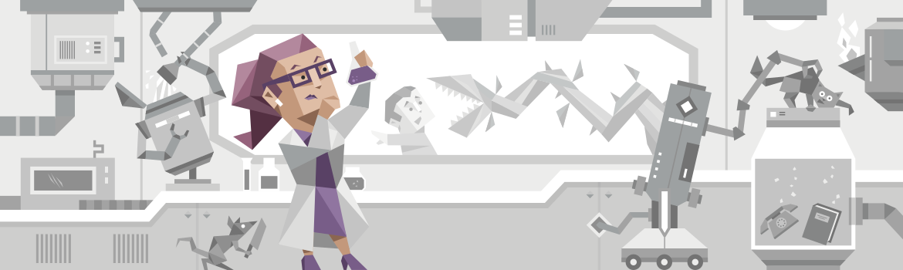

# MBTI (INTP-T)

[테스트 사이트 16personalities.com](https://www.16personalities.com/ko/%EC%84%B1%EA%B2%A9%EC%9C%A0%ED%98%95-intp)

## 성격 유형 (논리적인 사색가, INTP-T)

  

> 과거에서 배우되, 현재에 살며, 미래에 대한 희망을 가지세요. 그리고 중요한 것은 질문하는 일을 멈추지 않는 것입니다.
>
> Albert Einstein

사색가형은 전체 인구의 3% 정도를 차지하는 꽤 흔치 않은 성격 유형으로, 이는 그들 자신도 매우 반기는 일입니다. 왜냐하면, 사색가형 사람보다 '평범함'을 거부하는 이들이 또 없기 때문입니다. 이 유형의 사람은 그들이 가진 **독창성**과 **창의력**, 그리고 그들만의 **독특한 관점**과 **왕성한 지적 호기심**에 나름의 자부심을 가지고 있습니다. 보통 철학자나 사색가, 혹은 몽상에 빠진 천재 교수로도 많이 알려진 이들은 역사적으로 수많은 과학적 발전을 이끌어 내기도 하였습니다.

### 연구되지 않은 삶은 의미가 없다!

> 천재적인 이론이나 난해한 논리로 유명한 이들은 다른 성격 유형과 비교하여 가장 논리적인 사람들로 알려져 있습니다.

이들은 사건이나 사물의 어떠한 일련의 **연속성**에 관심이 많으며, 사람들의 언행에 불일치되는 부분을 집어내 트집 잡는 것을 즐기는데, 이는 거의 취미 수준에 가까울 정도입니다. 때문에 이들에게 거짓말은 하지 않는 것이 좋습니다. 또 한 가지 아이러니한 점은 이들의 얘기를 곧이곧대로 듣지 말고 잘 새겨 들어야 한다는 것입니다. 이는 이들이 솔직하지 않아서가 아니라 아직 채 명확히 규명되지 않은 생각이나 이론에 대하여 얘기하는 경향이 있기 때문입니다. 이들은 상대방을 실질적인 대화 상대로 보는 것이 아니라 그들의 생각이나 이론을 펴기 위한 하나의 대상으로 여깁니다.

이러한 성향 때문에 이들에게 일을 맡기는 게 불안하게 느껴질 수도 있지만, 사실 사색가형 사람보다 문제를 정확히 파악하고 이를 둘러싸고 있는 요소를 낱낱이 파헤쳐 독창적이며 실행 가능한 해결책을 찾아내는 데 더 열성적이고 뛰어난 사람은 없습니다. 단, 이들에게서 업무 진행 상황에 따른 보고서 따위를 제출받기를 기대하지는 않는 게 좋습니다. 이 성격 유형의 사람은 실질적인 하루하루 업무나 유지에는 관심이 없기 때문입니다. 하지만 일단 이들의 천재성과 잠재력이 활개 칠 수 있는 환경이 조성되면 이들은 통찰력 있고 편향되지 않은 해결책을 찾는 데 그들이 가진 모든 시간과 에너지를 모두 쏟아부을 것입니다.

### 지혜는 호기심으로부터 시작

이런저런 몽상에 사로잡혀 있는 듯한 모습을 자주 보이는 이들은 한시도 쉼 없이 생각에 몰두합니다. 심지어는 아침에 눈을 뜰 때조차도 쉴 새 없이 쏟아지는 아이디어와 함께 하루를 시작합니다. 머릿속에서 끊임없는 벌어지는 논쟁과 생각으로 수심에 가득 차 보이거나 혼자 동떨어져 있어 보이기도 하지만, 이들과 비슷한 관심사를 가진 사람 혹은 친밀한 관계의 이들과 있을 때면 편안하고 밝은 모습을 보입니다. 이와 대조적으로 낯선 이들과 있을 때는 극도로 수줍어하며, 만일 이들이 논리적으로 내린 결론이나 이론이 상대방으로부터 비판을 받거나 하는 경우가 생기면 가벼운 농담에도 호전적인 태세를 보이기도 합니다.

특히나 흥분된 상태에서 이야기할 때에는 대화에 일관성이 떨어지기도 하는데, 이는 가장 최근 정립한 이론이 결론에 도달하기까지 일련의 논리적 연결 고리를 모두 설명하려 들기 때문입니다. 이들은 또한 상대방이 그들의 논리를 충분히 이해하지 못하였음에도 쉽게 풀어 설명하거나 하지 않은 채 대화를 다른 주제로 옮기기도 합니다.

주관적인 관점이나 감정에 치우쳐 사고하는 사람과 비교해보면 아마도 이들의 사고 과정을 보다 잘 이해할 수 있을 것입니다. 가령 매우 정교하고 복잡한 시계 작동법을 창의적으로 사고하되, 가능한 한 하나의 사실도 빠짐없이 논리적으로 가장 합당한 결론에 이르게 설명한다고 상상해 보십시오. 이것이 바로 사색가형 사람이 사고하는 방식입니다. 이들은 감정 망치가 이들의 사고방식에 훼방 놓는 것을 한치도 용납하지 않습니다.

### 세상을 변화시키고자 하는 당신, 먼저 자신부터 변화하십시오!

또한 이들은 다른 이의 감정 섞인 불평이나 불만을 전혀 이해하지 못하기 때문에 친구들은 그들에게서 어떠한 정서적인 위로나 위안을 받지 못합니다. 더욱이 사색가형 사람은 근본적으로 내재되어 있는 문제 해결을 위한 논리적인 해결책을 제안하는 것을 선호하는데, 이는 감성적인 성향의 사람과는 대조되는 부분입니다. 이러한 이들의 성향은 나아가 저녁 모임 계획이나 결혼 준비와 같은 기타 사회적 만남이나 활동에도 영향을 미치는데 이들은 기본적으로 지나치리만치 **독창성**과 **효율적인 결과**를 좇는 경향이 있습니다.

이들의 앞길을 가로막는 한 가지 장애물은 계속해서 드는 **실패에 대한 두려움**입니다. 사색가형 사람은 혹 자신이 중요한 퍼즐 조각을 놓친 것은 아닌지, 혹 이로 인해 자신이 정체되거나 그들의 지식이 아직 실질적으로 적용되지 않은 무형의 세계에서 길을 잃는 것은 아닌지를 걱정하며 자신의 생각이나 이론을 끊임없이 재평가하는 경향이 있습니다. 자기 자신에 대한 의구심을 극복하는 것이 이들이 직면한 가장 큰 과제입니다. 하지만 그것이 크든 작든, 이들이 가진 지적 능력에서 말미암은 이들의 도전은 그 자체만으로도 세상에 큰 가치를 가져옵니다.

## 강점과 약점

### 강점

**분석** – 논리학자는 연구 데이터에서 주변 사람들의 행동에 이르기까지 자신이 발견하는 모든 것을 분석합니다. 이것은 다른 성격 유형이 간과할 수 있는 예상치 못한 **패턴과 연결을 발견하는 요령**을 제공합니다.

**독창적** – 끊임없는 상상력 덕분에 논리학자는 대부분의 사람들에게 발생하지 않는 **창의적이고 반직관적인 아이디어**를 내놓을 수 있습니다. 물론 이러한 모든 아이디어가 실현 가능한 것은 아니지만, 상자 밖에서 생각하려는 논리학자의 의지는 놀라운 혁신을 가져올 수 있습니다.

**개방적** – 논리학자들은 **호기심**과 그들이 할 수 있는 모든 것을 배우고자 하는 강렬한 열망에 의해 움직입니다. 이러한 성격 유형을 가진 사람들은 건전한 추론에 의해 뒷받침되는 한 새로운 아이디어와 일을 수행하는 방법을 수용하는 경향이 있습니다.

**호기심** – 이러한 성격은 항상 새로운 추구, 취미 및 연구 분야를 위해 활용됩니다. 한 주 동안 그들은 지구 물리학에 집착하고 다음에는 기타 제작에 대한 비디오에서 자신을 잃을 수 있습니다. 영감이 떠오르면 논리학자들은 새로운 관심사에 모두 참여하여 할 수 있는 모든 것을 배웁니다.

**목표** – 논리학자는 **진실에 관심**이 있습니다. 이데올로기에서 위로를 받거나 아이디어를 받기보다는 사물의 표면 아래에서 실제로 무슨 일이 일어나고 있는지 이해하기를 원합니다. 그 결과, 편견과 잘못된 정보에 맞서 싸우는 것이 쉽지 않을 때에도 신뢰할 수 있으며 다른 사람들이 그 대가로 정직하기를 기대합니다.

### 약점

**단절** – 논리학자는 다른 사람들과 함께 있을 때에도 자신의 사고방식에서 길을 잃을 수 있습니다. 어떤 주제에 대해서 이야기 중일 때, 해당 주제에 대해서 깊이 생각하다가 마침내 할 말이 떠올랐을때는 이미 대화가 그들없이 진행되었음을 알 수 있습니다. 이로인해 특히 대규모 사교 모임에서 다른 사람들과 단절감을 느낄 수 있습니다.

**무감각** - 이 성격 유형을 가진 사람들은 **합리성**을 더 좋고 행복한 세상의 열쇠로 봅니다. 때때로 그들은 감정, 연민, 에티켓, 전통과 같은 비합리적인 가치의 중요성을 과소 평가할 수 있습니다. 결과적으로 의도가 일반적으로 좋은데도 무심하거나 불친절하게 보일 수 있습니다.

**불만족** – 논리학자들은 그들이 이미있는 것보다 어떻게 더 나을 수 있을지 상상할 수 밖에 없습니다. 이러한 성격은 지속적으로 해결해야 할 문제, 배울 주제, 사물에 접근하는 새로운 방법을 찾고 있습니다. 너무 멀리 보면 이 사고방식은 압도적일 수 있으며, 논리학자는 자신의 요구와 책임을 안정적으로 해결하기보다 현재 만들어진 것들을 지속적으로 재발명하려고 합니다.

**성급함** – 논리학자들은 자신의 지식과 아이디어 공유에 자부심을 가지고 있습니다. 그러나 그 이유를 설명할 때 항상 **인내심**이있는 것은 아닙니다. 대화상대가 따라 오지 않거나 충분히 관심이 있는 것처럼 보이지 않으면 논리학자는 "신경 쓰지마."라고 말하며 포기할 수 있습니다.

**완벽주의** – 논리학자들은 일을 완수하기를 원하지만 완벽에 대한 그들의 추구는 방해가 될 수 있습니다. 때때로 이러한 성격은 다양한 옵션을 분석하는 데 너무 길을 잃어 결정에 도달하지 못할 수 있습니다. 또한 마음속에 있는 이상적인 비전과 일치하지 않는 프로젝트를 포기할 수도 있습니다.

### 낭만적인 관계

논리학자의 특이한 특성 조합은 종종 낭만적인 파트너에게 즐거운 놀라움으로 다가옵니다. 이러한 성격 유형을 가진 사람들은 대뇌적이고 내성적인 것처럼 보일 수 있지만 일단 경계를 늦추면 장난스럽고 창의적인면을 갖게됩니다.

> 관계에서 논리학자는 창의력을 사용하여 일을 신선하게 유지하고 파트너가 특별하다고 느끼도록 영리하고 예기치 않은 방법을 찾을 수 있습니다.

내향적인 논리학자는 혼자만의 시간을 높이 평가하지만, 그렇다고해서 동료애를 갈망하지 않는다는 의미는 아닙니다. 이런 성격 유형을 가진 사람들에게 이상적인 로맨틱 파트너는 시간을 보낼 수 있는 사람이 아니라 자신의 아이디어에 도전할 수 있는 동등한 사람입니다. 논리학자는 **학습과 성장**을 추구하는 데 평생을 보내고 싶어합니다. 사랑하는 사람이 이 사명을 공유할뿐만 아니라 적극적으로 격려해주기를 바랍니다.

이러한 기준을 충족하는 관계를 찾는 것이 항상 쉬운 것은 아닙니다. 논리학자들은 세상으로 나가 새로운 사람들을 만날 때 발을 끌 수 있습니다. 그리고 그들이 누군가에게 관심이 있어도 거절의 위험을 감수하고 그 사람을 밖으로 요청하는 데 시간이 걸릴 수 있습니다. 감정적으로 섬세한 상황에서 관심의 중심이 되는 것은 누구에게나 쉽지 않지만 특히 논리 학자에게는 더 어렵습니다.

### 진정한 연결

처음부터 논리학자들은 관계를 진지하게 받아들입니다. 그들이 마침내 파트너를 만났을 때 그들(존경하는 사람일 수도 있고 직장에서 친한 사람들)과 가까운 관계를 추구합니다.

데이트 단계의 초기에도 논리학자는 비정상적으로 직접적이고 정직합니다. 그들은 게임의 요점을 보지 못하고 조용할 수는 있지만 수줍어하지 않습니다. 이 성격유형을 가진 사람들은 자신의 의견을 거의 필터링하지 않으며 파트너도 그들에게 솔직하도록 권장합니다. 많은 논리학자에게 앞장서는 것은 무례함이나 매너의 신호가 아니라 오해를 피할 수 있는 방법은 말할 것도 없고 자부심입니다.

관계가 발전함에 따라 논리학자의 일상적인 요구사항은 간단합니다. 선물, 놀라움, 복잡한 사회 계획 및 정교한 데이트 밤은 모두 그들에게 상당히 중요하지 않습니다. 불행히도, 그들의 파트너가 이러한 것들을 원하더라도, 논리학자들이 그것들을 계획하지 않을 수도 있습니다.

이러한 성격은 상대방과 공감하는 방식으로 애정을 표현하는 방법을 배우는 데 특별한 노력과 관심을 기울여야 할 수도 있습니다. 그렇지 않으면 그들의 파트너는 무시 당하고, 저평가되거나 심지어 사랑받지 못한다고 느낄 수 있습니다. 플러스 측면에서 논리학자는 이러한 상황을 자신의 상표 독창성을 잘 활용할 수 있는 기회로 만들 수 있습니다.

### 충돌 탐색

갈등을 좋아하는 사람은 거의 없지만 논리학자는 감정적 불일치가 발생할 때 특히 문을 닫는 경향이 있습니다. 속도를 늦추고 실제로 듣는 대신 논리의 힘을 사용하여 파트너가 잘못되었음을 증명할 수 있습니다. 또는 더 깊은 문제와 감정의 어수선함을 파헤치고 싶지 않은 쉽고 논리적인 솔루션을 제공할 수도 있습니다.

> 갈등과 관련하여 논리학자는 고의적인 무지에 대해 죄를 지을 수 있습니다. 그들은 너무 오랫동안 파트너의 감정과 자신의 감정을 버리고 싶은 유혹을 받을 수 있습니다.

그들이 성숙해지면서 논리학자들은 종종 사람들의 정서적 욕구 (자신의 것을 포함하여)가 실제적이고 타당하다는 것을 알게됩니다. 합리성을 사랑하는 성격 유형의 경우 이것이 항상 쉬운 일은 아닙니다. 그러나 이러한 인식은 논리학자가 모든 장기적인 관계가 직면하는 문제에 대처하는 데 도움이 될 수 있습니다. 감정에 대해 이야기하는 것은 자연스럽게 오지 않을 수 있지만 논리학자는 의견이 일치하지 않는 순간에도 파트너와 감정적인 공통점을 찾는 법을 배울 수 있습니다.

### 기쁨의 불합리성

논리 학자들은 생각의 세계에 사는 경향이 있습니다. 낭만적인 관계는 그들을 자신의 마음에서 깨뜨리는 데 도움이되며, 현재 순간에 충만한 기쁨과 즐거움을 경험할 수 있습니다.

이 경험은 논리학자가 몰랐던 강점, 특성 및 욕망을 드러내는 변형적일 수 있습니다. 창의적이고 생생한 상상력으로 논리학자는 자신의 감각을 잃지 않고 관계에 봉사하는 방식으로 시야를 확장할 수 있는 놀랍도록 열정적인 파트너를 만들 수 있습니다.

## 우정

모든 사람과 마찬가지로 논리학자는 친구와의 교제와 도움을 찾습니다. 그러나 이러한 성격 유형을 가진 사람들은 지적 깊이라는 다른 것도 중요하게 생각합니다. 모든 사람이 잠재적인 친구에 대한 논리학자의 표준을 충족하는 것은 아니지만 누군가가 그렇게 했을 때 연결이 즉시 촉발 될 수 있으며 겉으로 보기에는 성격이 고정되었다고 생각하는 모든 사람을 놀라게 할 수 있습니다.

### 적당한 선택(Choosy) 또는 신중한 선택(Selective)?

아마도 그들은 자신의 생각으로 회사를 신경 쓰지 않기 때문에 논리학자는 단지 그것을 위해 사람들과 함께하지 않습니다. 결과적으로 이러한 성격과 친한 친구가 되는 것이 항상 쉬운 것은 아닙니다. 그러나 논리학자가 입을 열면 항상 흥미롭거나 예상치 못한 말을 할 수 있는 활기차고 상상력이 풍부한 친구가 될 수 있습니다.

논리학자의 가장 친한 친구는 새로운 아이디어, 수수께끼, 해결책에 대한 열정을 공유하는 경향이 있습니다. 하지만 그렇다고 이 성격 유형을 가진 사람들이 그들에게 동의하는 친구만 찾는다는 의미는 아닙니다. 논리학자들은 자신의 아이디어에 도전하는 것을 신경 쓰지 않습니다. 사실 그들은 자신의 가정을 다시 생각하게하고 발끝을 계속 유지하는 사람들에 대해 많은 **존경심**을 가지고 있습니다.

논리적인 우정은 지식에 기반을 두고 있으며 아이디어, 이론 및 개념의 교환을 통해 촉진됩니다. 따라 잡을 수 없거나 취향이 급격히 다른 사람(연예인에 대해 논리학자는 이야기하지 않음)은 무시 당하거나 무시 당하는 느낌을 받을 수 있습니다. 논리 학자들은 의미있는 주제나 이미 마음에 드는 사람들을 위해 대화를 예약합니다.

> 논리학자의 지적 스타일이 모든 사람을 위한 것은 아니지만 괜찮습니다. 이 성격 유형을 가진 대부분의 사람들은 좋은 친구의 작은 서클을 선호합니다.

### 우정의 의미

친구들이 문제와 딜레마를 가지고 그들에게 올 때, 논리학자는 일반적으로 도움을 줍니다. 그들은 논리적인 조언과 합리적인 해결책을 제공 할 수 있으며, 가장 복잡한 상황조차도 장단점 목록으로 바꿀 수 있습니다.

그러나 정서적 지원이나 마음의 문제에 관해서는 이러한 성격 유형을 가진 사람들은 약간의 어려움을 느낄 수 있습니다. 논리 학자에게 있어 우정의 가장 큰 (그리고 가장 어려운) 교훈 중 하나는 때때로 사람들이 문제를 해결하는 방법에 대한 조언이 필요하지 않다는 것입니다. 그들은 자신의 곁에 있을 수 있는 사람이 필요하다는 것입니다.

> 논리학자들은 자신의 가장 큰 힘이 마음에 있다고 믿는 경향이 있습니다. 그러나 우정의 경험은 그 아이디어가 아무리 독창적이거나 획기적이든 상관없이 자신의 아이디어보다 세상에 더 많은 것을 제공한다는 것을 깨닫는 데 도움이 될 수 있습니다.

시간이 지남에 따라 많은 논리학자들은 활기찬 대화와 밤새도록 브레인 스토밍 세션이 재미있을 수 있지만 우정에 관한 전부는 아닙니다. 이러한 성격은 사회적 지위 또는 누군가의 옷차림과 같은 과거의 피상적 덫을 볼 수있는 기괴한 능력을 가지고 있으며, 내부 사람의 잠재력을 충분히 인식합니다. 피팅에 집착하는 세상에서 논리학자는 친구들에게 관습을 타파하고 트렌드를 무시하고 독특한 목소리를 찾도록 영감을 줄 수 있습니다.

## 부모

많은 사회적 역할과 마찬가지로 육아에서 논리학자는 강력하지만 건전한 도전에 직면합니다. 때로는 아이들의 지저분하고 비합리적이며 끊임없이 변화하는 – 그러나 완전히 자연스러운 – 감정에 당황 할 수 있습니다. 결국, 아이들은 논리학자들이 당연하게 여기는 선택의지와 논리를 아직 개발하지 못했습니다.

그래도 부모가 되는 것은 논리학자에게 매우 의미가 있습니다. 이러한 성격 유형의 부모는 호기심과 배움에 대한 사랑으로 자녀에게 세상에 대해 가르치는 데 큰 기쁨을 누릴 수 있습니다. 관대하고 열린 마음을 가진 논리학자는 자녀가 독립적으로 생각하고 새로운 지식을 찾고 자신의 의견을 말하고 방어하도록 권장합니다.

### 너 자신에게 진실해라

이 성격 유형의 부모는 사회적 기대에 대해 걱정하지 않습니다. 즉, 자녀가 어떻게 행동해야 하는지에 대한 양육 조언이나 다른 사람들의 생각에 집착하는 경우는 거의 없습니다. 그들은 또한 아이들을 `학교 > 직업 > 결혼 > 집 > 아이 > 퇴직`의 전통적인 생활로 밀어 붙일 가능성이 낮습니다.

이것은 논리학자가 자녀에 대한 기대치가 없다고 말하는 것이 아닙니다. 그들은 자녀들이 스스로 동기를 부여하고 독립적이기를 기대합니다. 그들은 자녀가 충분히 나이가 들면 자신의 삶의 길을 결정하고 그 길을 쫓는 방법을 알아내는 데 필요한 **비판적 사고능력**을 갖기를 바랍니다.

### 자유의 선물

논리학자는 자녀의 호기심을 장려하여 지식을 습득하고 시야를 넓힐 수 있는 자유를 줍니다. 이 부모는 일반적으로 자녀에게 편안하고 지적 접근 방식을 취합니다. 불필요한 규칙이나 엄격한 일정을 부과하는 대신 탐험과 독립을 장려하는 가정환경을 만드는 것을 목표로 합니다.

논리학자에게 자녀의 독립성을 존중하는 것은 존경의 표시입니다. 그러나 많은 어린이 (청소년까지)에게 이러한 수준의 개인적인 자유는 벅찰 수 있습니다. 가정 생활에 합리적인 경계와 부모의 지도가 포함되어 있지 않으면 아이들은 집중하지 않거나 표류하며 스스로 세상을 파악해야 한다고 확신 할 수 있습니다.

> 역설적이게도, 돌보는 규칙과 부모의 검증을 받는 안정적인 가정 기반은 논리학 자의 자녀가 독특하고 독립적인 모습으로 꽃을 피우는 데 필요한 것입니다.

다행히도 논리학자는 너무 손을 대지 않고도 자녀의 독립성을 장려 할 수 있다는 것을 이해할 수 있는 정신적 유연성이 있습니다. 이러한 성격 유형의 부모는 자녀가 필요할 때마다 조언과 지원을 제공 할 수 있도록하여 균형을 다시 잡을 수 있습니다. 또한 명확하고 상식적인 경계를 설정하고 잘못된 행동에 대한 합리적인 결과를 설정하여 자녀가 자신의 급증하는 자제에 전적으로 의존하지 않고 일상 생활을 탐색 할 수 있도록 합니다.

### 합당한 도전

논리학자 부모에게는 정서적 지원을 제공하는 것이 쉽지 않을 수 있습니다. 사실 규칙과 경계를 설정하는 것과 함께 가장 큰 도전이 될 수 있습니다. 좋은 소식은 이러한 성격이 약간의 노력이 필요할 수 있지만 이러한 문제를 해결할 수 있다는 것입니다.

논리학자는 자녀가 자신의 문제를 해결하고 자신의 필요를 충족 할 수 있도록 권한을 부여하기를 원합니다. 이것은 가치있는 목표이지만, 아이들은 스스로 세상을 다스리기 전에 앞서 언급한 규칙과 경계와 함께 검증과 지원의 꾸준한 기반이 필요합니다. 이러한 기초를 만들기 위해 논리학 부모는 자녀에 대해 느끼는 사랑, 애정, 감탄을 표현해야합니다.

> 이성적인 논리를 가진 논리학자에게는 애정이 넘치거나 어색해 보일 수 있지만, 이러한 말과 행동은 아이들이 사랑 받고, 받아 들여지고, 안정감을 느끼도록 돕는 데 큰 도움이 됩니다.

논리학자는 자녀가 똑똑하고 독립적으로 성장하는 것 이상을 원하지 않습니다. 이 성격 유형을 가진 부모가 합리성과 함께 공감을 가르치는 한, 자녀는 질문을하고, 마음을 사용하며, 자신을 돌보는 방법을 알고 있는 자신감있는 성인으로 성장할 수 있습니다.

## 진로

자유롭고 편심한 논리학자는 자신에게 맞는 직업과 경력 경로를 찾기 위해 고군분투 할 수 있습니다. 논리학자는 세상에 대한 독특한 관점을 가진 특이한 성격이지만 이를 염두에 두고 설계된 작업 환경은 거의 없습니다.

그러나 약간의 독창성으로 논리학자는 창의성, 아이디어에 대한 열정 및 혁신적인 정신을 포함하여 자신의 강점을 최대한 활용하는 작업을 찾을 수 있습니다. 이 성격 유형에 관한 많은 것들과 마찬가지로 이러한 특성은 드뭅니다. 결과적으로 논리학자는 약간의 노력으로 다양한 분야에서 눈에 띄는 방법을 찾을 수 있습니다.

### 탐험의 부름을 받다

논리학자들은 탐험을 갈망하지만 기존 방식은 아닙니다. 그들은 이론과 아이디어의 영역에 이끌려 일상 생활의 표면을 탐구하고 우주의 신비를 조사하기를 열망합니다.

> 논리학자 성격의 경우 이상적인 근무일은 애완 동물 가게를 관리하든 평행 우주에 대한 이론을 세우든 어렵고 해결 불가능 해 보이는 문제를 해결하는 것입니다.

호기심이 많은 논리학자는 다른 성격 유형의 눈을 빛나게 할 수있는 개념에서 아름다움을 찾을 수 있습니다. 논리학자는 수학자, 분석가, 연구원 및 과학자들 사이에서 특히 물리학과 같은 좀 더 추상적인 분야에서 잘 대표됩니다. 엔지니어링 및 기술 분야의 직업도 일치 할 수 있습니다. 특히 창의력을 발휘할 수 있는 여지가 있는 경우 논리학자는 다른 사람의 작업을 구현하는 데 시간을 보내는 것보다 훨씬 더 새로운 접근 방식을 개척할 것입니다.

즉, 논리학자는 기술 분야에만 국한할 필요가 없습니다. 분석 및 연구에 대한 그들의 재능은 거의 모든 업무 분야에서 매우 귀중 할 수 있으며, 논리학자는 명백한 일치처럼 보이지 않을 수 있는 직업에서도 빛을 발할 수 있는 유연성을 가지고 있습니다. 이러한 성격이 교육에서 관리, 상품화에 이르기까지 새로운 프로세스를 발명하거나 실험 할 수 있는 모든 직업은 끝없는 만족감을 줄 수 있습니다.

### 더 깊은 동기

때때로 논리 학자들은 동료들이 이해하기 어려울 수 있습니다. 많은 성격 유형과 달리 논리학자는 상사에게 깊은 인상을 주거나 동료의 인정을 받거나 멋진 새 직책을 얻고 자하는 욕구에 동기를 부여하지 않습니다. 사실, 팀 구축 운동, 수냉식 잡담, 체크인 회의 또는 관리자의 동기 부여 연설과 같이 다른 직원에게 동기를 부여하는 일로 인해 종종 꺼집니다.

대신, 이러한 성격 유형을 가진 사람들은 자신의 호기심과 자신에 대한 높은 기준에 따라 움직입니다. 논리학자에게 "충분히 좋다"는 것은 거의 충분하지 않으며, 그들은 평균적이거나 (심지어 더 나쁜) 평범한 사람이라고 부르기를 싫어합니다. 그러나 그들은 단지 그것을 위해 열심히 일하지 않으며 모든 작업이 그들의 주의를 똑같이 포착하는 것은 아닙니다. 때때로 그들은 더 매력적이거나 중요하다고 생각하는 추구를 위해 일상적인 또는 행정적인 작업을 무시할 수 있습니다.

> 논리학자들이 진정 원하는 것은 흥미로운 프로젝트에 몰입하는 것이며,이 초점을 방해하는 모든 것에 짜증을 내는 경향이 있습니다.

압도적인 상사를 상대하거나 다른 사람들의 의견을 기다리는 것보다 논리학자를 더 실망시키는 것은 거의 없습니다. 그 결과 상대적으로 평탄한 계층 구조를 가진 자기 주도적 작업장에 끌리는 경우가 많습니다. 너무 많은 사람들이 어깨 너머로 쳐다 보지 않고도 작업을 수행하고 아이디어를 탐색 할 수 있는 거의 모든 환경과 마찬가지로 실험실은 훌륭한 조합이 될 수 있습니다. 또는 많은 논리학자가 컨설턴트 및 프리랜서로 서비스를 제공하는 자영업 경로로 이동하여 유연성과 독립성을 유지합니다.

### 사회적 단서

요즈음 거의 모든 구인 공고는 인재 능력이 뛰어난 지원자를 요구합니다. 논리 학자들은 사람의 기술이 과대 평가되었다고 주장 할 수 있으며 데이터와 기술에 의해 얼마나 많은 분야가 혁명을 일으키고 있는지를 고려할 때 요점이 있을 수 있습니다. 점점 더 고용주는 복잡한 시스템을 이해하고 비판적으로 생각할 수 있는 논리 학자와 같은 사람을 필요로합니다.

논리학자가 거의 성공하지 못하는 곳은 높은 수준의 정서적 만족을 제공해야 하는 직장에 있습니다. 크루즈 선박 마사지 치료사로 일하는 것은 아마도 그들의 행복한 곳이 아닐 것입니다. 즉, 이러한 성격 유형을 가진 사람들은 적응할 수 없다면 아무것도 아니며 서비스 또는 사람 중심의 위치에서 절대적으로 성공할 수 있습니다. 이러한 역할에서 논리학자는 고객에게 서비스를 제공하는 새롭고 효과적인 방법을 실험하여 마음의 참여를 유지해야 할 수 있습니다.

> 논리학자들은 사회적 상호 작용을 수반하는 직업에서 벗어나려는 유혹을 받을 수 있지만, 어떤 분야에서 성공하려면 다른 사람들과 적어도 어느 정도의 협력이 필요하다는 것을 종종 발견합니다.

이러한 성격 유형을 가진 사람들이 사회적 요소가 있는 작업을 처리 할 수 ​​없다고 스스로에게 말하면 자신을 짧게 팔고 옵션을 불필요하게 축소하는 것입니다. 그들이 자신의 기술을 증명할 수 있을 만큼 충분히 웃고 악수를 하는 한, 논리학자들은 종종 그들의 **예리함과 창의성이 높은 수요가 있음**을 발견합니다.

## 직장(Workplace) 습관

논리학자에게 직장 만족도의 요소는 매우 간단합니다. 이러한 성격 유형을 가진 사람들은 **지적 자극, 아이디어를 추구 할 자유, 도전적인 퍼즐을 풀 기회**를 갈망합니다. 그리고 그들이 최소한의 사회적 의무와 겸손한 관리 작업으로 이러한 요구를 충족시킬 수 있다면 훨씬 좋습니다.

일부 논리학자는 이 개념을 비웃을 수 있지만 종종 다른 사람들과 협력하여 최선을 다합니다. 이러한 성격은 머릿속에 사는 경향이 있으며, 자신이 무엇을 해야할지 아는 것보다 더 빨리 생각과 통찰력을 얻습니다. 논리학자는 관리자나 동료가 자신의 아이디어를 구현하는 방법을 파악하고 속도를 늦추도록 강요할 때 짜증을 내기도하지만 장기적으로는 **그러한 동료가 논리학자의 성공 비결이 될 수 있습니다.**

### 논리적인 부하직원

적절한 조건에서 논리학자 직원은 혁신적이고 수완이 풍부하며 복잡한 문제가 앞에 놓이면 마음을 쉽게 감쌉니다. 그러나 독립성을 제한하거나 "그런 일"을 하도록 강요하는 작업 환경에서는 이러한 성격이 빠르게 동기부여를 잃을 수 있습니다.

이것은 불행한 [catch-22](https://namu.wiki/w/%EC%BA%90%EC%B9%98-22#fn-1)를 만들 수 있습니다. 논리학자들은 지루하거나 밑에 있는 일을 미루고 싶은 유혹을 받는 경우가 많지만, 이러한 일을 수행하여 “회비를 지불”할 때까지 상사는 자신이 원하는 자유를 주지 않을 것입니다. 논리학자들은 흥미로운 부분으로 건너뛰기를 원할 수도 있지만 먼저 관리자에게 자신을 증명해야합니다.

하지만 좋은 소식이 있습니다. 논리학자가 **직책의 맨 아래에 있는 시간**은 실제로 **나중에 성공하는 데 도움이되는 새로운 기술과 습관을 구축하는 데 도움이 될 수 있습니다.** 이 성격 유형을 가진 사람들은 많은 장점을 가지고 있지만 프로젝트를 완료하는 것이 그 중 하나가 아닙니다. **논리학자는 경력 초기에 접하게되는 감시와 한계를 곤경에 빠뜨릴 수 있습니다. 또는 추가 책임과 구조를 유리하게 사용하여 아이디어를 현실로 바꾸는 데 더욱 효과적이되는 방법을 배울 수 있습니다.**

### 논리적인 동료

때때로 논리학자들은 동료들을 친해지고 함께 일할 사람들의 그룹이 아니라 때로는 유용한 지식을 제공하는 일련의 잠재적인 산만함으로 볼 수 있습니다. 이런 성격을 가진 사람들이 동료와 회사를 결코 즐기지 않는다는 말은 아니지만, 아침에 가볍게 나누는 잡담이 논리학자를 아침에 침대에서 나오게 할 수는 없습니다.

즉, 대부분의 논리학자는 동료가 생각하는 것보다 더 많은 혜택을 얻을 수 있습니다. 이러한 성격은 자신에게 도전하는 사람들과 둘러싸여 실제로 최선을 다하고 있는지 확인할 수 있습니다. 논리학자가 정확히 사회적 나비는 아니지만 자신이 존경하는 동료로부터 아이디어를 튀길 수있는 기회가 있을 때 업무 시간이 조금 더 빨리가는 경우가 많습니다.

이 성격 유형의 사람들은 집중하는 것을 좋아한다고 말할지 모르지만 비밀리에 다양성을 갈망합니다. 긍정적인 관계를 구축하는 논리학자는 아이디어와 전문지식을 새로운 프로젝트에 기여하도록 요청받을 가능성이 더 높습니다. 그들이 직장에서 일어나는 가장 흥미로운 새로운 일의 최첨단에 머물고 싶다면, 논리학자들은 스스로를 고독한 늑대가 아니라 도움이 되는 협력자로 확립하는 것이 좋을 것입니다.

### 논리적인 관리자

논리학자는 일반적으로 다른 사람보다 권력을 갖는 것에 대해 신경쓰지 않지만 종종 관리 직책을 즐깁니다. 책임자가 되면 이런 성격 유형의 사람들은 눈을 뗄 수 없는 관리 업무를 위임하고 좋은 일에 집중할 수 있습니다. 새로운 아이디어를 떠올리는 것입니다.

관리자로서 논리학자는 관대하고 유연한 경향이 있습니다. 그들은 제안에 개방적이며 (물론 논리적인 제안이라면) 직원에게 상당한 자유를 허용합니다. 그러나 이러한 자유에는 대가가 따릅니다. 논리적인 관리자는 높은 기준을 가지고 있으며 다른 사람들이 자신의 통찰력을 즉시 파악하고 동일한 방식으로 자신의 통찰력을 제공하기를 기대합니다.

이 성격 유형의 보스는 엄격하다는 평판을 얻을 수 있습니다. 그들은 직원들의 업무에서 불일치를 빠르게 발견하고 부정적인 피드백을 할 때 주저하지 않을 수 있습니다. 경험이 쌓이면서 논리적인 관리자는 종종 비판과 칭찬 및 격려의 균형을 통해 팀이 더 높은 사기를 누릴 수 있으며 중요한 것은 더 나은 결과를 누릴 수 있다는 것을 종종 발견합니다.
