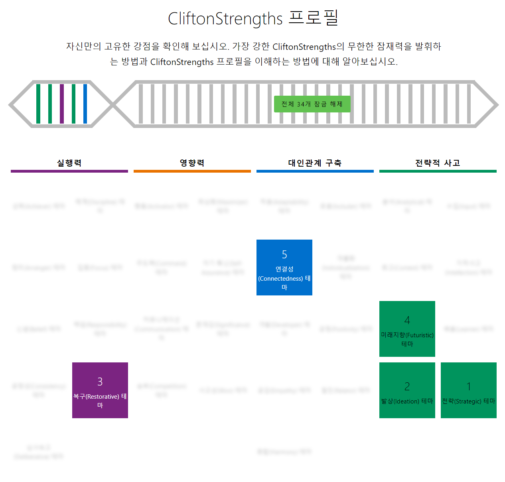

# Clifton Strengths

  

<head2 style="color:#00945D">

## 전략(Strategic) 테마

</head2>

**전략(Strategic) 테마는 당신이 혼돈에서 벗어나 최선의 길을 찾을 수 있게 해줍니다.** 이 테마는 가르친다고 배울 수 있는 기술이 아닙니다. 이는 독특한 사고 방식이며, 세상 전반에 대한 특별한 시각입니다. 이런 특별한 시각 때문에 복잡하게만 보이는 혼돈 속에서도 당신은 **패턴**을 발견할 수 있습니다. 이런 패턴을 바탕으로, 당신은 여러 가지 대안과 시나리오를 생각해 봅니다. "이렇게 되면 어떤 일이 벌어질까? 저렇게 되면 또 어떤 일이 벌어질까?"라고 반복해서 자문하다 보면 당신은 다음에 일어날 일을 예측할 수 있습니다. 이러한 방식으로 당신은 장애물이 될 만한 것을 정확하게 파악할 수 있습니다.

당신의 눈에는 각각의 길이 어디에 이르는지 보이기 때문에 이를 바탕으로 선택을 하기 시작합니다. 목표 성취에 도움이 안 되는 길, 곧장 저항에 부딪칠 길, 혼돈의 안개로 이어지는 길은 선택에서 제외합니다. 이렇게 추려내는 과정을 통해 결국에는 당신이 원하는 경로, 즉 당신이 선택한 전략에 도달합니다. 튼튼한 전략으로 무장한 당신은 이제 "공격 앞으로!"라고 외치며 전진합니다. 한 마디로, 당신의 전략(Strategic) 테마는 현실에서 이렇게 발현된다고 할 수 있습니다. 우선 여러 가상 상황과 대안을 세우고, 그 중 가장 좋은 전략을 선택한 후, 목표를 향해 전진함으로써 말입니다.

<head2 style="color:#00945D">

## 발상(Ideation) 테마

</head2>

**당신은 아이디어에 매료되어 있습니다.** 아이디어란 무엇일까요? 이는 세상사를 가장 잘 설명해 주는 어떤 원리나 이념이라고 볼 수 있습니다. 당신은 복잡한 현상의 근본 원인을 설명해 주는 **명쾌하고 단순한 원리**를 발견할 때 기쁨을 느낍니다. 아이디어는 **연결고리**입니다. 당신은 항상 연결고리를 찾으려 합니다. 그래서 서로 관련이 없어 보이는 별개의 현상들이 **눈에 띄지 않는 연결고리**로 연결되어 있음을 발견할 때 흥미를 느낍니다. 아이디어는 또한 익숙한 문제를 바라보는 **새로운 시각**입니다.

당신은 우리 모두가 알고 있는 세계를 뒤집어서 전혀 **새로운 각도**, 즉 **생소한 깨우침을 주는 시각**으로 보는 데서 즐거움을 느낍니다. 당신은 이런 모든 종류의 발상과 아이디어들을 사랑합니다. 왜냐하면 이들은 심오하고, 참신하고, 엉뚱하며 기존과는 다른 시각과 명확성을 제공하기 때문이지요. 이런 모든 이유로 인해, 당신은 새로운 아이디어가 떠오를 때마다 기운이 샘솟는 것을 느낍니다. 사람들은 당신이 **"창의적이다", "독창적이다", "발상력이 풍부하다" 또는 "똑똑하다"**고 표현할 수도 있습니다. 어쩌면 당신은 이 모두에 해당될 수도 있습니다. 어느 누가 확신할 수 있겠습니까? 하지만 확실한 것 하나는 아이디어가 당신을 신바람 나게 만든다는 점입니다. 이것만으로 당신은 만족합니다.

<head2 style="color:#7B2481">

## 복구(Restorative) 테마

</head2>

**당신은 문제 해결하기를 무척 좋아합니다.** 고장이 나거나 문제가 발생하면, 또 이런 일이 생겼다고 힘 빠져 하는 사람들이 있는 데 반해, 당신은 이런 상황에서 오히려 활력을 얻습니다. 증상을 **분석**하고, **원인**을 알아내고, **해결안**을 찾는 일에 큰 기쁨을 느낍니다. 실용적인 문제나 추상적인 문제, 혹은 개인과 관련한 문제를 선호할 수도 있습니다. 전에 여러 번 다뤄본 적이 있어서 해결할 자신이 있는 특정 문제를 선호할 수도 있습니다. 아니면, 복잡하고 생소한 문제를 마주칠 때 가장 큰 의욕을 느낄 수도 있습니다. 정확하게 어떤 문제를 선호하는지는 어떤 다른 강점과 경험을 지녔는지에 따라 결정되겠지만, 확실한 것은 당신이 문제를 고쳐서 당면한 상황을 소생시키는 것을 즐긴다는 것입니다.

문제의 원인을 파악하고 해소하여 상황을 바람직하게 복구하는 데에서 큰 기쁨을 느낍니다. **만약 당신이 개입하지 않았더라면 일이 실패로 돌아갔을 것이라는 점을 당신은 직관적으로 압니다.** 이것이 기계든, 기술이든, 사람이든, 아니면 회사에 관한 일이든 말이죠. 당신이 문제시된 상황을 고치고, 소생시켰으며, 활력을 다시 불어 넣은 것입니다. 이를 어떤 식으로 표현을 하든, 당신이 이 상황을 위험에서 구해낸 것입니다.

<head2 style="color:#7B2481">

## 미래지향(Futuristic) 테마

</head2>

**미래가 이러이러하면 좋지 않을까?** 당신은 당면한 현실 너머를 바라보기를 무척 좋아하는 사람입니다. 당신은 미래에 매혹됩니다. 마치 벽에 투사되는 그림을 보는 것처럼, 당신의 눈에는 미래가 어떨지 상세하게 보입니다. 이 상세한 그림에 끌려 당신은 앞을 향해, 내일을 향해 나아갑니다. 그림의 구체적인 내용은 당신이 가진 다른 강점들과 관심사에 따라 달라지겠지만, **이 그림**은 언제나 당신에게 더 좋은 제품, 더 훌륭한 팀, 더 행복한 인생, 혹은 더 나은 세상 등에 대한 **영감**을 줍니다. 당신은 미래의 가능한 모습을 꿈꾸는 사람이며 이러한 비전을 소중히 여깁니다.

현재 상황이 너무 힘들고, 주변 사람들이 너무 현실에만 치중할 때면, 당신은 미래에 대한 비전을 떠올려 보는 방법으로 기운을 냅니다. 이런 당신의 비전은 다른 이들에게도 활력을 줄 수 있습니다. 사실, 사람들은 당신이 미래에 대한 비전을 이야기해 주기를 자주 기대합니다. 그들은 **희망과 활기**를 얻을 수 있는 **청사진**을 원합니다. 당신은 그들에게 이런 비전을 제공해줄 수 있습니다. **연습하십시오.** 단어를 신중히 선택하고, 비전이 최대한 생생하게 전달 될 수 있도록 하십시오. 사람들은 당신이 가져다 주는 희망을 품고 싶어할 것입니다.

<head2 style="color:#0070CD">

## 연결성(Connectedness) 테마

</head2>

**우연이란 없습니다.** 어떤 일이든 이유가 있어서 일어나는 것이지요. 당신은 이를 확신합니다. 우리 모두가 연결되어 있음을 마음속 깊이 알기 때문입니다. 물론 우리는 스스로의 판단에 책임을 지는, 자유 의지가 있는 개인들이기는 하지만 그럼에도 불구하고 우리는 보다 큰 네트워크의 일부입니다. 이를 집단 무의식이라고 부르는 사람도 있고, 영혼(spirit)또는 생명력(life force)이라 부르는 사람도 있습니다. 하지만 이를 뭐라 부르건 간에 당신은 우리가 고립된 존재가 아니라는 사실에서 자신감을 얻습니다. 우리는 서로 간에 그리고 이 지구와 지구 생명체들과 연결되어 있으니까요. 이런 연결성(Connectedness) 테마는 **일정한 책임감**도 내포하고 있습니다. 우리 모두가 보다 더 큰 네트워크의 일부라면, 다른 존재들에게 해를 입혀서는 안 됩니다. 그것은 우리 스스로에게 해를 입히는 셈이니까요. 착취해서도 안 됩니다. 우리 자신을 착취하는 것이 될 테니까요. 이러한 책임에 대한 의식은 당신의 **가치관**을 형성합니다.

당신은 **사려 깊고, 자상하며, 포용력**이 있습니다. 인류가 하나로 연결되어 있음을 확신하여 문화적 배경이 서로 다른 사람들을 연결해 주는 **다리** 역할을 합니다. 눈에 보이지 않는 더 큰 존재가 있음을 느끼는 당신은 주위 사람들에게 단조로운 우리 인생 이면에 더 큰 삶의 의미가 존재한다는 안도감을 줍니다. 구체적인 믿음의 내용은 성장 환경과 문화에 따라 다르겠지만 당신의 이런 믿음은 강합니다. 그리고 이런 믿음은 인생의 불확실함 속에서 당신과 주변 친구들에게 든든한 힘이 되어 줍니다.
